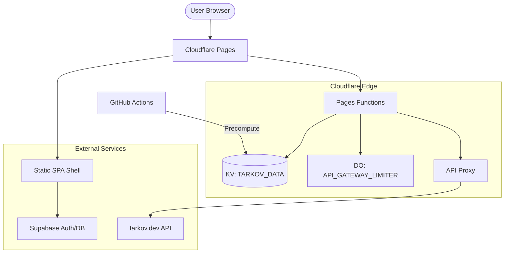
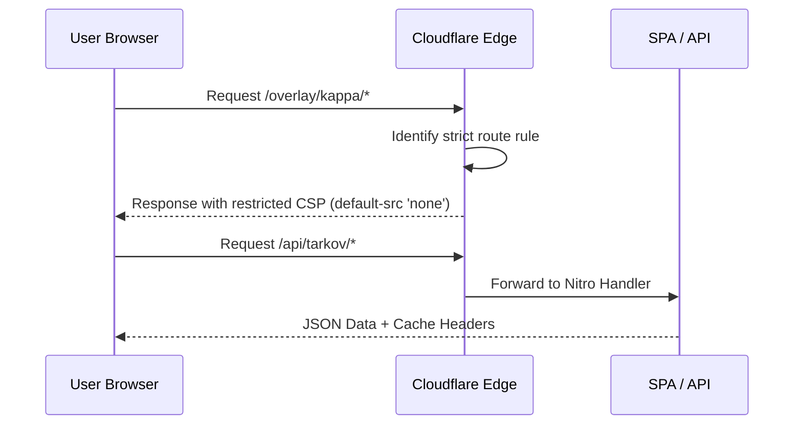

Relevant source files

The following files were used as context for generating this wiki page:

- [wrangler.toml](wrangler.toml)
- [nuxt.config.ts](nuxt.config.ts)
- [AGENTS.md](AGENTS.md)
- [README.md](README.md)
- [code_review.md](code_review.md)
- [app/utils/__tests__/nuxtSecurityConfig.test.ts](app/utils/__tests__/nuxtSecurityConfig.test.ts)
- [app/utils/__tests__/runtimeConfig.test.ts](app/utils/__tests__/runtimeConfig.test.ts)

# Cloudflare Deployment

TarkovTracker utilizes a hybrid deployment architecture leveraging **Cloudflare Pages** for the frontend application and **Cloudflare Workers** for auxiliary services such as the API Gateway and precomputation tasks. The system is architected as a Single-Page Application (SPA) with `ssr: false`, ensuring that the primary application logic executes on the client while utilizing Cloudflare's edge network for high-performance data delivery and global consistency.

The deployment infrastructure is designed to handle high-traffic loads through multi-layered caching, including a globally-replicated Key-Value (KV) store for precomputed game data and a Durable Object-based rate limiter to protect upstream resources.

Sources: [README.md:38](README.md#L38), [AGENTS.md:37](AGENTS.md#L37), [wrangler.toml:1-10](wrangler.toml#L1-L10)

## Architecture Overview

The application is built using Nuxt 4 and is deployed as a static SPA shell. It integrates with Cloudflare Pages Functions specifically for routing `/api/*` and `/overlay/*` paths. Other requests are served as static assets from the `dist` directory.

### Deployment Components

The following diagram illustrates the relationship between the deployment components and the external services they interact with:

The system ensures reliability by providing fallbacks; for instance, if the KV binding for precomputed data is absent, the application degrades to using the per-colo Cache API.

Sources: [AGENTS.md:37-45](AGENTS.md#L37-L45), [wrangler.toml:14-25](wrangler.toml#L14-L25), [nuxt.config.ts:167-175](nuxt.config.ts#L167-L175)

## Configuration Management

Deployment settings are governed by the `wrangler.toml` file and environment variables processed during the Nuxt build phase.

### Environment Bindings

| Binding Type | Name | Purpose |
| :--- | :--- | :--- |
| **Durable Object** | `API_GATEWAY_LIMITER` | Atomic, globally-consistent rate limiter shared with the api-gateway Worker. |
| **KV Namespace** | `TARKOV_DATA` | Globally-replicated store for precomputed heavy-route payloads (e.g., tasks-core). |
| **Variable** | `APP_URL` | Canonical URL of the application (e.g., `https://tarkovtracker.org`). |
| **Variable** | `SUPABASE_URL` | Endpoint for Supabase authentication and database services. |

Sources: [wrangler.toml:8-40](wrangler.toml#L8-L40), [nuxt.config.ts:88-150](nuxt.config.ts#L88-L150)

### Build and Output Logic

The project uses a custom Nitro preset to optimize the Cloudflare Pages output. This includes:
1.  **SPA Fallback Promotion**: Promoting `200.html` to `index.html` to support client-side routing on static hosting.
2.  **Route Filtering**: Explicitly defining which routes are handled by Pages Functions (`/api/*`, `/overlay/*`) via the `_routes.json` file.
3.  **Dependency Stripping**: A hook (`nitro:init`) strips bare Node.js imports from the compiled server code to ensure compatibility with the Cloudflare Workers runtime.

Sources: [nuxt.config.ts:167-185](nuxt.config.ts#L167-L185), [app/utils/__tests__/nuxtSecurityConfig.test.ts:15-20](app/utils/__tests__/nuxtSecurityConfig.test.ts#L15-L20), [AGENTS.md:42-45](AGENTS.md#L42-L45)

## Specialized Workers and Functions

### API Gateway and Rate Limiting
The deployment includes a dedicated `api-gateway` Worker that owns the `ApiGatewayRateLimiter` Durable Object class. Pages binds to this script to perform consistent rate limiting across the edge.

### Precompute Workflow
Due to CPU limits on the Cloudflare Workers Free tier, heavy payloads (like the core task data) are precomputed using a scheduled GitHub Actions workflow instead of a Cron Worker. This workflow writes directly to the `TARKOV_DATA` KV namespace, which is then read by Pages Functions.

Sources: [wrangler.toml:8-12](wrangler.toml#L8-L12), [wrangler.toml:14-20](wrangler.toml#L14-L20), [AGENTS.md:58-62](AGENTS.md#L58-L62), [code_review.md:54-58](code_review.md#L54-L58)

## Security and Performance

### Content Security Policy (CSP)
The deployment automatically generates route-specific CSP headers via `buildContentSecurityPolicyRouteRules`. This allows for stricter policies on `/overlay/` routes compared to the main application.

Sources: [app/utils/__tests__/nuxtSecurityConfig.test.ts:48-61](app/utils/__tests__/nuxtSecurityConfig.test.ts#L48-L61), [nuxt.config.ts:187-195](nuxt.config.ts#L187-L195)

### Runtime Validation
The build process includes strict validation of environment variables. For production builds, the absence of required Stripe or Supabase keys will trigger a build failure to prevent broken deployments.

Sources: [nuxt.config.ts:48-58](nuxt.config.ts#L48-L58), [code_review.md:104-108](code_review.md#L104-L108)

## Summary
Cloudflare Deployment for TarkovTracker is a sophisticated SPA implementation that maximizes the capabilities of the Cloudflare network. By utilizing Pages for the frontend, Workers for the API gateway, and KV/Durable Objects for global state and data caching, the project achieves a highly performant and scalable architecture while maintaining a strictly client-side application model.
