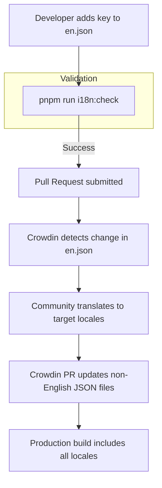

<details>
<summary>Relevant source files</summary>

The following files were used as context for generating this wiki page:

- [app/locales/en.json](app/locales/en.json)
- [app/locales/de.json](app/locales/de.json)
- [app/locales/fr.json](app/locales/fr.json)
- [app/locales/zh.json](app/locales/zh.json)
- [app/locales/pt.json](app/locales/pt.json)
- [AGENTS.md](AGENTS.md)
- [DESIGN.md](DESIGN.md)
- [code_review.md](code_review.md)
- [public/llms.txt](public/llms.txt)
- [tests/llms-txt.test.ts](tests/llms-txt.test.ts)
</details>

# Localization & i18n

TarkovTracker implements a robust localization (l10n) and internationalization (i18n) system designed to support a global user base. The system primarily manages user interface strings across multiple languages and integrates with external game data sources that provide localized content for tasks, items, and hideout modules.

The project differentiates between UI locales (the language of the application interface) and API data languages (the language of game-specific data fetched from the backend). The primary source of truth for UI strings is English, with other supported languages managed via a community-driven translation workflow.

Sources: [AGENTS.md:144-156](AGENTS.md#L144-L156), [public/llms.txt:7-11](public/llms.txt#L7-L11)

## Architecture and Data Flow

The localization architecture relies on JSON-based locale files stored within the `app/locales/` directory. The application uses `vue-i18n` as its core engine for handling translations, with a fallback mechanism that reverts to English (`en`) if a specific key is missing in a non-English locale.

### Core Components

| Component | Description |
| :--- | :--- |
| `app/locales/en.json` | The source locale file. All new user-facing copy must be added here first. |
| `app/locales/*.json` | Target locale files (e.g., `de.json`, `zh.json`, `fr.json`) owned and updated by Crowdin. |
| `vue-i18n` | The internationalization plugin used for managing translations in Vue components. |
| `lang` API Parameter | A query parameter used in `/api/tarkov/*` requests to request localized game data. |

Sources: [AGENTS.md:144-148](AGENTS.md#L144-L148), [public/llms.txt:9-11](public/llms.txt#L9-L11)

### Localization Flow

The following diagram illustrates the lifecycle of a localized string from development to production.



The `pnpm run i18n:check` command is a critical validation step that ensures all keys in `en.json` follow the mandatory `snake_case` naming convention.

Sources: [AGENTS.md:144-156](AGENTS.md#L144-L156), [code_review.md:17-21](code_review.md#L17-L21), [code_review.md:86-92](code_review.md#L86-L92)

## Implementation Guidelines

Developers must adhere to strict rules when working with localized content to prevent drift and ensure consistency across the application.

### Development Constraints
- **English First**: Only the `app/locales/en.json` file should be edited manually. Non-English files are "Crowdin-owned" and updated through automated PRs.
- **Naming Convention**: All locale keys must use `snake_case`. Violation of this rule is considered a P1 severity issue as it blocks the CI pipeline.
- **Fallback Strings**: Calls to the translation function `t('key', 'Fallback')` must include a default English string to maintain usability if the key-value pair is missing.
- **No Hard-coding**: User-facing strings must not be hard-coded within Vue components.

Sources: [AGENTS.md:113](AGENTS.md#L113), [AGENTS.md:144-156](AGENTS.md#L144-L156), [DESIGN.md:104-106](DESIGN.md#L104-L106), [code_review.md:86-92](code_review.md#L86-L92)

### Localized Game Data
While UI strings are managed locally, game data (items, tasks, maps) is localized at the API level. Requests to the `/api/tarkov/*` proxy accept a `lang` parameter to return localized game content.

| Supported API Languages |
| :--- |
| `cs`, `de`, `en`, `es`, `fr`, `hu`, `it`, `ja`, `ko`, `pl`, `pt`, `ro`, `ru`, `sk`, `tr`, `zh` |

Sources: [public/llms.txt:10-11](public/llms.txt#L10-L11), [tests/llms-txt.test.ts:74-80](tests/llms-txt.test.ts#L74-L80)

## Locale File Structure

Locale files are organized into functional namespaces (e.g., `admin`, `tasks`, `hideout`, `page`) to prevent key collisions and improve maintainability.

```json
{
  "common": {
    "cancel": "Cancel",
    "close": "Close"
  },
  "tasks": {
    "title": "Tasks",
    "questcard": {
      "mark_complete": "Mark complete",
      "level_badge": "Lv {count}"
    }
  }
}
```

### Namespace Overview
- **`admin`**: Strings for the administrative management panel, including cache purging and user overrides.
- **`tasks`**: Task-specific interface elements, statuses (available, locked, failed), and quest card controls.
- **`hideout`**: Hideout station upgrades, prerequisites, and material tracking.
- **`needed_items`**: Filters, sorting options, and progress formats for the consolidated item requirements view.
- **`page`**: Page-level metadata and specific sections like the `dashboard`, `storyline`, and `supporter` perks.

Sources: [app/locales/en.json:2-10](app/locales/en.json#L2-L10), [app/locales/en.json:521-525](app/locales/en.json#L521-L525), [app/locales/zh.json:2-55](app/locales/zh.json#L2-L55)

## Validation and Testing

The project employs automated tests to ensure the integrity of the localization system. The `i18n:check` script validates the source `en.json` file for format compliance. Additionally, integration tests ensure that the documentation and public-facing manifests correctly declare supported locales.

The `public/llms.txt` file and its associated test `tests/llms-txt.test.ts` verify that:
1. Every supported UI locale is declared in the project summary.
2. Every API-supported language is listed.
3. Language fallbacks (to `en`) are correctly documented.

Sources: [tests/llms-txt.test.ts:65-80](tests/llms-txt.test.ts#L65-L80), [public/llms.txt:7-11](public/llms.txt#L7-L11)

## Conclusion

The Localization & i18n system in TarkovTracker provides a scalable framework for supporting a multilingual community. By enforcing a strict "English-source" workflow and utilizing Crowdin for community translations, the project ensures high-quality localized interfaces while maintaining developer velocity through automated validation and fallback mechanisms.

Sources: [AGENTS.md:144-156](AGENTS.md#L144-L156), [code_review.md:86-92](code_review.md#L86-L92)
