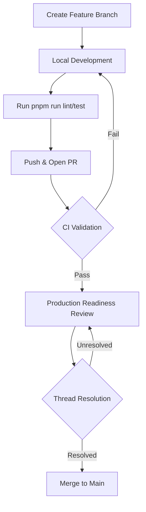

Relevant source files

The following files were used as context for generating this wiki page:

- [README.md](README.md)
- [AGENTS.md](AGENTS.md)
- [code_review.md](code_review.md)
- [.github/CONTRIBUTING.md](.github/CONTRIBUTING.md)
- [.github/LABELS.md](.github/LABELS.md)
- [.github/PROJECT_BOARD.md](.github/PROJECT_BOARD.md)
- [.github/pull_request_template.md](.github/pull_request_template.md)

# Development Workflow

The development workflow for TarkovTracker is designed to maintain a high-quality single-page application (SPA) through rigorous automated validation and structured collaboration. It centers on a specialized tech stack including Nuxt 4, Vue 3, TypeScript, and Supabase, with deployment handled via Cloudflare Pages and Workers.

Sources: [README.md:58-61](README.md#L58-L61), [AGENTS.md:38-42](AGENTS.md#L38-L42)

## Local Development Setup

To begin development, contributors must enable Corepack to manage `pnpm`, install dependencies, and configure environment variables for Supabase integration. Without Supabase credentials (`NUXT_PUBLIC_SUPABASE_URL` and `NUXT_PUBLIC_SUPABASE_ANON_KEY`), the application defaults to an offline mode using browser `localStorage` for progress persistence.

Sources: [README.md:46-56](README.md#L46-L56), [AGENTS.md:214-220](AGENTS.md#L214-L220)

### Essential Commands

| Task | Command | Description |
| :--- | :--- | :--- |
| **Dev Server** | `pnpm run dev` | Launches local server at `http://localhost:3000` |
| **Lint** | `pnpm run lint` | Runs ESLint/Prettier checks (zero warnings allowed) |
| **Typecheck** | `pnpm run typecheck` | Validates TypeScript strict typing |
| **Test** | `pnpm run test` | Executes Vitest suite |
| **Gateway Test** | `pnpm run test:api-gateway` | Specifically tests Cloudflare Worker logic |

Sources: [README.md:65-72](README.md#L65-L72), [AGENTS.md:61-68](AGENTS.md#L61-L68), [code_review.md:12-23](code_review.md#L12-L23)

## Contribution Pipeline

The project enforces a "one change per pull request" policy. This ensures that every PR is a single, reviewable unit such as a fix, a document improvement, or a specific feature. PRs that bundle unrelated changes are typically rejected or asked to split.

Sources: [README.md:76-78](README.md#L76-L78), [AGENTS.md:154-155](AGENTS.md#L154-L155)

### Branching and Commits

The workflow utilizes a structured commit naming convention based on types and scopes defined in `commitlint.config.js`. Contibutors are encouraged to work on standard branches unless a `worktree` is explicitly required for testing separate branches simultaneously.

Sources: [AGENTS.md:183-207](AGENTS.md#L183-L207)

#### Commit Types and ScScopes

| Element | Examples |
| :--- | :--- |
| **Types** | `feat`, `fix`, `docs`, `refactor`, `test`, `ci`, `chore` |
| **Scopes** | `app`, `workers`, `api`, `ui`, `tasks`, `hideout`, `i18n`, `config` |

Sources: [AGENTS.md:200-207](AGENTS.md#L200-L207)

### Pull Request Lifecycle

The pull request process follows a strict sequence of automated checks and manual reviews before merging is permitted.

The diagram above illustrates the path from initial branch creation to the final merge, highlighting the iterative nature of the review phase.

Sources: [AGENTS.md:162-181](AGENTS.md#L162-L181), [code_review.md:12-23](code_review.md#L12-L23)

## Technical Standards

Contributors must adhere to specific architectural "hard rules" to maintain codebase consistency:

- **SPA-Only:** Server-Side Rendering (SSR) is strictly disabled (`ssr: false`). Features like `useAsyncData` SSR options or server-only middleware must not be used.
- **Tailwind v4:** Styling is strictly Tailwind-based. Scoped `<style>` blocks, SCSS, and hex color values in templates are prohibited.
- **Imports:** Parent-relative imports are blocked; all internal imports must use the `@/` alias.
- **Localization:** Only `app/locales/en.json` should be edited. All other languages are managed via Crowdin.

Sources: [AGENTS.md:131-152](AGENTS.md#L131-L152), [code_review.md:30-41](code_review.md#L30-L41)

## Review and Validation Policy

A PR cannot be merged until all automated checks pass and all review threads have an explicit disposition. The "Production Readiness Review" is the final gate, focusing on critical risk areas.

### Risk Areas for Review

1.  **Supabase Migrations:** Must be forward-compatible to avoid breaking existing frontend code during rolling deployments. RPC additions must not bypass Row Level Security (RLS).
2.  **Cloudflare Workers:** Review focuses on Durable Object (DO) alarm lifecycles and avoiding alarm leaks.
3.  **KV Precompute:** Requires strict schema agreement between precompute scripts (`scripts/precompute/`) and the handlers reading the data.
4.  **Pinia Stores:** `useTarkovStore` is the core state. Changes must be backward-compatible to avoid corrupting persisted user sessions.

Sources: [AGENTS.md:162-181](AGENTS.md#L162-L181), [code_review.md:43-100](code_review.md#L43-L100)

### Severity Calibration

| Level | Impact |
| :--- | :--- |
| **P0** | Data loss, auth bypass, service-role key exposure, broken deployment. |
| **P1** | Broken feature for segments, migration breaking rolling deploy, stale state via leaks. |
| **P2** | Missing test coverage, silent error swallowing, missing locale fallbacks. |
| **P3** | Minor naming cleanup, optional tests, locale key case violations. |

Sources: [code_review.md:104-116](code_review.md#L104-L116)

## Summary

The TarkovTracker development workflow prioritizes architectural stability and data integrity. By combining strict technical rules—such as SPA-only constraints and Tailwind v4 standards—with a mandatory review process that evaluates compatibility across Supabase and Cloudflare infrastructures, the project ensures that contributions do not disrupt the user experience or existing progress data.
