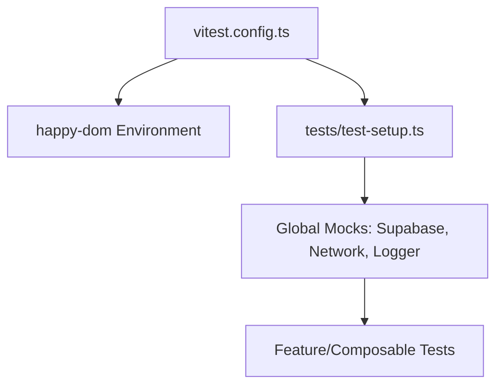
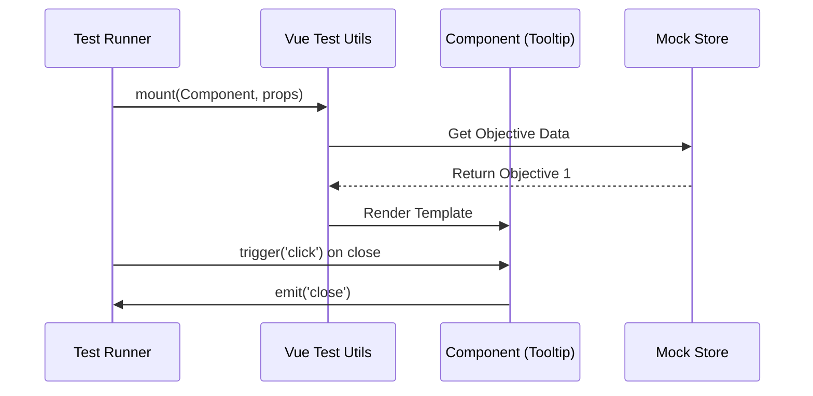

Relevant source files

The following files were used as context for generating this wiki page:

- [vitest.config.ts](vitest.config.ts)
- [tests/test-setup.ts](tests/test-setup.ts)
- [AGENTS.md](AGENTS.md)
- [code_review.md](code_review.md)
- [app/composables/__tests__/useXpCalculation.test.ts](app/composables/__tests__/useXpCalculation.test.ts)
- [app/features/maps/__tests__/LeafletObjectiveTooltip.test.ts](app/features/maps/__tests__/LeafletObjectiveTooltip.test.ts)
- [tests/llms-txt.test.ts](tests/llms-txt.test.ts)

# Testing Strategy

The Testing Strategy for TarkovTracker is built on a multi-layered approach designed to validate a Nuxt 4 Single-Page Application (SPA). The strategy emphasizes deterministic unit testing, component validation, and automated data integrity checks. Vitest serves as the primary testing engine, configured to run in a client-only environment that mirrors the project's production architecture.

Sources: [AGENTS.md:46](AGENTS.md#L46), [vitest.config.ts](vitest.config.ts), [code_review.md:15-20](code_review.md#L15-L20)

## Core Framework and Configuration

The project utilizes **Vitest** for all JavaScript and TypeScript testing. Tests are generally co-located with the source code within `__tests__` directories, using the `*.test.ts` naming convention.

### Environment and Setup
The testing environment is configured as `happy-dom` to support Vue component testing without a full browser. A global setup file, `tests/test-setup.ts`, is used to establish common mocks and configurations required across the suite.

The diagram above illustrates the configuration flow from the base Vitest file through global setups to individual test suites.

Sources: [vitest.config.ts](vitest.config.ts), [tests/test-setup.ts](tests/test-setup.ts), [AGENTS.md:157](AGENTS.md#L157)

### Key Validation Commands
The project defines specific commands for different testing scopes:

| Command | Purpose |
| :--- | :--- |
| `pnpm run test` | Executes the standard test suite. |
| `pnpm run test:watch` | Runs tests in watch mode for local development. |
| `pnpm run test:coverage` | Generates code coverage reports (uploaded to Codecov in CI). |
| `pnpm run test:api-gateway` | Specifically tests the Cloudflare Workers API gateway. |

Sources: [AGENTS.md:92-95](AGENTS.md#L92-L95), [code_review.md:21-25](code_review.md#L21-L25)

## Testing Layers

### Unit Logic and Composables
Unit tests focus on pure logic and Nuxt/Vue composables. These tests often involve mocking Pinia stores and verifying state transitions or complex calculations (e.g., experience/level progression).

**Example: XP Calculation Testing**
Tests for `useXpCalculation` verify that:
- Quest XP is summed correctly based on task completion.
- Total XP accounts for user-defined offsets.
- Levels are correctly derived from XP thresholds.
- Progress percentage and XP required for the next level are accurate.

Sources: [app/composables/__tests__/useXpCalculation.test.ts:48-125](app/composables/__tests__/useXpCalculation.test.ts#L48-L125)

### Component Testing
Component tests utilize `@vue/test-utils` and the `mount` function to verify UI behavior, props, and emitted events. Components are tested in isolation with mocked dependencies.

The sequence diagram demonstrates the flow of a component test, from mounting with mocked stores to verifying event emissions.

Sources: [app/features/maps/__tests__/LeafletObjectiveTooltip.test.ts:32-60](app/features/maps/__tests__/LeafletObjectiveTooltip.test.ts#L32-L60)

### Specialized Data Validation
The project includes tests that validate non-code assets and specific configurations to ensure consistency:
- **llms.txt Validation:** Ensures the `llms.txt` file contains valid hyperlinks, covers all supported UI locales, and advertises all public API handlers present on disk.
- **Resource Data Parity:** Validates that community tool guides have the correct i18n keys and that search functionality matches expected keywords.

Sources: [tests/llms-txt.test.ts:50-120](tests/llms-txt.test.ts#L50-L120), [app/features/resources/__tests__/resourceData.test.ts](app/features/resources/__tests__/resourceData.test.ts)

## Validation Policy and CI

TarkovTracker enforces a strict validation policy before any changes can be merged.

### Mandatory Checks
AI agents and contributors must run the smallest relevant validation for their task. The full validation pipeline required for a "READY" verdict includes:
1. `pnpm run typecheck`: Strict TypeScript validation.
2. `pnpm run lint`: Zero-warning ESLint/Prettier check.
3. `pnpm run test`: Full Vitest suite.
4. `pnpm run i18n:check`: Fatal check for `snake_case` violations in `en.json`.
5. `pnpm run validate:openapi`: Ensures API schemas are consistent.

Sources: [AGENTS.md:100-115](AGENTS.md#L100-L115), [code_review.md:14-20](code_review.md#L14-L20)

### Test Determinism
A core requirement of the testing strategy is determinism. Developers are instructed to:
- Mock all Supabase and network calls.
- Use `vi.doMock` for store and utility isolation.
- Ensure tests do not rely on external service state.

Sources: [AGENTS.md:195](AGENTS.md#L195), [app/features/maps/__tests__/LeafletObjectiveTooltip.test.ts:25-30](app/features/maps/__tests__/LeafletObjectiveTooltip.test.ts#L25-L30)

## Risk Areas and Mitigation

| Risk Area | Testing/Validation Approach |
| :--- | :--- |
| **Database Migrations** | Manual inspection for forward compatibility and RLS policy integrity. |
| **KV Precompute** | Verified by ensuring precompute scripts and request handlers agree on payload schemas. |
| **Pinia Store State** | Tests verify `useTarkovStore` shape changes do not break dependent stores. |
| **Cloudflare Workers** | Specialized `test:api-gateway` command for Durable Object and rate-limiter logic. |

Sources: [code_review.md:38-85](code_review.md#L38-L85)

The Testing Strategy ensures that the TarkovTracker SPA remains stable through frequent game data updates and community contributions by combining rigorous logic validation with automated UI and asset consistency checks.
