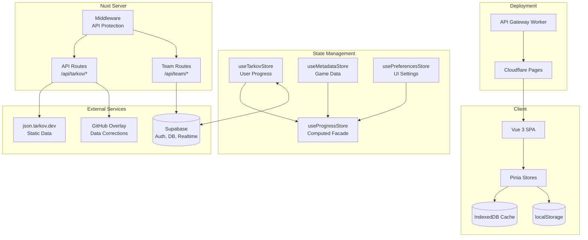
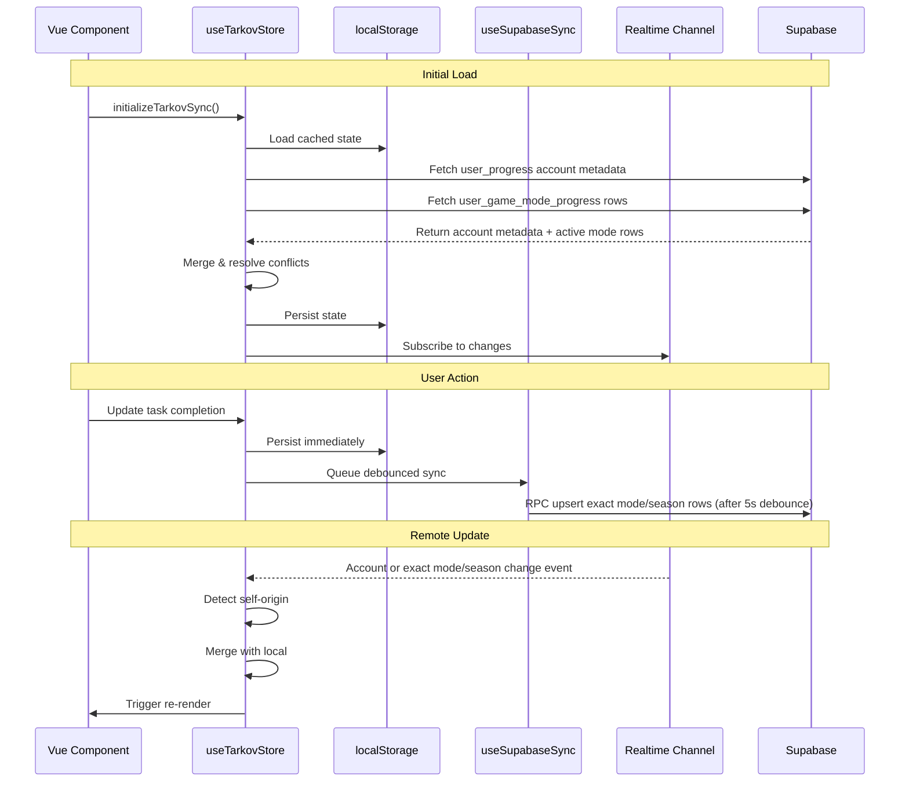
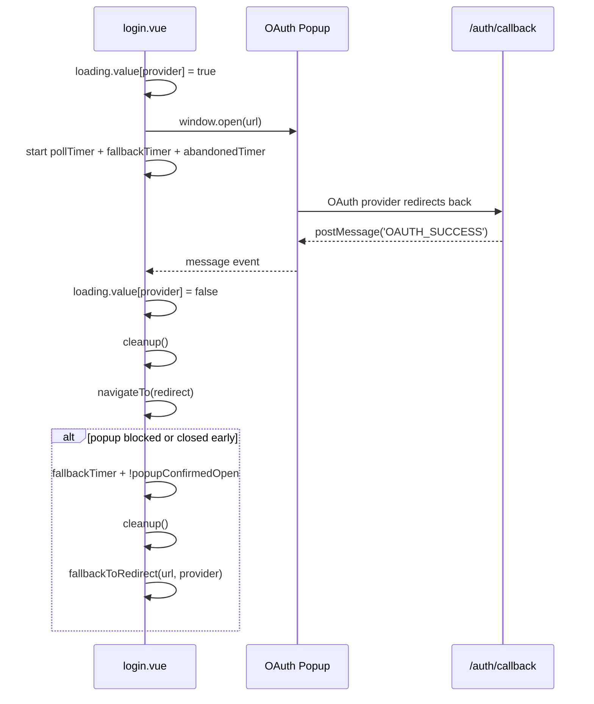
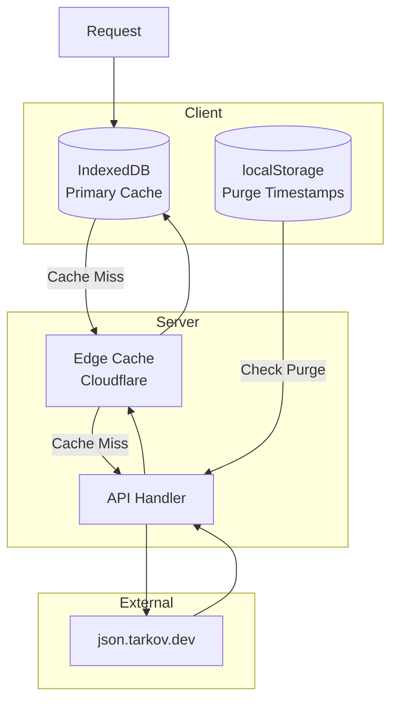

# TarkovTracker Architecture Documentation

<!-- AGENT QUICK REFERENCE
Canonical env var map: §Environment Variables (~40 vars with descriptions).
Naming: SUPABASE_* shared, NUXT_* private server, NUXT_PUBLIC_* browser-exposed.
wrangler.toml is source of truth for Cloudflare Pages vars/bindings.
Quoting: quote in TOML, unquoted in .env/.dev.vars unless dotenv requires it.
-->

## Overview

TarkovTracker is a sophisticated single-page application (SPA) for tracking progress in Escape from Tarkov. Built with Nuxt 4, Vue 3, and Supabase, it provides real-time multi-device synchronization, team collaboration, and comprehensive task/hideout tracking.

## Technology Stack

| Layer             | Technology       | Version  |
| ----------------- | ---------------- | -------- |
| Framework         | Nuxt             | ^4.4.2   |
| UI Library        | Vue 3            | ^3.5.32  |
| Component Library | @nuxt/ui         | ^4.6.1   |
| Styling           | Tailwind CSS     | ^4.2.2   |
| State Management  | Pinia            | ^3.0.4   |
| Backend           | Supabase         | ^2.103.0 |
| Deployment        | Cloudflare Pages | -        |
| Maps              | Leaflet          | ^1.9.4   |
| Graphs            | Vue Flow         | ^1.48.2  |
| i18n              | Vue I18n         | ^11.3.2  |

## Project Structure

```text
/
├── app/                      # Application source (Nuxt srcDir)
│   ├── assets/              # Static assets (CSS, images)
│   ├── components/          # Global UI components
│   ├── composables/         # Reusable composition functions
│   ├── data/                # Static data (maps.json)
│   ├── features/            # Feature modules (domain slices)
│   │   ├── admin/           # Admin dashboard
│   │   ├── dashboard/       # Main dashboard
│   │   ├── drawer/          # Side-drawer and help UI
│   │   ├── hideout/         # Hideout tracking
│   │   ├── maps/            # Interactive maps
│   │   ├── neededitems/     # Required items tracker
│   │   ├── profile/         # Profile and shared progress views
│   │   ├── settings/        # User settings
│   │   ├── storyline/       # Storyline progression
│   │   ├── streamer-tools/  # Streamer overlay tooling
│   │   ├── supporter/       # Supporter/tier management
│   │   ├── tasks/           # Task/quest tracking
│   │   └── team/            # Team collaboration
│   ├── layouts/             # Page layouts
│   ├── locales/             # i18n translations (JSON)
│   ├── pages/               # File-based routing
│   ├── plugins/             # Nuxt plugins
│   ├── server/              # Nitro server routes
│   │   ├── api/             # API endpoints
│   │   ├── middleware/      # Server middleware
│   │   └── utils/           # Server utilities
│   ├── shell/               # App chrome (nav, footer)
│   ├── stores/              # Pinia stores
│   ├── types/               # TypeScript definitions
│   └── utils/               # Utility functions
├── docs/                     # Documentation
├── supabase/                 # Supabase config and functions
├── workers/                  # Cloudflare Workers
│   └── api-gateway/         # External API gateway + Durable Object rate limiter
├── nuxt.config.ts           # Nuxt configuration
├── package.json             # Dependencies
└── vitest.config.ts         # Test configuration
```

Rate limiting is multi-plane (Worker DO, Edge mutation counters, Pages shared limits, Auth
platform limits). See [`RATE_LIMITING.md`](./RATE_LIMITING.md) for ownership, flows, and when to
use which enforcer.

## Architecture Diagram



## State Management

### Three-Store Pattern + Facade

TarkovTracker uses a **three-store pattern** with Pinia plus a computed facade:

1. **useTarkovStore** - User progress (tasks, hideout, level)
2. **useMetadataStore** - Game data (tasks, items, maps)
3. **usePreferencesStore** - UI settings

**Facade:**

- **useProgressStore** - Computed properties combining all three stores

### Store Responsibilities

#### useTarkovStore (User Progress)

**Location:** `app/stores/useTarkov.ts`

Manages isolated progress for persistent PvP, persistent PvE, and numbered Seasonal PvP.

**Key Features:**

- localStorage persistence with user ID validation
- Supabase real-time sync with debouncing (5s)
- Normalized Supabase rows keyed by `(user_id, game_mode, season_number)`
- Multi-device conflict resolution
- Data migration for legacy formats
- Task repair mechanisms
- Stores a single linked `tarkovUid` for tarkov.dev profiles
- Treats import target mode as import-time UI state, not persisted account metadata

#### Tarkov.dev Linking and Importing

- A linked tarkov.dev account is represented by a single persisted `tarkovUid`.
- The app does **not** persist a long-lived "linked mode" or "imported mode" field.
- Unlinking a tarkov.dev account clears only the saved `tarkovUid`; it does not roll back imported
  progress, profile, skill, level, edition, or prestige fields.
- Refetching a linked profile asks for a profile mode because PvP, PvE, and Seasonal profile JSON
  use the same account id but different tarkov.dev mode routes.
- Tarkov.dev imports default to the current mode when the pasted source does not identify a mode.
  Mode-specific profile URLs fix the target to prevent cross-mode writes.
- The import UI accepts a full `tarkov.dev/players/{regular|pve|pvp-season}/{uid}` profile URL,
  fetches `players.tarkov.dev/{profile|pve|pvp-season}/{uid}.json` through the public
  `/api/tarkov-dev/profile` proxy, and parses that JSON with the existing Tarkov.dev profile parser.
- The import preview keeps parsed skill values collapsed by default, but exposes the exact
  skill-id and level pairs that will be applied.
- Tarkov.dev only refreshes that public JSON after the user opens their profile page on tarkov.dev,
  so the UI asks users to open the profile before importing.
- Tarkov.dev links use the currently viewed or selected mode only to choose the URL slug:
  `regular` for PvP, `pve` for PvE, and `pvp-season` for Seasonal.
- EFT-log imports are also locked for Seasonal until the active-season data source is verified.
- Legacy embedded `tarkovDevProfile` payloads are sanitized out of stored progress data and should
  not be reintroduced as long-lived state.

#### useMetadataStore (Game Data)

**Location:** `app/stores/useMetadata.ts`

Manages static game data from tarkov.dev API.

**Key Features:**

- Two-phase task loading (core → objectives → rewards)
- IndexedDB caching with TTL
- Graph building for task dependencies
- Item hydration for objectives
- Language-aware data fetching

#### useProgressStore (Computed Facade)

**Location:** `app/stores/useProgress.ts`

Provides computed properties combining all stores.

**Key Computed Properties:**

- `tasksCompletions` - Per-team task completion status
- `unlockedTasks` - Task availability considering prerequisites
- `hideoutLevels` - Current hideout progression
- `objectiveCompletions` - Task objective progress
- `invalidTasks` - Data consistency validation

## Data Synchronization

### Supabase Sync Flow



### Conflict Resolution Strategy

1. **Sticky Complete Semantics**: Once a task is marked complete, it stays complete unless explicitly set to false
2. **Timestamp-Based Merging**: Newer entries take precedence
3. **Max Value Preservation**: For counts and levels, keep the higher value
4. **Self-Origin Filtering**: Ignore echoed updates from own device (< 3s threshold)

Persistent PvP and PvE use season number `0`. Seasonal PvP uses the active positive season number
(`1` for the initial integration). The legacy `user_progress` row remains the account-metadata
source and temporarily mirrors PvP/PvE for rolling compatibility; Seasonal progress exists only in
`user_game_mode_progress`. See [`SYSTEMS.md`](./SYSTEMS.md#7-game-mode-and-seasonal-progress-storage)
for the storage, RLS, team, sharing, prestige, backup, and compatibility invariants.

## Authentication

### OAuth Popup Flow (Login)

- Initial conditions:
  - `loading.value[provider]` is set to `true` before popup open.
  - `popupConfirmedOpen` starts as `false`.
  - `pollTimer`, `fallbackTimer`, and `abandonedTimer` are created.
- `pollTimer` runs every 500ms; if the popup closes, it clears `loading.value[provider]` and runs
  `cleanup()`, otherwise it sets `popupConfirmedOpen`.
- `fallbackTimer` runs at 3s; if `didCleanup` is false, loading is still active, the popup was never
  confirmed open, and the popup is missing or closed, it runs `cleanup()` and then
  `fallbackToRedirect(url, provider)`.
- `abandonedTimer` runs at 90s; if `didCleanup` is still false, it clears `loading.value[provider]` and
  runs `cleanup()` to abort the flow.
- Success path: on `OAUTH_SUCCESS` message from the popup, it clears `loading.value[provider]`, runs
  `cleanup()`, and navigates to the safe redirect.
- `popupConfirmedOpen` tracks whether the popup has been detected as open at least once to avoid
  triggering the redirect fallback unnecessarily.
- `loading.value[provider]` acts as the gate for the fallback timer; if loading is cleared, fallback exits.
- `cleanup()` clears timers, removes the message listener, and attempts to close the popup safely.



### Supabase Authentication

1. User authenticates via Supabase (OAuth/email)
2. JWT stored in session
3. Client initialization and session reads are single-flight per browser client.
4. Protected requests reuse the current access token; concurrent refreshes share one
   `refreshSession()` request per client.
5. Protected routes validate token
6. Team API validates membership

## API Architecture

### Tarkov Data API

All game data is fetched through Nuxt server routes that proxy to `json.tarkov.dev` static data.
Internal modes map to upstream endpoints as `pvp` → `regular`, `pve` → `pve`, and
`seasonal` → `pvp-season`.

| Endpoint                       | Purpose              | Cache TTL |
| ------------------------------ | -------------------- | --------- |
| `/api/tarkov/bootstrap`        | Player levels        | 12h       |
| `/api/tarkov/tasks-core`       | Tasks, maps, traders | 12h       |
| `/api/tarkov/tasks-objectives` | Task objectives      | 12h       |
| `/api/tarkov/tasks-rewards`    | Task rewards         | 12h       |
| `/api/tarkov/hideout`          | Hideout stations     | 12h       |
| `/api/tarkov/items-lite`       | Items (minimal)      | 24h       |
| `/api/tarkov/items`            | Items (full)         | 24h       |
| `/api/tarkov/prestige`         | Prestige levels      | 24h       |
| `/api/tarkov/map-spawns`       | Map spawn points     | 12h       |
| `/api/tarkov/cache-meta`       | Cache purge status   | 5m edge   |

### Team API

| Endpoint            | Method | Purpose                    |
| ------------------- | ------ | -------------------------- |
| `/api/team/members` | GET    | Fetch team member profiles |

### Caching Strategy



## Security

### API Protection

```typescript
// nuxt.config.ts
runtimeConfig: {
  apiProtection: {
    allowedHosts: process.env.API_ALLOWED_HOSTS,
    trustedIpRanges: process.env.API_TRUSTED_IP_RANGES,
    requireAuth: process.env.API_REQUIRE_AUTH !== 'false',
    publicRoutes: '/api/tarkov/*,/api/tarkov-dev/profile',
    trustProxy: resolveTrustProxySetting({
      API_TRUST_PROXY: process.env.API_TRUST_PROXY,
      NITRO_PRESET: process.env.NITRO_PRESET,
    }),
  }
}
```

## Performance Optimizations

1. **IndexedDB Caching**: Reduce network requests
2. **Idle Task Scheduling**: Defer non-critical fetches
3. **Graph Building**: O(1) task dependency lookups
4. **Memoization**: Cache computed values
5. **Incremental List Loading**: Load long item/task lists progressively
6. **Manual Chunks**: Separate vendor bundles

## Testing

**Framework:** Vitest + Vue Test Utils

```bash
# Run all tests
pnpm run test

# Watch mode
pnpm run test:watch

# API Gateway tests
pnpm run test:api-gateway
```

**Test Organization:**

- Unit tests: `app/**/__tests__/*.test.ts`
- Mock strategy: Supabase client, network requests
- DOM environment: happy-dom

## Deployment

### Cloudflare Pages

```yaml
# Cloudflare Pages project build configuration (dashboard / CI build settings).
# Runtime app vars live in wrangler.toml [vars], not here.
Build command: pnpm run build
Build output: dist
Root directory: /
Node.js version: 24.x
# Pages Functions only handle /api/* and /overlay/*; the build promotes Nuxt's
# 200.html SPA fallback to index.html so Pages serves all app routes statically.
# Optional build-tool pin (Pages build image). Detection also works from
# pnpm-lock.yaml + packageManager without this env var.
# PNPM_VERSION: 10.34.5
```

### Environment Variables

Naming convention: `SUPABASE_*` for shared Supabase project settings, `NUXT_*` for Nuxt private
runtime config (server-only), `NUXT_PUBLIC_*` for Nuxt public runtime config (browser-exposed), and
plain names for platform/build-time or Supabase Edge Function settings.

`SUPABASE_URL` and `SUPABASE_ANON_KEY` are the canonical shared Supabase values. Nuxt, Cloudflare
Pages/Workers, and Supabase Edge Functions can all consume them, so they must not be duplicated as
`NUXT_PUBLIC_*` or `VITE_*` values.

Full resolution logic is in `app/utils/runtimeConfig.ts`.

### Environment value entry standard

Quote syntax depends on where a value is entered:

- In `wrangler.toml`, write string values as TOML strings, for example
  `APP_URL = "https://tarkovtracker.org"`. The TOML parser treats the quotation marks as syntax;
  they are not part of the resulting value.
- In `.env`, `.env.*`, and `.dev.vars*` files, use unquoted values by default, for example
  `APP_URL=https://tarkovtracker.org`. Dotenv permits both quoted and unquoted values, but matching
  dashboard entry style reduces copy/paste mistakes. Add quotes only when they are semantically
  required, such as preserving leading or trailing whitespace, including `#` as data, or expressing
  a supported multiline value.
- In a Cloudflare Pages or Workers dashboard **Value** field, enter only the raw value, for example
  `https://tarkovtracker.org`. Cloudflare stores and passes dashboard values as entered; quotation
  marks typed into the field become part of the value.
- At an interactive `wrangler secret put` value prompt, enter only the raw secret. Shell quotes used
  around command arguments are shell syntax, but quotation marks pasted or piped as secret content
  are data and are preserved.
- Never place private credentials in `[vars]` or commit them to `wrangler.toml`. Store them as
  encrypted Cloudflare secrets. It is safe for intentionally public identifiers such as the
  Supabase anon key and Turnstile sitekey to remain plaintext configuration.

Therefore, TOML strings stay quoted because TOML requires a string delimiter. Dotenv and dashboard
values stay unquoted unless the dotenv value specifically requires quoting. Interactive secret
fields never include decorative wrapping quotes.

References: Cloudflare's Pages bindings and Workers secrets documentation, Cloudflare's Pages API
(`env_vars.*.value` is the stored string), Node.js's dotenv specification, and TOML v1.0.

Cloudflare Pages production and preview configuration is sourced from `wrangler.toml`. Dashboard
entries are reserved for encrypted secrets; do not duplicate plaintext `[vars]` there. Smart
Placement is enabled for both environments through the top-level `[placement]` block.

**Client-side (browser) — Nuxt public runtime config:**

| Variable                                         | Description                                              | Required |
| ------------------------------------------------ | -------------------------------------------------------- | -------- |
| `SUPABASE_URL`                                   | Shared Supabase project URL for auth and sync            | Yes¹     |
| `SUPABASE_ANON_KEY`                              | Shared Supabase anon key for auth and sync               | Yes¹     |
| `NUXT_PUBLIC_CLIENT_LOG_SINK_URL`                | Optional browser log collector URL (disabled by default) | No       |
| `NUXT_PUBLIC_TURNSTILE_SITE_KEY`                 | Turnstile widget sitekey for Tarkov.dev profile imports  | No²      |
| `NUXT_PUBLIC_TARKOV_DEV_IMPORT_COOLDOWN_MINUTES` | Browser cooldown after a confirmed profile import        | No       |

> **¹ Required in production.** These shared names are consumed by Nuxt, Pages, Workers, and Edge
> Functions. Without Supabase configuration, auth, sync, realtime, and team features are unavailable;
> the app runs in offline mode with localStorage only.
>
> **² Turnstile is optional, but its public sitekey and private secret must be configured together.
> Local development uses Cloudflare's always-pass test keys automatically.**

`VITE_PERF_DEBUG` is an opt-in client performance debugging switch. Set it to `1`, `true`, `yes`,
or `on` before starting the dev server or building the app to enable timing logs from
`app/utils/perf.ts` through the shared client logger. Leave it unset or set it to `false` for normal
builds. This is a Vite build-time variable, not Nuxt runtime configuration.

**Server-side (Nuxt private runtime config):**

| Variable                                        | Description                                         | Required   |
| ----------------------------------------------- | --------------------------------------------------- | ---------- |
| `NUXT_SUPABASE_SERVICE_KEY`                     | Supabase service role key                           | Yes (prod) |
| `NUXT_TARKOV_JSON_BASE_URL`                     | Static game-data JSON base URL override             | No         |
| `NUXT_LOG_SINK_URL`                             | Centralized server log sink (HTTPS)                 | No         |
| `NUXT_TWITCH_CLIENT_ID`                         | Twitch API client ID                                | No         |
| `NUXT_GITHUB_CONTRIBUTORS_EXCLUDE`              | Bot accounts excluded from contributors             | No         |
| `NUXT_GITHUB_TIMEOUT_MS`                        | GitHub API timeout                                  | No         |
| `NUXT_GITHUB_TOKEN`                             | GitHub API token                                    | No         |
| `NUXT_CACHE_BYPASS_ENABLED`                     | Enable server-side cache bypass header              | No         |
| `API_ALLOWED_HOSTS`                             | Allowed origin hosts                                | No         |
| `API_TRUSTED_IP_RANGES`                         | Trusted IP ranges (CIDR)                            | No         |
| `API_REQUIRE_AUTH`                              | Require auth for protected routes (default true)    | No         |
| `API_PUBLIC_ROUTES`                             | Routes exempt from auth                             | No         |
| `API_TRUST_PROXY`                               | Trust proxy headers (auto-detected on Cloudflare)   | No         |
| `STRIPE_SECRET_KEY`                             | Stripe API secret key                               | Yes (prod) |
| `STRIPE_PRICE_SCAV_MONTHLY`                     | Stripe price ID for Scav monthly plan               | Yes (prod) |
| `STRIPE_PRICE_SCAV_6MONTH`                      | Stripe price ID for Scav 6-month plan               | Yes (prod) |
| `STRIPE_PRICE_SCAV_YEARLY`                      | Stripe price ID for Scav yearly plan                | Yes (prod) |
| `STRIPE_PRICE_TIMMY_MONTHLY`                    | Stripe price ID for Timmy monthly plan              | Yes (prod) |
| `STRIPE_PRICE_TIMMY_6MONTH`                     | Stripe price ID for Timmy 6-month plan              | Yes (prod) |
| `STRIPE_PRICE_TIMMY_YEARLY`                     | Stripe price ID for Timmy yearly plan               | Yes (prod) |
| `STRIPE_PRICE_CHAD_MONTHLY`                     | Stripe price ID for Chad monthly plan               | Yes (prod) |
| `STRIPE_PRICE_CHAD_6MONTH`                      | Stripe price ID for Chad 6-month plan               | Yes (prod) |
| `STRIPE_PRICE_CHAD_YEARLY`                      | Stripe price ID for Chad yearly plan                | Yes (prod) |
| `NUXT_ACCOUNT_IP_HASH_SECRET`                   | HMAC secret for account-level IP audit records      | Yes (prod) |
| `NUXT_TARKOV_DEV_PROFILE_CACHE_TTL_MS`          | Tarkov.dev profile shared-cache TTL in milliseconds | No         |
| `NUXT_TARKOV_DEV_PROFILE_RATE_LIMIT_PER_MINUTE` | Per-IP profile-import requests per minute           | No         |
| `NUXT_TARKOV_DEV_PROFILE_RATE_LIMIT_PER_HOUR`   | Per-IP profile-import requests per hour             | No         |
| `NUXT_TARKOV_DEV_PROFILE_MAX_UPDATED_AGE_DAYS`  | Reject older profile snapshots; `0` disables        | No         |
| `NUXT_TURNSTILE_SECRET_KEY`                     | Server-side Turnstile secret for profile imports    | No²        |

**Build-time / platform:**

| Variable             | Description                            |
| -------------------- | -------------------------------------- |
| `APP_URL`            | Canonical production application URL   |
| `CF_PAGES_URL`       | Automatic Cloudflare Pages preview URL |
| `GA_MEASUREMENT_ID`  | Google Analytics measurement ID        |
| `CLARITY_PROJECT_ID` | Microsoft Clarity project ID           |
| `VITE_PERF_DEBUG`    | Client performance timing logs         |

**Supabase Edge Functions** (set in Supabase Dashboard, not Cloudflare Pages):

`SUPABASE_URL`, `SUPABASE_ANON_KEY`, and `SUPABASE_SERVICE_ROLE_KEY` are platform-managed canonical
Edge Function values. Nuxt uses `NUXT_SUPABASE_SERVICE_KEY` for the privileged key. `APP_URL` is the
canonical application URL used by `admin-cache-purge`; it has no alias fallback.
`STRIPE_SECRET_KEY` and `STRIPE_WEBHOOK_SECRET` are shared canonical names used by both Nuxt and
Edge Functions. `DISCORD_BOT_TOKEN`, `DISCORD_GUILD_ID`, `DISCORD_SUPPORTER_ROLE_ID`,
`DISCORD_LINKED_ROLE_ID`, `CLOUDFLARE_ZONE_ID`, and `CLOUDFLARE_API_TOKEN` are Edge-only. See
`supabase/functions/.env.example`.

**Cloudflare Workers** (`workers/api-gateway`, set via `wrangler secret put`):

| Variable                    | Description                                                    | Required   |
| --------------------------- | -------------------------------------------------------------- | ---------- |
| `SUPABASE_URL`              | Supabase project URL                                           | Yes        |
| `SUPABASE_ANON_KEY`         | Supabase anon key                                              | Yes        |
| `SUPABASE_SERVICE_ROLE_KEY` | Supabase service role key                                      | Yes        |
| `IP_HASH_SECRET`            | HMAC secret for pseudo-anonymizing IPs in abuse-gate log lines | Yes (prod) |

## Code Conventions

- **Indent:** 2 spaces
- **Line width:** 100 characters
- **Strings:** Single quotes
- **Semicolons:** Always
- **Imports:** Use `@/` alias
- **Components:** PascalCase
- **Colors:** Tailwind tokens only (no hex)
- **Comments:** Only where necessary
