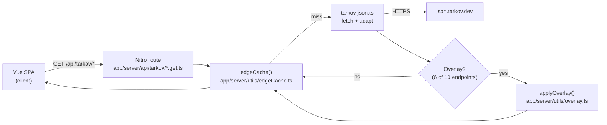
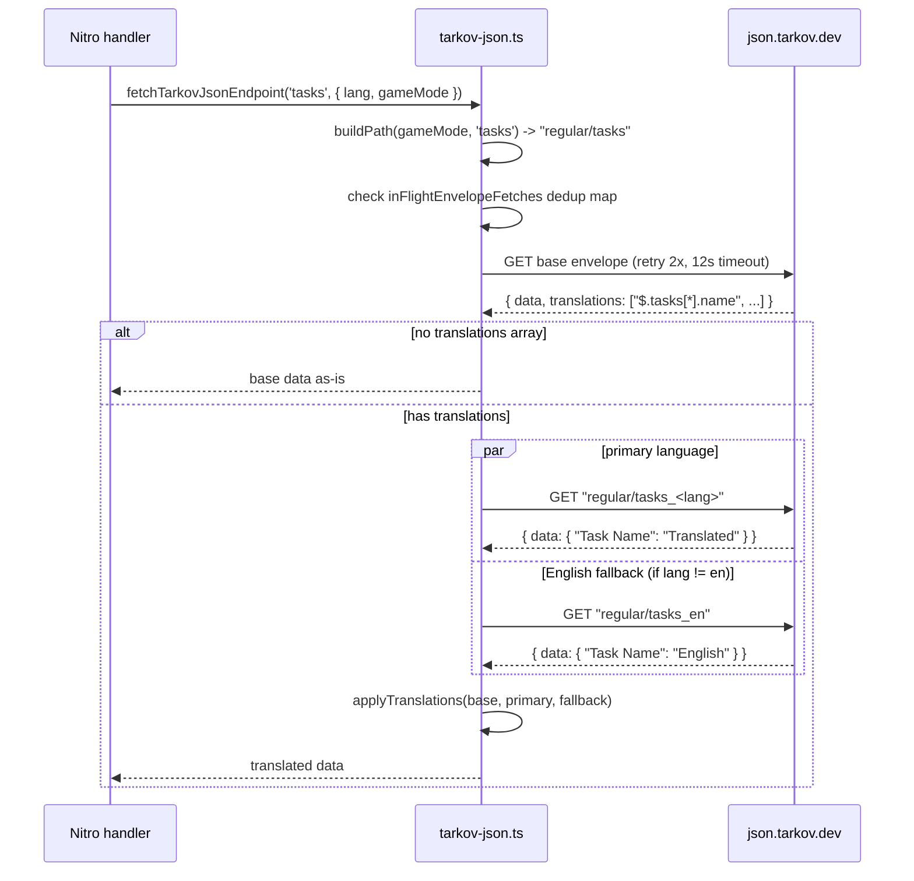
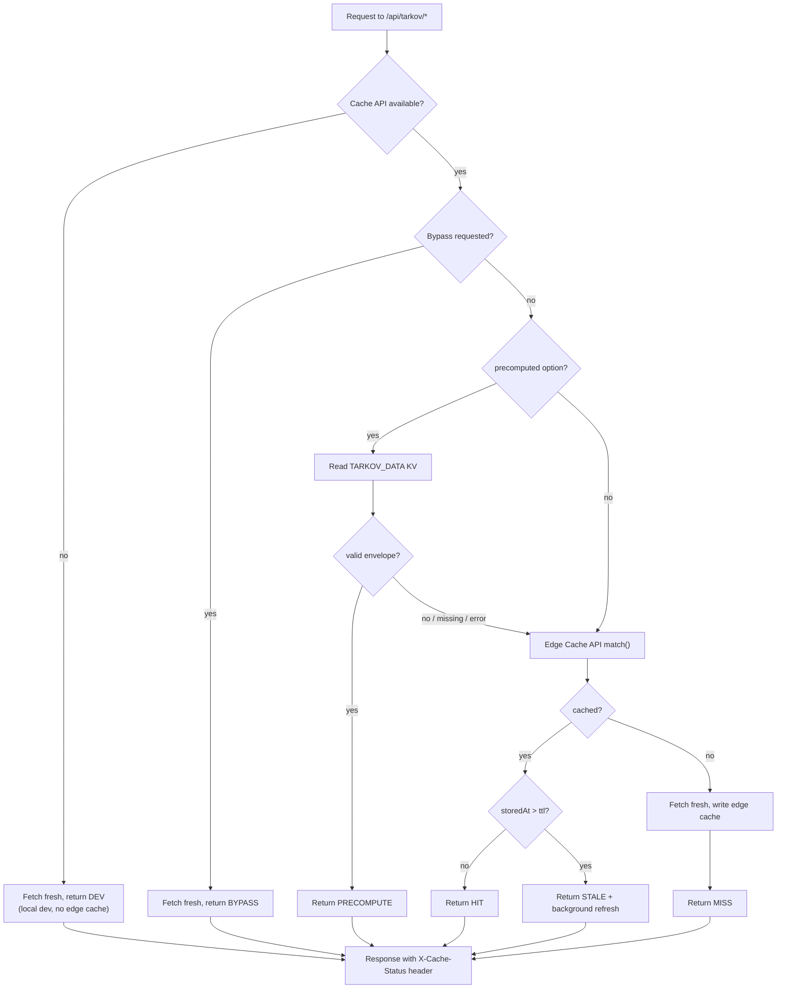
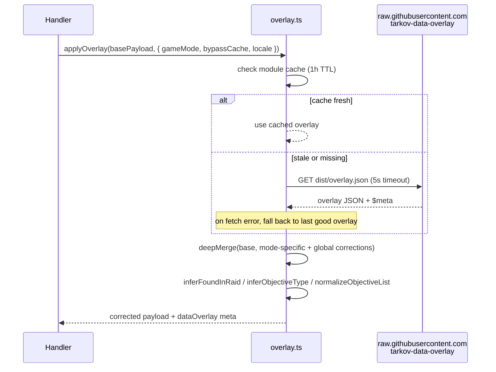
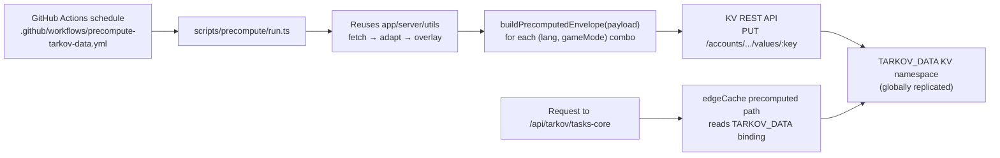
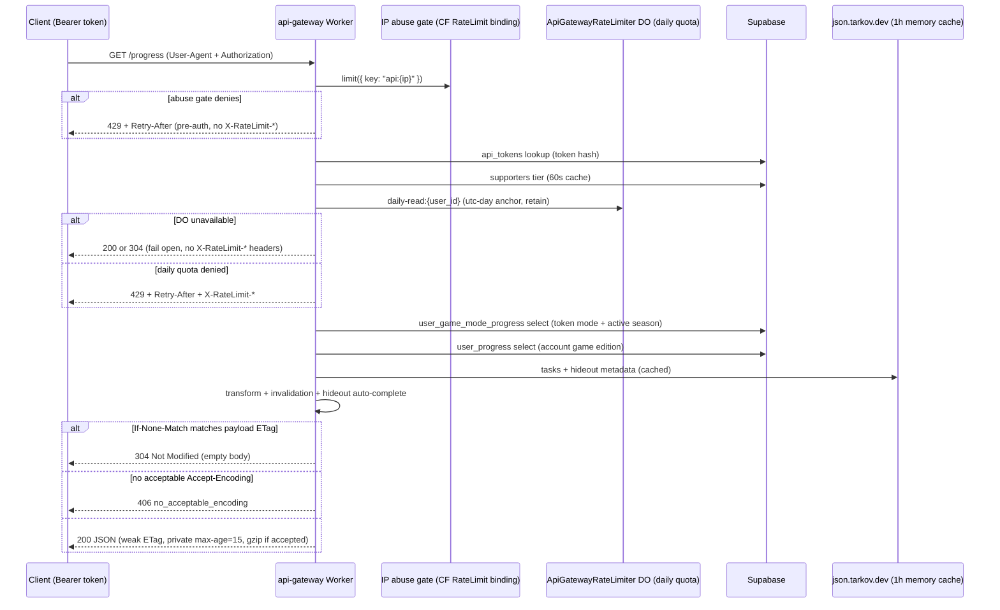
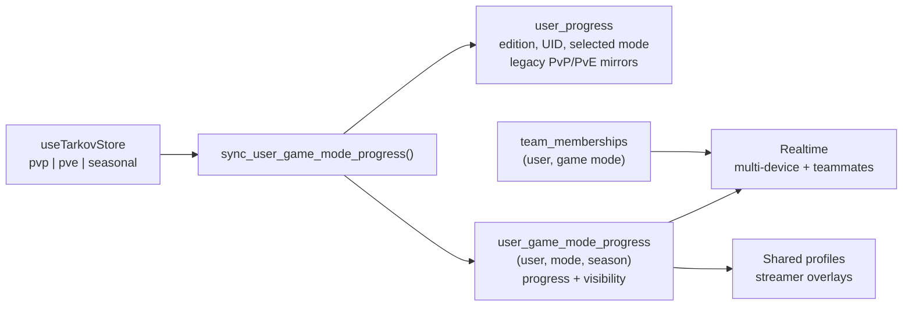
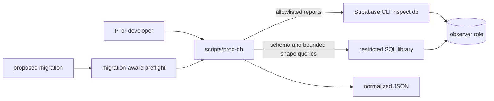
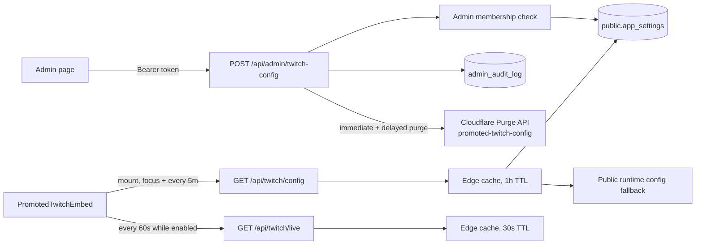

# TarkovTracker Systems Spec

<!-- AGENT QUICK REFERENCE
Endpoint table with cache TTLs: §1 (Tarkov.dev data integration)
Each section ends with code-binding INVARIANTS — check these when modifying a system.
Game-mode + seasonal progress storage: §7
Implementing files are listed within each section body.
-->

This document explains **how the non-obvious systems in TarkovTracker actually work**, in plain
language with diagrams. It is the spec you point at when you want to ask "why does the app do X?"
and have an agent verify the answer against the code.

> **How to use this doc**
>
> - Each system has: a short plain-English summary, a diagram, a step-by-step flow, a list of the
>   files that implement it, and the **invariants** the code must hold. If the code and an invariant
>   disagree, the code is the bug (or the invariant is stale — fix the doc in the same PR).
> - File paths are relative to the repo root so agents can open them directly.
> - When a system changes, update its section here in the same PR. `AGENTS.md` enforces this.

## Systems covered

1. [Tarkov.dev data integration](#1-tarkovdev-data-integration) — where game data comes from
2. [Data fetching pipeline](#2-data-fetching-pipeline) — retries, timeouts, translations, dedup
3. [Multi-layer caching](#3-multi-layer-caching) — the four cache layers and how they fall through
4. [Overlay corrections](#4-overlay-corrections) — fixing wrong upstream data
5. [Precompute workflow](#5-precompute-workflow) — warming KV off the request path
6. [Progress API data flow](#6-progress-api-data-flow) — how an external `GET /progress` is served
7. [Game-mode and Seasonal progress storage](#7-game-mode-and-seasonal-progress-storage) —
   normalized persistence, compatibility, sharing, and teams
8. [Tarkov.dev profile import](#8-tarkovdev-profile-import) — player profile fetch, caching,
   freshness gate, abuse controls
9. [Production database observer](#9-production-database-observer) — bounded read-only telemetry,
   JSON normalization, and migration preflight
10. [Promoted Twitch configuration](#10-promoted-twitch-configuration) — admin-managed stream
    selection, public resolution, and client polling
11. [Boot-time asset-failure recovery](#11-boot-time-asset-failure-recovery) — recovering from
    stale-chunk load failures before and after the app boots
12. [Map objective visibility and required items](#12-map-objective-visibility-and-required-items) —
    map marker categories and split pinned/active requirements

---

## 1. Tarkov.dev data integration

**Summary.** TarkovTracker does not ship its own copy of the game database. Static game data
(tasks, hideout stations, items, maps, traders, prestige levels, player levels, map spawns) comes
from the community-maintained `json.tarkov.dev` static JSON API. The browser never calls
`json.tarkov.dev` directly — every request goes through our own Nitro server routes under
`/api/tarkov/*`. The server route fetches from upstream, adapts the raw JSON into the shape our
client expects, and (for most endpoints) applies corrections (see [Overlay](#4-overlay-corrections))
before returning it.

> **Note on upstream endpoints.** `json.tarkov.dev` is the static JSON API TarkovTracker uses for
> all Tarkov.dev game data. TarkovTracker no longer uses the older `api.tarkov.dev` GraphQL API;
> do not use it for new TarkovTracker functionality. The current static endpoint list is available
> at `https://json.tarkov.dev/endpoints`.

**Why a proxy instead of calling upstream from the browser?**

- We control caching headers and can serve stale-while-revalidate from the Cloudflare edge.
- We can apply the overlay and adapt the payload once on the server instead of in every client.
- We can keep the upstream retry/timeout budget server-side (see [Data fetching](#2-data-fetching-pipeline)).
- We avoid leaking the user's IP to a third party and avoid CORS quirks.

### Endpoints

| Endpoint                       | Purpose              | Cache TTL | Precomputed? | Overlay? |
| ------------------------------ | -------------------- | --------- | ------------ | -------- |
| `/api/tarkov/bootstrap`        | Player levels        | 12h       | no           | no       |
| `/api/tarkov/tasks-core`       | Tasks, maps, traders | 12h       | **yes**      | yes      |
| `/api/tarkov/tasks-objectives` | Task objectives      | 12h       | no           | yes      |
| `/api/tarkov/tasks-rewards`    | Task rewards         | 12h       | no           | yes      |
| `/api/tarkov/hideout`          | Hideout stations     | 12h       | no           | yes      |
| `/api/tarkov/items-lite`       | Items (minimal)      | 24h       | no           | yes      |
| `/api/tarkov/items`            | Items (full)         | 24h       | no           | yes      |
| `/api/tarkov/prestige`         | Prestige levels      | 24h       | no           | no       |
| `/api/tarkov/map-spawns`       | Map spawn points     | 12h       | no           | no       |
| `/api/tarkov/cache-meta`       | Cache purge status   | 5m edge   | no           | no       |

Overlay is applied by the six task/hideout/item endpoints. `bootstrap`, `prestige`,
`map-spawns`, and `cache-meta` fetch directly into `edgeCache` without the overlay step —
their upstream data does not currently need corrections.

Only `tasks-core` is precomputed today (it is the largest, hottest, and most expensive payload).
See [Precompute](#5-precompute-workflow).

The hideout route is the cache-order exception: its `json-v4` edge entry stores the adapted base
payload, then the handler applies the current module-cached overlay after every edge-cache read. Its
browser IndexedDB entry also uses `json-v4`, with a one-hour TTL matching overlay freshness. This
keeps the 12-hour edge cache and the browser cache from pinning an old overlay correction. The other
overlay-enabled routes cache their final overlay-applied payload.

### Diagram



### Files

- `app/server/api/tarkov/*.get.ts` — one handler per endpoint; thin wrappers around `edgeCache`.
- `app/server/utils/tarkov-json.ts` — upstream fetch + adapt into client types.
- `app/server/utils/tarkov-cache-config.ts` — TTL constants and game-mode validation.
- `app/types/tarkov.ts` — the adapted shapes the client stores.

### Invariants

- The browser must never call `json.tarkov.dev` directly. All static game data flows through
  `/api/tarkov/*`.
- Every endpoint handler returns its payload through `edgeCache()`; no handler fetches upstream
  outside the cache wrapper.
- Only `json.tarkov.dev` static endpoints are used for upstream game data. The `api.tarkov.dev`
  GraphQL playground is deprecated and must not be called by TarkovTracker code.
- Overlay is applied only by endpoints that call `applyOverlay()` in their handler. Adding a new
  endpoint does not imply adding overlay — only add it when the upstream data needs corrections.
- Game mode is validated with `validateGameMode()` and defaults to `regular` on any invalid input.
- Internal `pvp`, `pve`, and `seasonal` modes map to upstream `regular`, `pve`, and `pvp-season`
  respectively. The upstream endpoint catalog is the authority for supported slugs.
- Language is validated with `getValidatedLanguage()` and defaults to `en`.

---

## 2. Data fetching pipeline

**Summary.** `tarkov-json.ts` is the only module that talks to `json.tarkov.dev`. It fetches the
base (English) envelope, fetches the requested language envelope (and an English fallback if the
requested language is not English), then applies translations onto the base data. It has bounded
retries, a hard timeout, and deduplication of in-flight requests so a burst of cache misses for the
same payload only hits upstream once.

### Flow



### Retry, timeout, and dedup budget

- `DEFAULT_TIMEOUT_MS = 12000` per attempt, `DEFAULT_MAX_RETRIES = 2` attempts per envelope.
- Exponential backoff between attempts: 1s, then 2s, capped at 5s.
- The total upstream budget is bounded under Cloudflare's 100s origin limit. Worst case per route
  is roughly 2 legs (base + lang/en) × (2 retries × 12s + backoff) + overlay ≈ 55s, which fails
  fast (502) instead of triggering a 524.
- `inFlightEnvelopeFetches` is a module-level `Map<key, Promise>`. A concurrent cache miss for the
  same URL shares one upstream request. The key is `${url}|${timeoutMs}|${maxRetries}`.

### Translation application

`json.tarkov.dev` returns a `translations` array of JSONPath strings (e.g. `$.tasks[*].name`) that
point at string keys to look up in the language envelope. `applyTranslations` walks those paths and
replaces the key with the translated string.

- A fast path (`immutableUpdate`) handles the common JSONPath shapes (`*`, `prop[*]`, `prop`)
  without a dependency.
- If a path shape is not handled by the fast path, it falls back to `jsonpath-plus` for correctness.
- Primary language wins; English is the fallback when a key is missing in the primary language.

### Files

- `app/server/utils/tarkov-json.ts` — fetch, retry, dedup, adapt, translate.
- `app/server/utils/language-helpers.ts` — `getValidatedLanguage()`.

### Invariants

- Only `tarkov-json.ts` imports a fetcher for `json.tarkov.dev`. No other module hits upstream.
- Every upstream call uses `fetchEnvelope` (which enforces timeout + retry + dedup). No raw `$fetch`
  to upstream anywhere else.
- A missing translation falls back to English when available; otherwise, the original
  translation key is preserved.
- The upstream budget must stay under Cloudflare's 100s origin limit. If you add a new leg, budget
  it here.

---

## 3. Multi-layer caching

**Summary.** Game data is served from a four-layer cache that falls through on miss. The goal is:
**a warm colo never blocks on upstream, and a slow or failing upstream never blocks the user.**

### The four layers (in order)

1. **Precomputed KV** (globally replicated) — only when `edgeCache({ precomputed: true })`. Reads
   the `TARKOV_DATA` KV binding populated by the scheduled precompute workflow. See
   [Precompute](#5-precompute-workflow).
2. **Edge Cache API** (per-colo, Cloudflare `caches.default`) — the standard layer. Stores the
   adapted + overlay-applied payload with `s-maxage = ttl + staleTtl`. The hideout route instead
   stores its adapted base payload and applies the current overlay after the cache read.
3. **Upstream fetch** — on a cold miss, run the full pipeline (fetch → adapt → overlay) and write
   the result back into the edge cache.
4. **Dev fallback** — when running locally with no Cache API (`globalThis.caches` undefined), skip
   caching entirely and always fetch. Sets `X-Cache-Status: DEV`.

On top of these, the **client** has its own IndexedDB cache in `useMetadataStore` so the browser
does not re-fetch on every navigation. That layer is documented in `ARCHITECTURE.md`.

### Stale-while-revalidate

When an edge cache entry exists but is older than `ttl`, the handler:

1. Returns the stale payload immediately with `X-Cache-Status: STALE`.
2. Kicks off a background refresh via `reviveCacheEntry()`, guarded by an `inFlightRevalidations`
   set so only one refresh per key runs at a time.
3. Uses `ctx.waitUntil()` on Cloudflare so the response is not cut off when the request returns.

This is why a slow upstream never blocks a warm colo: the user gets stale data in milliseconds and
the refresh happens after the response is sent.

### Bypass

`shouldBypassCache(event)` returns true when `NUXT_CACHE_BYPASS_ENABLED` is on AND the request sends
`x-bypass-cache` / `x-cache-bypass` header, or `?nocache` / `?cacheBust` query. Bypass skips both KV
and edge cache, fetches fresh, and sets `X-Cache-Status: BYPASS`. Used for forcing a refresh after a
data correction.

### Diagram



### Response headers

| Header                | Meaning                                                             |
| --------------------- | ------------------------------------------------------------------- |
| `X-Cache-Status`      | One of `PRECOMPUTE`, `HIT`, `STALE`, `MISS`, `BYPASS`, `DEV`        |
| `X-Cache-Key`         | Full cache key (`prefix-key`)                                       |
| `Cache-Control`       | `public, max-age=ttl, s-maxage=ttl` for fresh; `no-cache` otherwise |
| `X-Overlay-Status`    | Overlay result (`fresh` / `cached` / `stale` / `missing`)           |
| `X-Overlay-Version`   | Overlay `$meta.version`                                             |
| `X-Overlay-Generated` | Overlay `$meta.generated` timestamp                                 |
| `X-Overlay-Sha256`    | Overlay `$meta.sha256`                                              |

### Files

- `app/server/utils/edgeCache.ts` — the `edgeCache()` function and `reviveCacheEntry()`.
- `app/server/utils/edgeCacheKey.ts` — builds the synthetic `Request` used as the Cache API key.
- `app/server/utils/edgeCacheSanitizers.ts` — sanitizes error messages before they reach the client.
- `app/server/utils/precomputedTarkov.ts` — KV binding contract shared with `scripts/precompute`.
- `app/server/utils/tarkov-cache-config.ts` — `CACHE_TTL_DEFAULT` (12h), `CACHE_TTL_EXTENDED` (24h).

### Invariants

- Cache layers must be checked in order: precomputed KV → edge Cache API → upstream. Never skip a
  layer or reorder them.
- A `STALE` response must always trigger exactly one background refresh (guarded by
  `inFlightRevalidations`).
- `X-Cache-Status` must be set on every successful response. Error responses from the
  catch block (502 on upstream failure) do not set it — the invariant covers the success
  paths only.
- The cache key must include language and game mode so two locales or modes never share an entry.
- Hideout edge-cache entries must contain the adapted base payload, not the overlay-applied response;
  `hideout.get.ts` applies the overlay after `edgeCache()` and restores the overlay metadata headers.
- The browser hideout cache version must match the server route version and its TTL must not exceed
  the one-hour overlay TTL.
- The precomputed envelope is only trusted if `isPrecomputedEnvelope()` returns true; a corrupt
  write falls through to the edge cache instead of serving `null`.

---

## 4. Overlay corrections

**Summary.** `json.tarkov.dev` is community-maintained and sometimes wrong (e.g. a task's
`minPlayerLevel` is off). The `tarkov-data-overlay` repo publishes a small JSON of corrections.
TarkovTracker fetches that overlay on the server, deep-merges it onto the upstream data, and
attaches overlay metadata to the response headers so we can tell which version was applied.

### Flow



### Behavior details

- Module-level cache (`cachedOverlay`, `cacheTimestamp`) with a 1-hour TTL
  (`OVERLAY_CACHE_TTL = 3600000`).
- The configured overlay URL must use HTTPS. Invalid URLs and non-HTTPS schemes fall back to the
  trusted `raw.githubusercontent.com` source so corrections cannot be modified in transit.
- Redirects are followed manually (`redirect: 'manual'`) for at most `MAX_OVERLAY_REDIRECTS = 3`
  hops, and every hop must also be HTTPS. A redirect to a non-HTTPS target, a redirect without a
  `location` header, or exceeding the hop limit aborts the fetch and leaves the previous overlay in
  place.
- Overlay task patches carry trader requirements in the raw upstream shape: one
  `traderRequirements` list discriminated by `requirementType` (`level` gates
  trader loyalty level, `reputation` gates standing). `applyOverlay` re-splits
  a patched task's merged list into `traderLevelRequirements` and
  `traderRequirements` (reputation-only) so availability and progress checks
  evaluate the right metric; a patch's `traderRequirements` replaces the whole
  requirement set.
- On fetch failure, serves the last good overlay (stale) rather than failing the request.
- Overlay supports mode-specific corrections under `modes[gameMode]` plus global corrections.
- Per-locale corrections under `locales[locale]` patch `tasks`, `items`, and `traders`
  (locale-sensitive fields such as name, wikiLink, and objective descriptions) and are applied last
  so they take precedence over global and mode-specific corrections. The locale defaults to `en`
  when a handler does not pass one.
- `tasksAdd` lets the overlay inject entirely new tasks not present upstream.
- Objective post-processing (`objectiveTypeInferrer.ts`) normalizes objective lists and infers
  `foundInRaid` flags so the client does not have to guess.
- `bypassCache: true` (from `shouldBypassCache`) forces an awaited overlay refresh — used after
  publishing a correction.
- A hideout request with an expired module-cached overlay serves the stale correction immediately
  and registers one coalesced refresh with the Cloudflare execution context. Background task
  rejections are logged and contained. A failed deferred refresh backs off for one minute before
  another hideout request may retry it. Cold requests still await the initial overlay fetch, whose
  five-second timeout covers both response headers and body parsing.
- Hideout applies the overlay after reading its versioned base-data edge entry, so its correction
  freshness is bounded by the overlay module's one-hour cache and browser cache TTL rather than the
  hideout edge TTL. Other
  overlay-enabled routes cache their final corrected payload; publishing new overlay data requires
  a Tarkov data cache purge so those entries and the browser cache-purge marker are invalidated.

### Files

- `app/server/utils/overlay.ts` — fetch, cache, merge, and deferred refresh coordination.
- `app/server/utils/backgroundTask.ts` — keeps deferred refreshes alive through the Cloudflare
  execution context.
- `app/server/utils/overlayResponseHeaders.ts` — restores overlay metadata headers when corrections
  are applied after an edge-cache read.
- `app/server/utils/deepMerge.ts` — `deepMerge` + `isPlainObject`.
- `app/server/utils/objectiveTypeInferrer.ts` — objective normalization.

### Invariants

- The overlay must never block the request path on a fresh fetch for more than
  `FETCH_TIMEOUT_MS = 5000`. On timeout, fall back to the cached overlay.
- A missing or malformed overlay must never cause a 5xx; the base payload is returned with
  `X-Overlay-Status: missing`.
- Overlay data must only be fetched over HTTPS on every server path. A non-HTTPS `OVERLAY_URL` must
  resolve to the trusted default, and no redirect hop may downgrade the transport — the fetch must
  fail rather than read a payload served over plaintext. `applyOverlay` follows HTTPS redirects
  manually; the streamer Kappa editions fetch in
  `app/server/api/streamer/[userId]/[mode]/kappa.get.ts` uses `redirect: 'error'` because its URL is
  a hardcoded constant that never redirects. Any new server-side overlay consumer must do one or the
  other.
- Overlay metadata (`status`, `version`, `generated`, `sha256`) must be propagated to response
  headers so we can debug which correction was applied. Routes that apply an overlay after
  `edgeCache()` must call `setOverlayResponseHeaders()` before returning.

---

## 5. Precompute workflow

**Summary.** `tasks-core` is the single largest, hottest, and most expensive payload — adapting it
inside a request on a cold, low-traffic Cloudflare colo used to exceed the Workers Free tier CPU
limit and trigger Error 1102. The fix: compute the final payload **off the request path** in a
scheduled GitHub Actions workflow, write it to the `TARKOV_DATA` KV namespace, and have the request
handler read it back through `edgeCache({ precomputed: true })`.

### Why GitHub Actions and not a scheduled Worker?

The account is on the Workers Free tier, whose CPU limit rules out a scheduled Worker doing the full
adapt pipeline. A scheduled GitHub Actions workflow on `pnpm` has no such limit and can reuse the
exact same `app/server/utils` pipeline via `tsx` with the repo's tsconfig paths, so the precompute
output is byte-identical to what the request handler would have produced.

### Flow



### Key contract

- The KV binding name is `TARKOV_DATA` (`PRECOMPUTED_KV_BINDING`).
- The envelope shape is `{ payload, storedAt, version }` with
  `PRECOMPUTED_ENVELOPE_VERSION = 1`.
- The cache key for `tasks-core` is built by `buildTasksCorePrecomputedKey(lang, gameMode)` and is
  `tasks-core-json-v2-<lang>-<gameMode>`. Both the precompute script and the request handler import
  this function from `precomputedTarkov.ts`, so the keys can never drift.
- Writes go through the Cloudflare REST API (one PUT per key) because the bulk endpoint's request
  size ceiling cannot hold all ~4.2MB envelopes in one call, and per-key writes isolate failures per
  `(lang, gameMode)` combo.

### Files

- `scripts/precompute/precompute.ts` — pipeline orchestration and `KvWriter` interface.
- `scripts/precompute/run.ts` — entry point invoked by the workflow.
- `scripts/precompute/kv.ts` — Cloudflare KV REST writer.
- `scripts/precompute/nuxt-imports.ts` — bridges Nuxt auto-imports for `tsx`.
- `.github/workflows/precompute-tarkov-data.yml` — schedule and secrets.
- `app/server/utils/precomputedTarkov.ts` — shared contract (binding name, envelope, key builder).

### Invariants

- The precompute script and the request handler must build the cache key with the same function
  (`buildTasksCorePrecomputedKey`). Never hard-code the key on either side.
- The envelope version must be bumped any time the envelope shape changes; old envelopes must be
  rejected by `isPrecomputedEnvelope()` and fall through to the edge cache.
- A missing or corrupt KV entry must fall through to the edge cache path, never 5xx.
- The precompute pipeline must reuse `app/server/utils` — it must not re-implement the adapt/overlay
  logic or the outputs will diverge from what the request handler would produce.

---

## 6. Progress API data flow

**Summary.** External clients (TarkovMonitor, RatScanner, tarkov.dev) read and write user progress
through the `api-gateway` Worker on `api.tarkovtracker.org`. A progress read touches several
layers; this section is the canonical map of those layers so a failure can be located quickly
instead of guessed at. Rate-limit ownership details live in
[`RATE_LIMITING.md`](./RATE_LIMITING.md); client-facing quota docs live in
[`API.md`](./API.md#rate-limits-api-gateway).

### Diagram



### Flow

1. **Routing + User-Agent gate.** `workers/api-gateway/src/router.ts` normalizes the path, rejects
   requests without a 5–200 character `User-Agent`, and (when enabled) 308-redirects legacy
   `/api/v2` hosts to the api subdomain.
2. **Pre-auth abuse gate.** A Cloudflare Workers Rate Limiting binding (`API_ABUSE_LIMITER`) keys
   on `CF-Connecting-IP` and shields the `api_tokens` lookup from token-rotation floods. It is
   infrastructure protection, not a customer quota, and fails open on binding errors.
3. **Token auth.** `workers/api-gateway/src/auth.ts` validates the bearer token against
   `api_tokens` by hash and checks the permission (`GP`/`TP`/`WP`).
4. **Tier + daily quota.** `resolveTier` reads `public.supporters` (cached 60s), then a single
   `ApiGatewayRateLimiter` Durable Object call (`daily-{kind}:{user_id}`, UTC-day anchor, retained)
   admits or denies the request. The quota counts admitted requests — downstream Supabase failures
   do not trigger refunds. The daily quota fails open on DO unavailability.
5. **Data fetch.** `workers/api-gateway/src/handlers/progress.ts` selects the token mode's
   `progress_data` from `user_game_mode_progress` using the mode's season number, selects only
   account-wide `game_edition` from `user_progress`, resolves a display-name fallback from Supabase
   Auth (24h cache), and loads matching tasks/hideout metadata from `json.tarkov.dev` via
   `workers/api-gateway/src/services/tarkov.ts` (1h memory cache).
6. **Transform.** `workers/api-gateway/src/utils/transform.ts` converts the JSONB objects into the
   public array format, applies invalidation (`workers/api-gateway/src/utils/invalidation.ts`) and
   game-edition hideout auto-completes.
7. **Conditional response.** `conditionalReadResponse` in `workers/api-gateway/src/responses.ts`
   serializes once, derives a weak `ETag` from the payload, answers `304` on a matching
   `If-None-Match`, and sets `Cache-Control: private, max-age=15` plus
   `Vary: Accept-Encoding, Authorization, Origin`. Bodies ≥1 KiB are gzipped when the client
   accepts gzip; an explicit `gzip;q=0` is honored as a rejection, `identity;q=0` bypasses the
   size threshold, and a client that refuses every available coding gets `406`.
8. **Usage accounting.** `workers/api-gateway/src/services/usage.ts` records the read/write (and
   throttle flag) in `public.api_usage_daily` via `record_api_usage`, off the response path.

### Files

- `workers/api-gateway/src/index.ts` — Worker entrypoint; delegates to the modules below
- `workers/api-gateway/src/router.ts` — path normalization, User-Agent gate, host/legacy redirect, route dispatch
- `workers/api-gateway/src/authentication.ts` — abuse gate, token auth, daily-quota enforcement
- `workers/api-gateway/src/rateLimiter.ts` — `ApiGatewayRateLimiter` Durable Object + quota client
- `workers/api-gateway/src/responses.ts` — CORS, envelopes, conditional response, ETag/compression
- `workers/api-gateway/src/auth.ts` — token validation
- `workers/api-gateway/src/handlers/progress.ts`, `workers/api-gateway/src/handlers/team.ts` —
  progress reads/writes
- `workers/api-gateway/src/services/supporter.ts`, `workers/api-gateway/src/services/usage.ts`,
  `workers/api-gateway/src/services/tarkov.ts`
- `workers/api-gateway/src/utils/transform.ts`, `workers/api-gateway/src/utils/invalidation.ts`
- `docs/RATE_LIMITING.md`, `docs/API.md` — ownership map and client-facing docs

### Invariants

- A request makes at most one Durable Object call (the daily quota). There is no burst bucket, no
  IP backstop bucket, and no refund reconciliation; reintroducing any of those is a regression.
- The daily quota fails open on DO unavailability (logs `daily_quota_unavailable`); the pre-auth
  abuse gate fails open on binding errors (logs `abuse_gate_unavailable`). Neither is recorded as a
  throttle in `api_usage_daily`.
- The daily quota counts admitted requests, not successful responses. A Supabase 500 after
  admission consumes one slot — no refund system exists or is needed.
- Progress reads select one exact `(user_id, game_mode, season_number)` row and account metadata;
  they never read another mode's progress or use `select=*`.
- Read responses derive the `ETag` from the serialized payload (not `updated_at`), so a `304` can
  never hide a change that came from task metadata or invalidation rather than the user's row.
- Read responses are `private` (token-scoped) — no shared/edge caching of authenticated progress.
- The ETag digest and the gzip decision both derive from the same serialized UTF-8 payload bytes,
  so the validator and the payload can never disagree. The wire body is those bytes uncompressed,
  or a `CompressionStream('gzip')` over them when gzip is negotiated — the ETag always represents
  the uncompressed entity, keyed by `Vary: Accept-Encoding`.
- gzip is applied when the client accepts it and the payload clears the 1 KiB size threshold, or
  when the client accepts gzip but explicitly refused identity (`identity;q=0`), in which case
  uncompressed is not an acceptable response and the threshold is bypassed. If no acceptable
  encoding exists the gateway returns `406 no_acceptable_encoding`.

---

## 7. Game-mode and Seasonal progress storage

**Summary.** Persistent PvP, PvE, and numbered Seasonal PvP progress share one normalized table.
`user_game_mode_progress` has primary key `(user_id, game_mode, season_number)`; PvP and PvE use
season `0`, while Seasonal uses the active positive season number. Season 1 is active. The legacy
`user_progress` row retains account-wide metadata and mirrored PvP/PvE JSON during the rolling
deployment window, but Seasonal progress is never stored in that combined row.

### Diagram



### Flow

1. Startup reads account metadata and legacy PvP/PvE from `user_progress`, then reads normalized
   rows and prefers the normalized active row for each mode. An account with no normalized row falls
   back to the legacy PvP/PvE JSON, so the normalized table can be populated lazily or backfilled
   after the schema ships.
2. Debounced writes call `sync_user_game_mode_progress`, which validates the caller, serializes
   concurrent account-row updates, updates account metadata, mirrors persistent PvP/PvE for older
   clients, and upserts each normalized row. The caller passes the season number its bundle was
   built for; the function writes the Seasonal row only when that number equals the database's
   active season, so a cached client from a previous season cannot upload stale Seasonal state.
   Persistent PvP and PvE still sync in that case. API gateway reads resolve the active Seasonal
   number through the database before selecting a row.
3. Realtime listens to both the account row and normalized rows. A normalized event is applied only
   when its mode is supported and its season equals the active season.
4. Profile sharing is stored per normalized row in `profile_public`. Public profile and streamer
   routes select the exact mode and season; teammates receive same-mode progress through RLS. The
   sharing RPC also mirrors persistent PvP/PvE visibility back to the legacy
   `user_preferences.profile_share_*` columns, and a trigger mirrors legacy writes forward into
   `profile_public`, so a cached older client can still turn sharing off during a rolling deploy.
   A missing normalized row is treated as private rather than missing.
5. Team identity comes from `team_memberships` for all modes. Team joins use a database transaction
   that locks the team while checking capacity and persists membership, user-system state, and the
   audit event together. `user_system` keeps legacy persistent PvP/PvE columns plus the active
   Seasonal team column. The team-members endpoint reads the `team_member_mode_summary` view, which
   derives display name, level, and completed-task count inside the database so teammate progress
   blobs never cross the wire. Owners disband through the authenticated `team-disband` function,
   which calls an atomic service-role-only RPC; regular `team-leave` remains the non-owner leave
   path.
6. The active season definition carries its number, start date, and exact end timestamp. The UI
   counts down to that end timestamp. Advancing the number starts each account on a fresh empty row;
   historical rows remain retained and cannot be merged into the new season. Locally persisted
   progress carries the season it belongs to, and Seasonal progress stamped with a different season
   is discarded on load so stale browser state cannot be uploaded into the new season. Rollover
   deploys the database flip first during the between-season no-write gap, verifies it, and then
   deploys the matching application constants before the new season opens.
7. Native backup v2 includes `seasonNumber` and Seasonal progress. A backup from another season
   may restore persistent modes but cannot write its Seasonal payload into the active season.
8. Prestige is a PvP-only concept and Seasonal PvP does not support it, so the archive RPC accepts
   only `pvp` (and `pve`, which the UI still gates off) and never writes the Seasonal row. The store
   rejects a Seasonal prestige before any request, and the settings card reports prestige as
   unavailable in Seasonal PvP.

### Files

- `supabase/migrations/20260804043342_normalize_game_mode_progress_and_add_seasonal.sql` — schema,
  RLS, compatibility triggers, `team_member_mode_summary`, sync/sharing/prestige RPCs
- `supabase/migrations/20260829120000_add_atomic_team_disband.sql` — owner-scoped atomic team
  disband RPC and grants
- `supabase/functions/team-disband/index.ts` — authenticated owner disband endpoint
- `supabase/migrations/20260806120000_add_game_mode_progress_backfill_helper.sql` — retained,
  revoked helper for optional one-range-at-a-time operational maintenance. Correctness does not
  depend on running it; see the Database Migrations section of `docs/runbook.md`
- `supabase/migrations/20260806160000_seed_unmaterialized_mode_progress_on_merge.sql` — seeds an
  unmaterialized persistent row from its legacy column inside `merge_progress_data`'s row lock
- `app/stores/tarkov/progressPersistence.ts`, `app/stores/tarkov/realtimeListener.ts`,
  `app/stores/useTarkov.ts` — load, merge, write, and realtime flow
- `app/stores/useSystemStore.ts`, `app/stores/useTeamStore.ts` — mode-specific teams and teammate
  hydration
- `app/features/team/TeamDangerZone.vue`, `app/features/team/useTeamInviteLink.ts` — resolved active
  team actions and mode-scoped invite links
- `app/composables/useDataBackup.ts` — season-aware native backups
- `app/server/api/profile/[userId]/[mode].get.ts`,
  `app/server/api/streamer/[userId]/[mode]/kappa.get.ts`, `app/server/api/team/members.ts` —
  mode-aware sharing and team routes
- `app/utils/constants.ts`, `workers/api-gateway/src/utils/gameMode.ts` — runtime active-season
  constants and upstream mode mapping

### Invariants

- `pvp` and `pve` always use season `0`; `seasonal` always uses a positive season.
- Legacy `user_system.team` / `team_id` values are used only when neither persistent mode-specific
  team ID exists. They must never make a PvP team appear as the active PvE team or vice versa.
- Team actions and invite links are unavailable until the active team row has loaded and its ID
  matches the mode-specific system-store team ID; stale owner or join-code state is never combined
  with another team's ID.
- App `ACTIVE_SEASON` metadata must match the database's `private.active_season_*()` functions;
  the Worker resolves the active Seasonal number through the database instead of carrying a
  second runtime constant.
- A missing or unmaterialized normalized persistent-mode row is never treated as absent progress: own
  and teammate hydration, shared profiles and overlays, team summaries, and public progress/team API
  reads fall back to `user_progress`; sharing falls back to the legacy preference. A row counts as
  unmaterialized when its `progress_data` carries no numeric `level`, which is the same test the
  optional operational backfill uses. Seasonal never falls back to persistent PvP. A materialized
  normalized row always wins, and writes populate it lazily. A failure reading the legacy sharing
  preference is logged and treated as "not shared"; it never discards normalized visibility that
  loaded successfully. Optional operational backfill only fills rows whose `progress_data` carries no
  `level`, so it cannot overwrite a write that landed first and never changes `profile_public` on an
  existing row.
- `merge_progress_data` seeds an unmaterialized persistent row from its legacy column inside the same
  `FOR UPDATE` lock before merging. Its original seed is an `INSERT ... ON CONFLICT DO NOTHING`, which
  only fires when no row exists, so a placeholder row created by the visibility RPC or the legacy
  sharing trigger used to become the merge base — and because the RPC mirrors the result back into
  `user_progress.pvp_data` / `pve_data`, a single public-API write erased the account's level, display
  name, and every task completion. The seed is a write-time repair, not a backfill: it touches only
  the row the write already locks. Reader-side fallback alone cannot close this hole, because the
  merge base comes from the row rather than from anything the caller sends.
- Historical Seasonal rows are retained but never merged into the active season. Locally persisted
  Seasonal progress is stamped with its season number and reset to defaults when that stamp does not
  match the active season; absent stamps are treated as the active season. `sync_user_game_mode_progress`
  independently rejects Seasonal writes whose caller-supplied season number is absent or does not
  match `private.active_season_number()`, so the fresh-season guarantee does not depend on client
  code alone.
- Teammate summaries normally come from `team_member_mode_summary`. When a persistent normalized row
  is missing or its summary has no level, `app/server/api/team/members.ts` loads that member's legacy
  progress server-side and returns only the derived display name, level, and completed-task count;
  progress blobs never reach the client in the team-members payload. That fallback is best-effort — a
  failed or timed-out legacy read is logged and the endpoint still returns the members it resolved.
- Authenticated users can write only their own progress. Teammate reads require a shared team in
  the same game mode; cross-mode teammates and outsiders cannot read a row.
- New clients read teammate progress from mode rows. The teammate policy on `user_progress` is a
  permanent dependency, not a rolling-deploy leftover: `useTeamStore` reads a teammate's legacy
  persistent column when their normalized row is missing or carries no `level`. Account-wide metadata
  for new clients is exposed through the authenticated team-members endpoint after explicit
  membership validation.
- The public API, profile sharing, teams, backups, and streamer tools use the exact mode and active
  season. No Seasonal operation may silently fall back to persistent PvP.
- Seasonal PvP has no prestige. `archive_prestige_run_and_reset_progress` rejects any mode outside
  `pvp`/`pve`, `user_prestige_runs` keeps its `mode IN ('pvp','pve')` constraint, and no Seasonal
  progress is written through a prestige.
- Tarkov.dev profile imports can target Seasonal through the verified `pvp-season` source. EFT-log
  imports cannot target Seasonal until their source data is verified.

---

## 8. Tarkov.dev profile import

**Summary.** Settings → Data Management lets a user import their in-game profile (level/XP,
skills, faction, prestige, edition guess) from tarkov.dev's player-profile snapshots on the
players.tarkov.dev host (the `profile/{aid}` path for PvP, `pve/{aid}` for PvE, and
`pvp-season/{aid}` for Seasonal, each with a JSON suffix). Profile URLs fix the target mode, so
Seasonal snapshots write only into active Seasonal progress. The upstream JSON only refreshes when
a human views the player page on tarkov.dev
(Turnstile-guarded
there); tarkov.dev purges its CDN copy on refresh, so a new snapshot is visible to us immediately.
The upstream sends no CORS headers, so the browser cannot fetch it directly — everything goes
through the Nitro proxy `/api/tarkov-dev/profile`, which layers cost and abuse controls.

### Flow

1. Client (`useTarkovDevImport.parseProfileUrl`) resolves the pasted URL to the upstream JSON URL,
   checks the per-profile client cooldown (localStorage, default 60 min after a confirmed import,
   `NUXT_PUBLIC_TARKOV_DEV_IMPORT_COOLDOWN_MINUTES`), obtains a Turnstile token when a sitekey is
   configured, and calls the proxy with `retry: 0`.
2. The proxy enforces, in order: a pre-verification per-IP rate limit when Turnstile is configured,
   Turnstile verification (production requires `NUXT_PUBLIC_TURNSTILE_SITE_KEY` and
   `NUXT_TURNSTILE_SECRET_KEY` to be paired; siteverify availability failures fail open), then the
   hourly per-IP limit. Without Turnstile, the normal minute limit runs in the first position. The
   separate `tarkov-dev-profile-verification-rate`, `tarkov-dev-profile-rate`, and
   `tarkov-dev-profile-hourly-rate` buckets use the DO binding when available. The shared edge cache
   follows (`tarkov-dev-profile` prefix,
   default TTL 15 min, `NUXT_TARKOV_DEV_PROFILE_CACHE_TTL_MS`; upstream 404s are negative-cached
   for 60 s).
3. On cache miss it fetches upstream with the shared User-Agent. With `?fresh=1` (sent by the
   client for explicit refetches and automatically after a stale rejection), serving from cache is
   skipped; the cache is still read to obtain the ETag for conditional `If-None-Match` revalidation.
   A `304` re-stamps a fresh cached entry without extending a payload that fails the freshness gate.
4. The freshness gate rejects payloads whose `updated` field is older than
   `NUXT_TARKOV_DEV_PROFILE_MAX_UPDATED_AGE_DAYS` (default 7, `0` disables) with a structured
   `422 profile_stale` error. Ordinary successful responses get
   `Cache-Control: private, max-age=<ttl>` so repeat clicks are served from the browser cache;
   explicit `fresh=1` responses and all error paths stay `no-store`.
5. The client parser surfaces `updated` as `updatedAt`; the preview UI shows the snapshot date and
   warns when it is 2+ days old. Structured error codes (`profile_stale`, `profile_not_generated`,
   `rate_limited`, `cooldown_active`, `turnstile_failed`) map to localized, actionable messages.

### Files

- `app/server/api/tarkov-dev/profile.get.ts` — proxy: limits, Turnstile, cache, freshness gate
- `app/server/utils/turnstile.ts` — siteverify wrapper (fail-open on availability errors)
- `app/utils/tarkovDevProfileSource.ts`, `app/utils/tarkovDevProfileParser.ts` — URL resolution and
  payload parsing (`updatedAt`)
- `app/composables/useTarkovDevImport.ts` — client flow, cooldown check, error-code mapping,
  automatic `fresh=1` retry after a stale rejection
- `app/composables/useTurnstile.ts`, `app/utils/turnstileKeys.ts` — widget lifecycle + test keys
- `app/utils/tarkovDevImportCooldown.ts` — localStorage cooldown bookkeeping
- `app/features/settings/DataManagementCard.vue` — import UI, snapshot age, cooldown countdown
- `docs/RATE_LIMITING.md` — limiter ownership for this route

### Invariants

- The browser never fetches `players.tarkov.dev` directly (no upstream CORS); the proxy is the only
  path, and it never talks to the api-gateway Worker or its daily token quotas — the rate-limit
  buckets are route-specific.
- A minute-scale limiter always runs before siteverify or any cache/upstream access. When Turnstile
  is enabled it uses the verification bucket, so invalid tokens cannot hammer siteverify while the
  hourly admitted-request quota remains reserved for verified traffic.
- Turnstile enforcement is keyed on the server secret being configured; production config requires
  the public sitekey and private secret together, so the client cannot submit before its widget is
  ready. Without the pair the route behaves as before (no token required). Siteverify availability
  failures allow the request; explicit verification failures reject it with `403 turnstile_failed`.
- Siteverify responses are pinned to the canonical `APP_URL` hostname, so a token minted on another
  origin is rejected with `hostname-mismatch`. Cloudflare's test secret is exempt because it
  reports `example.com` for every origin; it only validates test-key tokens, never production ones.
- Cached and upstream `200` payloads must pass the import profile schema before use. Invalid cached
  entries are treated as misses, and invalid upstream payloads fail without entering shared cache.
- Cached payloads are re-checked against the freshness gate on every serve, so a stale snapshot can
  never be imported from cache either.
- Profile page modes use the centralized upstream slugs `regular`, `pve`, and `pvp-season`; the
  `pvp-season` profile is imported into the stable internal `seasonal` progress mode.
- A `fresh=1` request bypasses serving from cache but not the cache lookup or rate limits, and
  revalidates with `If-None-Match` when a cached ETag exists — "I just refreshed on tarkov.dev"
  costs at most one conditional upstream request.
- The client cooldown is UX only (localStorage); the server-side cache + rate limits are the actual
  cost protection, per the design principle in `docs/RATE_LIMITING.md`.
- Ordinary success responses are browser-cacheable (`private`); explicit `fresh=1` responses and
  error responses never are.
- The client accepts the verified Tarkov.dev `pvp-season` profile source for Seasonal progress and
  rejects Seasonal EFT-log imports before mutating progress until that source is verified.

---

## 9. Production database observer

**Summary.** `scripts/prod-db` is the canonical production inspection interface for agents and
humans. It uses Supabase CLI inspection commands for database telemetry and a restricted SQL
library for schema and bounded data-shape reports. The wrapper normalizes every result to JSON so
callers do not depend on Supabase CLI presentation formatting. It never applies migrations or
accepts arbitrary SQL.

### Diagram



### Flow

1. The caller selects an allowlisted operation such as `table-stats`, `outliers`, `locks`, or
   `vacuum`.
2. `scripts/prod-db.mjs` selects the primary direct database target or local target and invokes
   the Supabase CLI with JSON output, then strips CLI connection noise and normalizes the result.
3. Every report captures observation metadata, including `captured_at`, observer application name,
   database statistics reset time, statement statistics reset time, and I/O statistics reset time.
   These timestamps establish the window for cumulative counters.
4. Schema, count, sample, and distribution operations use validated identifiers and bounded SQL.
   Samples select allowlisted low-risk columns and are capped at 20 rows; distributions are capped
   at 50 groups.
5. The observer rejects writes, DDL, transaction-control statements, `EXPLAIN ANALYZE`, arbitrary
   SQL, unbounded samples, and non-allowlisted distributions.
6. `canary` runs only health and telemetry reports and is the first production validation path.
   It rejects privileged/write-capable roles and unbounded transaction or lock timeouts before it
   runs the telemetry reports. It never reads application rows or runs migration preflight.
7. `preflight --migration <path>` parses the migration to identify referenced relations and
   operation classes, then collects table/index, traffic, vacuum, outliers, lock, and blocking reports
   sequentially to avoid a burst of production inspection queries. It returns an evidence-only JSON
   report. Unsupported or ambiguous syntax fails closed with `assessment: incomplete`,
   `risk: unknown`, and `requires_manual_review: true`. It does not execute the migration.
8. Production credentials are supplied only through `PROD_DB_URL`, which must identify a dedicated
   observer role. The wrapper removes its password before invoking the Supabase CLI and supplies
   the password through a mode-`0600` temporary `PGPASSFILE`, keeping it out of child-process
   arguments and command errors. The credential file is removed after each CLI invocation.
   The role's actual database privileges are the hard safety boundary; connection defaults such as
   `statement_timeout`, `lock_timeout`, and `default_transaction_read_only` are additional defenses.

### Files

- `scripts/prod-db` — stable executable entrypoint.
- `scripts/prod-db.mjs` — allowlist, SQL validation, Supabase CLI adapter, redaction, and preflight.
- `scripts/prod-db.test.mjs` — local integration tests for the observer contract.
- `.env.example` — observer environment variable documentation.
- `docs/runbook.md` — role provisioning and operational usage.

### Invariants

- Production inspection must use a dedicated database observer identity with no write or DDL
  privileges. Service-role, postgres-admin, migration, and Management API credentials are never
  accepted as observer credentials.
- `PROD_DB_URL` uses a TLS-protected direct connection or session-mode pooler with
  `sslmode=verify-full`; the transaction pooler is
  unsupported because session-level settings are not safe as a security boundary there. The
  wrapper rejects the documented default transaction-pooler port `6543`.
- Observer passwords must not appear in child-process arguments, inherited `PROD_DB_URL` values,
  normalized output, or command errors.
- Every successful operation returns JSON with `ok`, `operation`, `target`, `generated_at`, an
  `observation` object, and `data` or report fields.
- Built-in telemetry is allowlisted and does not depend on Supabase CLI text formatting.
- SQL identifiers are validated before interpolation, row and group limits are enforced, sensitive
  sample columns are excluded, and sensitive distributions are rejected.
- The observer never executes migrations, arbitrary SQL, writes, DDL, `EXPLAIN ANALYZE`, or
  transaction-control statements.
- `canary` is telemetry-only and excludes samples, distributions, and preflight.
- `canary` must fail before telemetry collection when the observer is privileged, can write
  application tables or create persistent objects, lacks default read-only transactions, or has
  unbounded statement or lock timeouts.
- Migration preflight is evidence-only and fails closed on unsupported or ambiguous syntax;
  production reports run sequentially, and migration execution remains in the reviewed merge and
  Supabase deployment workflow.

## 10. Promoted Twitch configuration

**Summary.** The promoted Twitch embed uses build-time public runtime config as a safe fallback, but
an administrator can change the active channel, display name, and enabled state without a frontend
redeploy. The override is stored in a service-role-only settings table. The public config route is
cached at the edge with a bounded TTL and explicitly invalidated after an admin update; live status is
also edge-cached per TTL, so mounted clients do not invoke the Pages Function for every poll.

### Diagram



### Flow

1. `AdminTwitchConfigCard` loads the effective public configuration with browser caching disabled,
   so a previously cached response cannot make a later save revert newer settings. It obtains the
   current Supabase access token before saving. After a successful save it also publishes the saved
   config to the shared `usePromotedTwitch` client state, so the embed in the same tab adopts the
   change immediately without waiting for a poll.
2. `POST /api/admin/twitch-config` requires authenticated admin membership and validates the Twitch
   channel, display name, and enabled flag. Validation and operational failures include a stable
   `data.code` for clients; the English `statusMessage` remains a non-localized fallback. It calls
   `update_promoted_twitch_config`, which updates the `promoted_twitch` JSON value, advances its
   shared version, and writes the admin audit row in one database transaction. A failure rolls back
   both writes.
3. Only after the transaction commits does the route invoke the `admin-cache-purge` edge function
   with `purgeType: 'twitch-config'`, which calls the Cloudflare Purge API with the
   `promoted-twitch-config` cache tag. If the tag purge fails, the edge function falls back
   to purging the `/api/twitch/config` URL (apex and `www` variants). After a successful immediate
   purge, `EdgeRuntime.waitUntil()` schedules the same purge six seconds later. That delay exceeds
   the config route's five-second Supabase timeout, so a request that read the previous version before
   the commit cannot refill the cache after both purges. If the immediate tag and URL purges both
   fail, the route returns the committed config with `cacheInvalidated: false`; the admin UI applies
   the saved value locally and shows an explicit warning instead of encouraging a duplicate database
   write. The edge function records Twitch-only invalidations as `twitch_config_cache_purge`, not the
   `cache_purge` action consumed by Tarkov game-data cache metadata. A delayed purge failure is logged
   without changing the already returned save result.
4. `GET /api/twitch/config` combines the build-time fallback with a validated database override. A
   missing table, missing row, malformed override, or unavailable database falls back safely instead
   of breaking the embed. The route reads the database only when the Pages Function executes — i.e.
   on cache fills. Its response carries `Cache-Tag: promoted-twitch-config` with a browser TTL of
   five minutes (`max-age=300`) and a bounded Cloudflare edge TTL of one hour
   (`s-maxage=3600` / `cloudflare-cdn-cache-control: public, max-age=3600`), so Cloudflare serves
   cache hits without invoking the Function. The bounded TTL remains the final recovery path
   if invalidation fails, while the delayed second purge prevents a successful invalidation from
   being undone by an in-flight stale fill. When the database read fails, the fallback response is
   sent with `no-store` so a transient outage never pins the env-default fallback at the edge.
   Missing or invalid Supabase credentials are treated as the same uncacheable failure. Successful
   responses include the settings version.
5. `PromotedTwitchEmbed` fetches config on mount, every five minutes while visible, and again on tab
   focus. Browser and edge caching absorb those refreshes between fills. It watches the shared client
   state for immediate propagation of admin saves in the same tab and polls `/api/twitch/live` every
   60 seconds while `enabled === true`, pausing both timers while the tab is hidden. It ignores
   fetched configs older than the latest shared version, so a browser cache hit or overlapping focus
   request cannot revert an admin save. Live responses are edge-cached for 30 seconds, so the CDN
   absorbs the polling traffic instead of the Function.
   Channel changes advance a request generation so stale live results cannot apply after a channel
   cycles back. Channel changes replace the player URL and clear a stored dismissal, disabling hides
   an active player, and an unavailable config endpoint keeps the build-time fallback working.

### Files

- `app/features/admin/AdminTwitchConfigCard.vue` — admin form, authenticated save flow, and shared
  state publish.
- `app/server/api/admin/twitch-config.post.ts` — validation, admin authorization, upsert, audit, and
  post-commit cache purge.
- `app/server/api/twitch/config.get.ts` — public fallback/override resolution and edge-cache
  headers.
- `app/server/api/twitch/live.get.ts` — live-status check with short edge caching.
- `app/components/PromotedTwitchEmbed.vue` — bounded config refresh, live polling, and player state
  updates.
- `app/composables/usePromotedTwitch.ts` — shared client config state for cross-component
  propagation.
- `supabase/functions/admin-cache-purge/index.ts` — Cloudflare Purge API calls, including the
  immediate and delayed `twitch-config` tag purges with purge-by-URL fallbacks.
- `supabase/migrations/20260814120000_add_app_settings.sql` — service-role-only settings table and
  transactional update/audit RPC.

### Invariants

- `public.app_settings` grants no table access to `PUBLIC`, `anon`, or `authenticated`; all reads and
  writes go through server routes using the service role.
- The admin write route must authenticate the user and verify `user_system.is_admin` before reading
  the request body or changing settings.
- Twitch channels are normalized to lowercase and limited to Twitch-compatible letters, digits, and
  underscores with a maximum length of 25 characters. Display names are limited to 50 characters.
- The settings update, version increment, and audit insert are one database transaction; none may
  commit independently.
- Invalid or unavailable database overrides never make the public route fail; build-time runtime
  config remains the fallback.
- The build-time fallback is opt-in: `NUXT_PUBLIC_PROMOTED_TWITCH_ENABLED` must be exactly `true` to
  promote a stream without a database override or admin write. The admin-managed override can change
  the effective channel, display name, and enabled state. A missing or malformed build-time flag
  resolves to disabled.
- The config response must carry the `promoted-twitch-config` cache tag and a bounded edge TTL so
  Cloudflare serves cache hits without executing the Pages Function; the route and its database read
  run only on cache fills. A failed database read must not be cached (`no-store`), so a transient
  outage cannot pin the env-default fallback at the edge.
- The admin route must purge the `promoted-twitch-config` tag only after the database transaction
  commits, then schedule a second purge after a delay longer than the config read timeout so an
  in-flight stale fill cannot survive successful invalidation. If immediate invalidation fails, it
  must return the committed config with an explicit warning flag; the client must apply that config
  and visibly warn the admin without retrying the database write. The bounded TTL remains the final
  recovery path when invalidation fails.
- Mounted clients must refresh config every five minutes while visible and on mount/focus so remote
  enable, disable, and channel changes reach continuously open tabs. Config refreshes and live-status
  checks stop while the tab is hidden, and pending lifecycle work must not start timers after unmount.
  Older config versions and stale live-request generations must never overwrite the latest shared
  configuration or player state.
- Twitch-only invalidations must use the `twitch_config_cache_purge` audit action. The `cache_purge`
  action is reserved for `all` and `tarkov-data` purges because `/api/tarkov/cache-meta` treats its
  latest successful row as a signal to clear browser game-data caches.

## 11. Boot-time asset-failure recovery

**Summary**: When a hashed chunk or the entry module fails to load — typically a stale
`/_nuxt/*` request answered by the Cloudflare Pages SPA fallback (`HTTP 200`, `text/html`, cached 5
hours) during a rolling deploy — the app recovers automatically. Recovery runs in two layers that
share one retry budget: a pre-boot inline script for entry-module failures (the bundle never
boots, so in-bundle code cannot run) and the in-app ChunkRecovery for lazy-chunk failures after
boot.

**Flow**

```
Page load
  → inline recovery script registers in <head> (before the entry module)
  → entry module fails? (error event on same-origin <script type="module">)
      → cooldown budget available? → record attempt → reload once with ?_tt_retry=<ts>
      → budget exhausted or storage write fails → stay on the broken page (manual refresh needed)
  → app boots → lazy chunk fails? (ChunkLoadError / blocked network request)
      → NuxtErrorBoundary / error handlers in app.vue → same budget check → hard reload once
      → still failing → friendly localized error page (errors.chunk_load_blocked /
        errors.network_access_denied)
```

**Step-by-step**

1. `nuxt.config.ts` emits the inline recovery script from `app/utils/entryRecoveryScript.ts` via
   `app.head.script`, so it lands in `<head>` before the entry module script in the built
   `index.html`.
2. The script registers a capture-phase `error` listener. It ignores classic scripts and
   cross-origin scripts; for same-origin `type="module"` failures it checks the shared cooldown,
   writes the attempt timestamp to sessionStorage, and reloads with a `_tt_retry` cache-buster so
   the HTML request revalidates (`max-age=0, must-revalidate`) against the fresh deployment and
   boots with the new chunk names.
3. Once the app boots, `app/app.vue`'s ChunkRecovery handles lazy-chunk and network failures with
   the same budget key, then surfaces localized error messages when recovery cannot succeed.

### Files

- `app/utils/entryRecoveryScript.ts` — the pre-boot inline script string.
- `nuxt.config.ts` — `app.head.script` placement, before the entry module in `<head>`.
- `app/app.vue` — ChunkRecovery: error patterns, cooldown check, hard reload, error page copy.
- `app/locales/en.json` — `errors.chunk_load_blocked` / `errors.network_access_denied` keys.

### Invariants

- The inline script must not depend on the bundle and must execute before the entry module.
- Recovery only triggers for `type="module"` script elements whose `src` parses (via the URL
  constructor against the page) to exactly `window.location.origin`. No string-prefix checks —
  they admit deceptive hosts such as `https://app.test.evil.example.com` and cross-host
  protocol-relative URLs.
- Both layers share the `tt:auto-reload-on-asset-error` sessionStorage key and the 120000 ms
  cooldown: at most one recovery reload per 2 minutes per tab session, so a prolonged outage
  cannot produce a reload loop.
- A throwing sessionStorage write must abort the reload (return before `location.replace`),
  otherwise storage breakage produces an unbounded reload loop.
- The retry URL always carries `_tt_retry=<timestamp>` so the reload bypasses the browser's cached
  HTML and revalidates against the current deployment.

## 12. Map objective visibility and required items

**Summary.** The Tasks map derives objective visibility once for map markers and the required-item
summary. Objectives are categorized as pinned, self, or team, while the summary separately groups
items and keys from pinned tasks and active tasks so pinned requirements remain distinguishable.

### Flow

1. `useMapObjectiveMarks` derives each objective's active users, completion state, and category.
   Pinning is resolved from the enclosing task ID; pinned objectives take precedence over self and
   team membership. The composable returns both map marks and an objective-visibility map, each
   entry carrying the category plus `selfNeedsObjective` — whether the local player still needs
   that objective themselves.
2. `LeafletMap` applies the pinned, self, and team map preferences to marker colors and visibility.
3. `MapRequiredItemsSummary` splits the selected task set using the persisted pinned task IDs, then
   aggregates bring-mode equipment and alternative key groups independently for each group. It
   filters objectives to the selected map and the shared objective-visibility state.
4. The summary's pinned group follows the pinned-objective preference. Its active group follows the
   self-objective preference. Objectives the player does not still need themselves are dropped, so
   the Team chip never changes required-item summaries.

### Files

- `app/composables/useMapObjectiveMarks.ts` — objective users, categories, map marks, and shared
  visibility state.
- `app/features/maps/LeafletMap.vue` — marker category filtering and map rendering.
- `app/features/maps/MapRequiredItemsSummary.vue` — pinned/active grouping and preference gates.
- `app/features/maps/composables/useMapRequiredItems.ts` — selected-map item/key aggregation.
- `app/features/tasks/task-objective-equipment.ts` — canonical bring-mode equipment extraction.
- `app/pages/tasks.vue` — passes filtered tasks and shared visibility into the map components.

### Invariants

- Pinning is determined by `task.id`, never by an objective ID; a pinned task's objectives are
  categorized as `pinned` before self or team membership is considered.
- Map marker visibility is controlled independently by the pinned, self, and team preferences.
- Required-item summaries use the selected map and shared objective visibility, exclude completed
  objectives, and preserve equipment counts and alternative key groups after deduplication.
- A summary lists only what the local player still needs, and enforces that through
  `selfNeedsObjective` rather than through `category`. That covers objectives the player ticked
  off, tasks they completed or failed, and tasks they have not unlocked — even when a teammate
  still needs the objective. Gating on `category` alone would be wrong, because a pinned task
  reports `category: 'pinned'` and would otherwise mask a teammate-only requirement.
- Pinned and active task requirements are aggregated into separate groups whenever both contain
  visible content; the pinned group uses the pinned marker accent.
- The pinned summary group follows `mapShowPinnedObjectives`; the active summary group follows
  `mapShowSelfObjectives`. `mapShowTeamObjectives` does not hide or alter the required-item
  summary, preserving the product rule that the Team chip controls map markers only.
- Bring-mode aggregation additionally includes the canonical `objective.item` field for bring-type
  objectives, covering upstream objectives that expose no `items` array. Task-card rendering uses
  `all` mode and is unaffected by that field, and neither mode reintroduces the removed task
  `alternatives` runtime dependency.
- A group given a title renders its section headings one level down (`h4`) and uses the short
  `required_items` / `required_keys` labels; an untitled standalone group keeps the `h3` level and
  the longer `*_summary` labels.

## When this doc is wrong

If you read something here that does not match the code, the disagreement is a bug — either in the
code (fix the code) or in this doc (fix the doc in the same PR). `AGENTS.md`'s Maintenance Contract
requires updating this file whenever one of these systems changes. When in doubt, the code is the
source of truth and this doc is the explanation of it.
