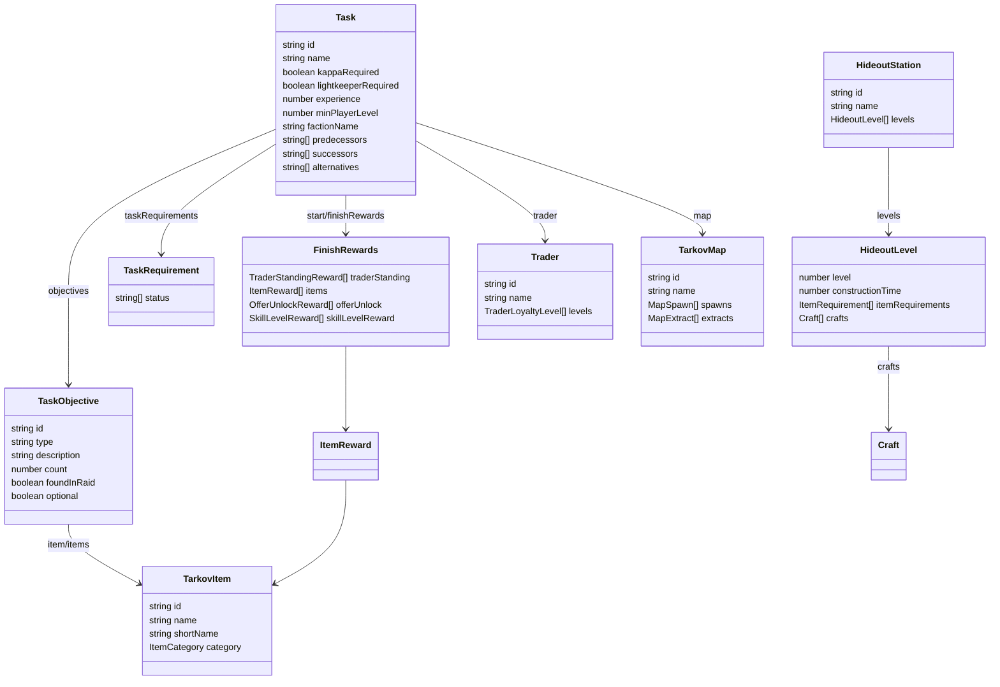
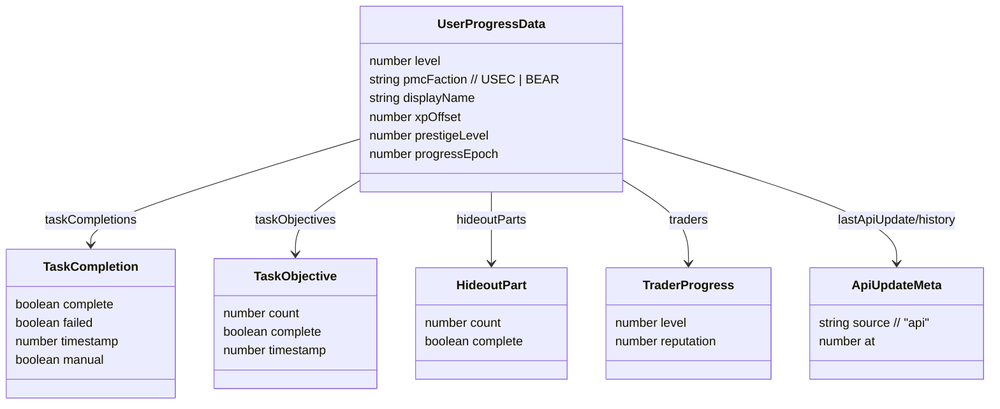
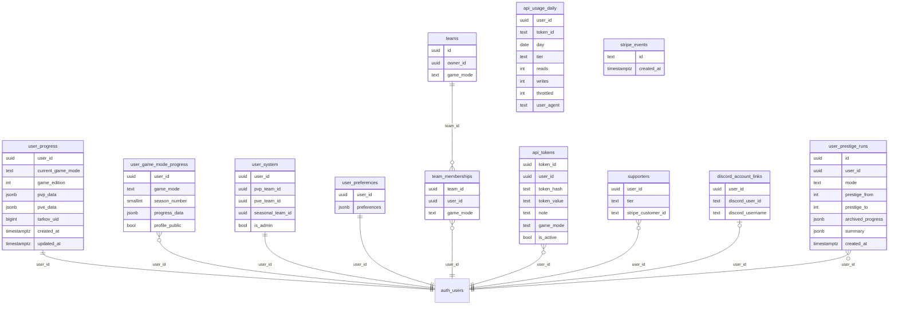

# Data Models — TarkovTracker

> Core data structures. Two domains: **game data** (immutable, from tarkov.dev) defined in
> `app/types/tarkov.ts`, and **user progress** (mutable, synced) defined in `app/types/progress.ts`
> and the Supabase schema. Edge Function/DB types are generated in
> `supabase/functions/_shared/database.types.ts` — do not duplicate them by hand.

## Game Data Model (`app/types/tarkov.ts`)

### Key game-data types

| Type                                                                       | Purpose                     | Notable fields                                                                                                                                                                                                                                                                              |
| -------------------------------------------------------------------------- | --------------------------- | ------------------------------------------------------------------------------------------------------------------------------------------------------------------------------------------------------------------------------------------------------------------------------------------- |
| `Task`                                                                     | A quest                     | `kappaRequired`, `lightkeeperRequired`, `minPlayerLevel`, `requiredPrestige`, `taskRequirements`, `predecessors`/`successors`/`parents`/`children`, `failConditions`/`failureOutcome`, `storyUnlocks`, `requirementDiagnostics`, `alternatives` (deprecated legacy, do not use), `disabled` |
| `TaskObjective`                                                            | One objective within a task | `type`, `count`, `foundInRaid`, `optional`, `items`/`markerItem`/`questItem`, `zones`/`possibleLocations`, `requiredKeys`                                                                                                                                                                   |
| `TaskRequirement`                                                          | Prereq link to another task | `task.id`, `status[]`                                                                                                                                                                                                                                                                       |
| `RequiredKeyGroup`                                                         | Keys needed for a task      | `keys[]`, `maps[]`, `optional`, `anyOf`                                                                                                                                                                                                                                                     |
| `FinishRewards`                                                            | Quest rewards               | `traderStanding`, `items`, `offerUnlock`, `skillLevelReward`, `traderUnlock`                                                                                                                                                                                                                |
| `HideoutStation` / `HideoutLevel` / `HideoutModule`                        | Hideout data + graph nodes  | `itemRequirements`, `stationLevelRequirements`, `skillRequirements`, `traderRequirements`, `crafts`; module adds `predecessors`/`successors`/`parents`/`children`                                                                                                                           |
| `TarkovItem` / `ItemRequirement`                                           | Items + quantities          | `shortName`, `category`, `containsItems`; requirement adds `count`, `quantity`, `foundInRaid`                                                                                                                                                                                               |
| `Trader` / `TraderLoyaltyLevel`                                            | Traders + loyalty           | `requiredPlayerLevel`, `requiredReputation`, `requiredCommerce`                                                                                                                                                                                                                             |
| `TarkovMap` / `MapSpawn` / `MapExtract` / `MapSvgConfig` / `MapTileConfig` | Maps + geometry             | spawn `position`, extract `faction`, SVG/tile `bounds`, `coordinateRotation`, `floors`                                                                                                                                                                                                      |
| `PlayerLevel`                                                              | Level XP thresholds         | `exp` stored as **cumulative** (transformed from API increments)                                                                                                                                                                                                                            |
| `PrestigeLevel`                                                            | Prestige tiers (0–6)        | `conditions`, `rewards`, `transferSettings`                                                                                                                                                                                                                                                 |
| `StoryChapter` / `StoryObjective`                                          | Storyline progression       | `order`, `mutuallyExclusiveWith`, `mapUnlocks`, `traderUnlocks`                                                                                                                                                                                                                             |
| `GameEdition`                                                              | Game edition bonuses        | `defaultStashLevel`, `traderRepBonus`, `exclusiveTaskIds`, `excludedTaskIds`                                                                                                                                                                                                                |

`Task.alternatives` (`alternatives?: string[]` in `app/types/tarkov.ts`) is deprecated legacy:
upstream no longer ships the field and `AGENTS.md` forbids new runtime dependencies on it.
Branch relationships are represented by `failConditions`/`failureOutcome` edges instead.

### Query result types

`tarkov.ts` also defines the response envelopes used by the metadata store and proxy adapters:
`TarkovBootstrapQueryResult`, `TarkovTasksCoreQueryResult`, `TarkovTaskObjectivesQueryResult`,
`TarkovTaskRewardsQueryResult`, `TarkovHideoutQueryResult`, `TarkovItemsQueryResult`,
`TarkovMapSpawnsQueryResult`, `TarkovPrestigeQueryResult`.

### Needed-items aggregation types

`NeededItemTaskObjective` and `NeededItemHideoutModule` (discriminated by `needType`) feed into
`GroupedNeededItem`, which aggregates per-item totals across tasks and hideout with FIR / non-FIR
split and current-progress counters (`taskFir`, `hideoutNonFir`, computed `total`/`currentCount`).

## User Progress Model (`app/types/progress.ts`)

`UserProgressData` is the persisted/synced progress record per game mode.

Maps keyed by id: `taskObjectives`, `taskCompletions`, `hideoutParts`, `hideoutModules`,
`traders`, `skills`, `skillOffsets`, `storyChapters`. Also tracks `progressEpoch` and
`manualActivityEpoch` for epoch fencing, `lastApiUpdate` and `apiUpdateHistory` for API-driven
changes, and `manualActivityHistory` (`ManualActivityEntry[]`: `id`, `timestamp`, `type`, `action`,
`title`, optional `details`) for user-initiated activity-log entries. Both history arrays are
deduplicated by id, ordered newest first, and capped at 50 entries per mode.

## Store State Types

Pinia store files `app/stores/useTarkov.ts`, `app/stores/useProgress.ts`,
`app/stores/useMetadata.ts`, and `app/stores/usePreferences.ts` export the symbols
`useTarkovStore`, `useProgressStore`, `useMetadataStore`, and `usePreferencesStore` respectively.

Defined in `app/types/tarkov.ts`:

- `SystemState` / `SystemGetters` — `user_id`, `tokens`, `team`, `pvp_team_id`, `pve_team_id`,
  `seasonal_team_id`, `is_admin`; getters `userTokens`, `userTeam`, `userTeamIsOwn`, `isAdmin`.
- `TeamState` / `TeamGetters` — active team `id`, `owner`, `joinCode`, `members`,
  `memberProfiles`; getters
  `teamOwner`, `isOwner`, `inviteCode`, `teamMembers`, `teammates`.
- `MemberProfile` — `displayName`, `level`, `tasksCompleted`, `gameMode` (`'pvp'|'pve'|'seasonal'`).

## Supabase Data Model

Derived from `supabase/migrations/`. RLS is enabled on user-owned tables; some operations go
through RPCs/Edge Functions for elevated privileges or rate limiting.

| Table / object               | Role                                                                                                                                      |
| ---------------------------- | ----------------------------------------------------------------------------------------------------------------------------------------- |
| `user_progress`              | Legacy per-user progress (pvp_data/pve_data); compatibility row for rolling deploys                                                       |
| `user_game_mode_progress`    | Normalized per-mode progress; PK `(user_id, game_mode, season_number)`; realtime-enabled                                                  |
| `user_system`                | Per-user system row (team linkage, seasonal_team_id, admin flag)                                                                          |
| `user_preferences`           | Per-user UI preferences (columns added incrementally via migrations)                                                                      |
| `teams` / `team_memberships` | Team ownership + membership (game-mode aware; accepts pvp/pve/seasonal)                                                                   |
| `api_tokens`                 | Gateway tokens (prefixed PVP_/PVE_/SZN_): `token_hash` for lookup, nullable raw `token_value` for retrieval                               |
| `api_usage_daily`            | Daily read/write/throttle counters + last `user_agent`; PK `(user_id, token_id, day)`; `user_id` has no FK, so rows outlive deleted users |
| `supporters`                 | Supporter tier + Stripe customer linkage                                                                                                  |
| `discord_account_links`      | Discord account linkage for supporter role sync; PK `user_id`                                                                             |
| `stripe_events`              | Idempotency/retention for webhook events                                                                                                  |
| `user_prestige_runs`         | Prestige run history (from/to level, archived progress, summary)                                                                          |
| `account_deletion_jobs`      | Account deletion job tracking                                                                                                             |
| `admin_audit_log`            | Admin action audit trail                                                                                                                  |
| RPCs                         | `sync_user_game_mode_progress`, `merge_progress_data`, prestige, rate limiting, ownership                                                 |

> Game modes: `pvp`, `pve`, `seasonal` internally. Game-data API uses `regular`/`pve`/`pvp-season`.
> Seasonal progress is keyed by season number (pvp/pve always use season_number=0).
> `private.active_season_number()` returns the current season; the app constant `ACTIVE_SEASON`
> in `app/utils/constants.ts` must stay synchronized with it.

## Static Local Data

- `app/data/maps.json` — map SVG/tile configuration (static).
- Storyline objective mutual-exclusion defaults live in `app/utils/storylineObjectives.ts`.
