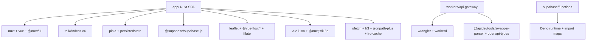

# Dependencies — TarkovTracker

> Package manifests (`package.json` and `workers/api-gateway/package.json`) declare dependencies and scripts; `pnpm-workspace.yaml` defines `catalog:` versions and overrides, and the root `pnpm-lock.yaml` holds resolved versions for both packages. Together these are the authoritative sources. This file documents only the architectural dependency boundaries and policies to keep maintenance overhead and token footprint minimal.

## Authoritative Manifests

- **Root manifest (`package.json`)**: SPA application dependencies, shared utils, dev tooling, test runners, linters, and precompute scripts.
- **API Gateway manifest (`workers/api-gateway/package.json`)**: Standalone Cloudflare Worker package with its own dependencies, a `pnpm-workspace.yaml` member resolved in the root `pnpm-lock.yaml`.
- **Supabase Edge Functions (`supabase/functions/deno.json`)**: Runs on **Deno** (not the Node tree), importing via URL / import maps.

## Architecture Boundaries

## Dependency Invariants & Policies

- **Runtime dependency additions**: Per `AGENTS.md`, do not add new runtime dependencies without justifying why existing dependencies or standard platform APIs are insufficient.
- **Version pins & overrides**: Document intentional pins in `package.json` under `__pinnedNotes` (e.g. `fast-xml-parser` compatibility overrides or upstream package adjustments).
- **Checking dependency updates**: Run `pnpm run deps` (`taze --r --I`).
- **Unused dependencies**: Run `pnpm run lint:unused` (`knip`).
