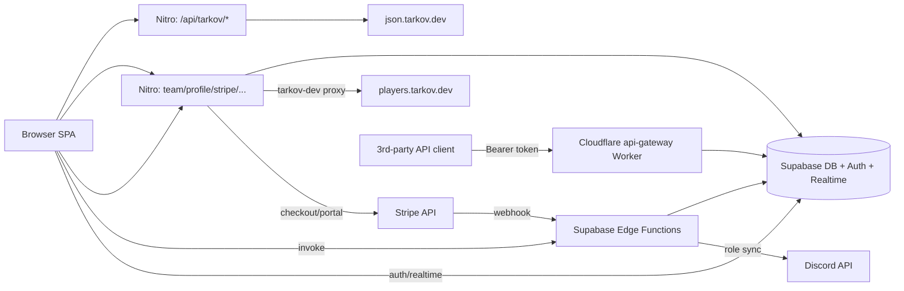
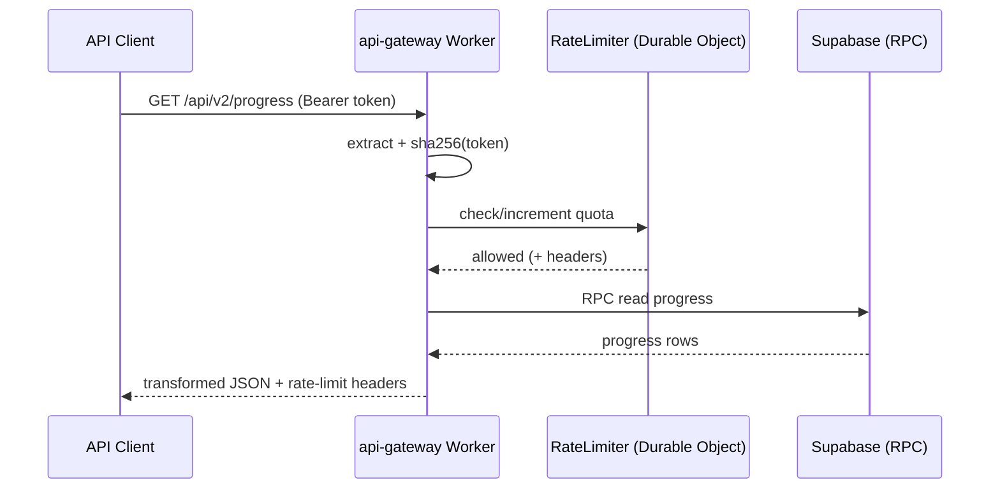

# Interfaces — TarkovTracker

> APIs, interfaces, and integration points. For full endpoint tables with request/response
> shapes, see `docs/API.md`. This file summarizes the boundaries between subsystems.

## Interface Map

## Endpoint Summary

- **`/api/tarkov/*`** — public cached proxies to `json.tarkov.dev` with overlay corrections. Most use 12h–24h edge TTLs (cache-meta: 5m). See `docs/API.md` §Tarkov Data Endpoints for the full table.
- **`/api/team/*`, `/api/stripe/*`** — authenticated app routes (Supabase JWT). See `docs/API.md` §Team Endpoints / §Supporter / Stripe Endpoints.
- **`/api/profile/*`** — public shared profiles (rate-limited, no auth required).
- **`/overlay/*`** — server-rendered streamer overlays (Nitro route, not Page Function).

### Stripe Request Bodies

- Checkout (subscription): `{ mode: "subscription", tier: "scav"|"timmy"|"chad", interval: "monthly"|"6month"|"yearly" }`
- Checkout (one-time): `{ mode: "payment", amount: <1..999> }`
- Portal: `{ returnUrl?: <absolute URL on app origin> }` — host must match app URL or falls back to `${appUrl}/supporter`.

## Public API Gateway (Cloudflare Worker)

`workers/api-gateway` — standalone REST API for third-party clients. Bearer API tokens (SHA-256 hashed), Durable Object rate limiter, OpenAPI spec at `workers/api-gateway/src/openapi.ts`.

Handlers: `progress.ts`, `team.ts`, `token.ts`. Validate with `pnpm run validate:openapi`.

## Supabase Edge Functions

Invoked via `app/composables/api/useEdgeFunctions.ts` or Stripe webhooks. Auth: `_shared/auth.ts`. Rate limit: `_shared/rate-limit.ts` (RPC).

| Function                                                                                   | Trigger      | Purpose                                    |
| ------------------------------------------------------------------------------------------ | ------------ | ------------------------------------------ |
| `team-create` / `team-join` / `team-leave` / `team-kick` / `team-disband` / `team-members` | Client       | Team lifecycle                             |
| `token-create` / `token-revoke`                                                            | Client       | API token management                       |
| `account-delete` / `account-delete-reconcile`                                              | Client / job | Account deletion                           |
| `stripe-webhook`                                                                           | Stripe       | Supporter grant/revoke + Discord role sync |
| `admin-cache-purge`                                                                        | Admin client | Purge Cloudflare + data caches             |

## External Integrations

| Integration                    | Direction               | Notes                                                      |
| ------------------------------ | ----------------------- | ---------------------------------------------------------- |
| `json.tarkov.dev`              | Outbound (server)       | Static game data; override via `NUXT_TARKOV_JSON_BASE_URL` |
| `tarkov-data-overlay` (GitHub) | Outbound (server)       | Community data corrections                                 |
| `players.tarkov.dev`           | Outbound (server proxy) | Profile import JSON                                        |
| Supabase                       | Bidirectional           | Auth, DB, Realtime, Edge Functions                         |
| Stripe                         | Outbound + webhook      | Supporter payments                                         |
| Discord                        | Outbound (edge)         | Supporter role sync                                        |
| Google Analytics / Clarity     | Client (consent-gated)  | Product analytics                                          |

## Error Conventions

Nitro endpoints return errors as `{ error, statusCode, statusMessage }`. Typical statuses:
`400` (bad params), `401` (missing/invalid token), `403` (forbidden), `404` (not found),
`5xx`/`502` (upstream failures). See `docs/API.md` for per-endpoint error tables.
