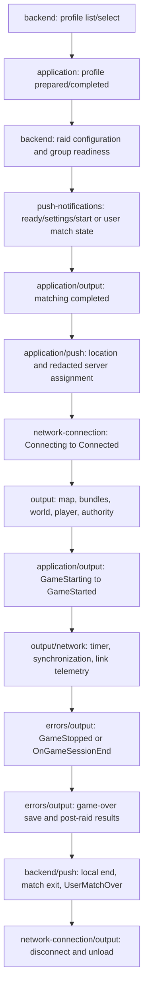

# Escape from Tarkov Local Log Events Reference

Evidence snapshots: 2026-08-09 and 2026-08-29. The `C` corpus was independently re-verified on
2026-08-29: corpus totals, per-build session counts, the event/version ledger, endpoints,
notification markers, and Arena tokens all reproduced exactly. One ledger correction was applied
(`World spawn confirmed` is not a `0.16.x` signal; see below).

## 1. Overview

This document inventories event types and data shapes directly observed in local Escape from Tarkov
(EFT) and EFT: Arena logs on this machine. It is a lookup reference, not a log dump. All examples are
normalized and redacted. No original log file was modified.

Evidence is cumulative and snapshot-based. `H` identifies the original 2026-08-09 corpus; `C`
identifies the fully rescanned 2026-08-29 current corpus. A signal absent from one snapshot is **not**
proof that the game removed it. Treat a signal as removed only after representative sessions that
exercise the applicable feature have been checked in a newer build.

### Scope and evidence method

- Both game roots above were checked read-only in each snapshot when present.
- `H`: 124 main-game session folders, 1,121 `.log` files, 16 builds; the Arena root was absent.
- `C`: 112 main-game session folders and 926 `.log` files across 18 builds, plus 5 Arena session
  folders and 61 `.log` files across 2 Arena builds.
- Main session folders match `log_<YYYY.MM.DD>_<HH-MM-SS>_<FULL_GAME_VERSION>`; Arena folders match
  `log_arena_<YYYY.MM.DD>_<HH-MM-SS>_<FULL_GAME_VERSION>`.
- `H` main filenames used `<TIMESTAMP>_<FULL_GAME_VERSION> <CHANNEL>_<N>.log`.
- `C` also contains unsuffixed `<CHANNEL>.log` files and legacy `_backend.log`,
  `-network-connection.log`, and `-network-messages.log` delimiter variants. Arena uses the same
  delimiter variants after an `arena_` prefix. File discovery must parse all observed forms.
- `H` normalized files up to 2 MB in full, sampled larger files at five positions, and ran targeted
  lifecycle/API searches over every file. `C` scanned every one of 6,050,658 non-empty physical lines
  in all 987 files; no large-file sampling was used.
- Timestamps, request identifiers, addresses, ports, profile/account/session identifiers, nicknames,
  paths containing a Windows username, UUIDs, long tokens, and contextual `*Id`/`*Token` values were
  replaced before analysis.
- `H` produced 9,763 privacy-normalized message shapes across 18 main-game channels. `C` was used for
  claim-by-claim version/channel/event verification, endpoint and notification inventories, and new
  channel discovery. The tables consolidate semantic families so stack frames and multiline payload
  fragments are not misrepresented as standalone events.

`Direct` means a message, route, field, or status was present in the normalized evidence.
`Interpretation` means the operational use is inferred from its name or its correlation with adjacent
events. A stack frame proves an error passed through a routine; it does not prove that routine
completed successfully.

### Line envelope and multiline behavior

Three record envelopes are directly observed:

```text
YYYY-MM-DD HH:MM:SS.mmm|<FULL_GAME_VERSION>|<LEVEL>|<CHANNEL>|<MESSAGE>
YYYY-MM-DD HH:MM:SS.mmm <UTC_OFFSET>|<FULL_GAME_VERSION>|<LEVEL>|<CHANNEL>|<MESSAGE>
YYYY-MM-DD HH:MM:SS.mmm <UTC_OFFSET>|<LEVEL>|<CHANNEL>|<MESSAGE>
```

The third form omits the embedded version; derive it from the validated session-folder or filename
version. It occurs in all three current `0.16.x` main builds (3,161 records total) and both Arena
builds (69 records total), mixed with versioned records in the same build. Envelope detection must be
per physical record, not selected once per build or file.

`C` contains 500,751 versioned records, 3,230 versionless records, and 5,546,677 continuation lines.
Continuation lines are primarily multiline JSON, exception text, and stack frames that belong to the
previous prefixed record. Parsers must attach them to the preceding record rather than treating every
physical line as a new event. Milliseconds were present in every timestamp-prefixed `C` record.

Additional content-format differences were observed:

- Backend request/response lines in `1.0.2.5.43579`, `1.0.4.0.44005`, and `1.0.4.1.44236` include an
  optional `crc:` segment. Later sampled builds omit it.
- `SelectProfile` is directly retained from `0.16.8.0.37972` through `1.0.4.1.44236` across the two
  snapshots. `PrepareSelectedProfileLocally` and `CompleteSelectedProfile` are directly retained from
  `1.0.4.6.44802` through the newest sampled `1.1.0.1.46911` build.
- Main notification filenames are `notifications.log` in current `0.16.x` samples and
  `push-notifications[_<N>].log` from `1.0.0.0.41760` onward.

### Builds analyzed

#### Historical main snapshot `H` (2026-08-09)

| Full version    | Sessions |
| --------------- | -------: |
| `1.0.2.5.43579` |        7 |
| `1.0.4.0.44005` |        1 |
| `1.0.4.1.44236` |       13 |
| `1.0.4.6.44802` |        9 |
| `1.0.4.9.45133` |        7 |
| `1.0.5.0.45272` |       14 |
| `1.0.5.0.45383` |        2 |
| `1.0.5.0.45436` |        3 |
| `1.0.5.0.45464` |        4 |
| `1.0.5.0.45581` |        9 |
| `1.0.6.0.46010` |        2 |
| `1.0.6.5.46189` |        2 |
| `1.0.6.5.46221` |       37 |
| `1.1.0.0.46608` |        2 |
| `1.1.0.0.46624` |        5 |
| `1.1.0.0.46657` |        7 |

#### Current main snapshot `C` (2026-08-29)

| Full version     | Sessions |
| ---------------- | -------: |
| `0.16.8.0.37972` |        7 |
| `0.16.8.1.38114` |       11 |
| `0.16.9.5.40743` |        2 |
| `1.0.0.0.41760`  |        1 |
| `1.0.0.1.41837`  |        2 |
| `1.0.0.1.41967`  |        5 |
| `1.0.0.2.42157`  |        7 |
| `1.0.0.5.42334`  |        3 |
| `1.0.1.0.42625`  |       22 |
| `1.0.1.1.42751`  |        5 |
| `1.0.2.0.43037`  |       12 |
| `1.0.6.0.46010`  |        6 |
| `1.0.6.5.46221`  |       11 |
| `1.1.0.0.46608`  |        1 |
| `1.1.0.0.46624`  |        1 |
| `1.1.0.0.46657`  |        5 |
| `1.1.0.1.46777`  |        2 |
| `1.1.0.1.46911`  |        9 |

#### Current Arena snapshot `C` (2026-08-29)

| Full version    | Sessions |
| --------------- | -------: |
| `0.3.2.1.38001` |        2 |
| `0.4.2.5.42886` |        3 |

### Mode notation

- `E`: PvE, identified directly by a PvE gateway/WebSocket marker or by `Session mode: Pve`.
- `P`: regular PvP, identified directly by a PvP gateway/WebSocket marker or by
  `Session mode: Regular`.
- `S`: PvP Seasons/alternate, identified directly by a seasonal gateway/WebSocket marker or by
  `Session mode: PvpSeason`.
- `U`: the message itself has no mode marker; applicability is inherited only from the containing
  session.
- `A`: Arena.

Mode counts overlap because one client session can touch more than one environment. `H` had 124
regular-PvP, 120 PvE, and 12 Seasonal marker-bearing sessions. `C` had 108 regular-PvP, 10 PvE, and
14 Seasonal marker-bearing main sessions, plus 5 Arena sessions. These are evidence-marker counts,
not mutually exclusive raid counts.

### High-value version evidence ledger

This ledger is authoritative for tracker-facing lifecycle signals. Versions are listed only when the
literal event family was found; a missing version means “not present in sampled sessions,” not
“removed.” `C-Raid14` abbreviates these 14 current main builds with a retained raid lifecycle:

`0.16.8.0.37972`, `0.16.8.1.38114`, `0.16.9.5.40743`, `1.0.0.0.41760`,
`1.0.0.1.41967`, `1.0.0.2.42157`, `1.0.1.0.42625`, `1.0.1.1.42751`,
`1.0.2.0.43037`, `1.0.6.0.46010`, `1.0.6.5.46221`, `1.1.0.0.46624`,
`1.1.0.0.46657`, and `1.1.0.1.46911`.

| Signal                                                                          | Direct version evidence                                                                                                                                                                                                                                                                      | Status and tracker consequence                                                                                                                                                                                                                                                                                                                                                                                                             |
| ------------------------------------------------------------------------------- | -------------------------------------------------------------------------------------------------------------------------------------------------------------------------------------------------------------------------------------------------------------------------------------------- | ------------------------------------------------------------------------------------------------------------------------------------------------------------------------------------------------------------------------------------------------------------------------------------------------------------------------------------------------------------------------------------------------------------------------------------------ |
| Legacy `SelectProfile`                                                          | `C`: `0.16.8.0.37972`, `0.16.8.1.38114`, `0.16.9.5.40743`, `1.0.0.0.41760`, `1.0.0.1.41837`, `1.0.0.1.41967`, `1.0.0.2.42157`, `1.0.0.5.42334`, `1.0.1.0.42625`, `1.0.1.1.42751`, `1.0.2.0.43037`; `H`: `1.0.2.5.43579`, `1.0.4.0.44005`, `1.0.4.1.44236`                                    | Historical parser branch remains necessary through `1.0.4.1.44236`                                                                                                                                                                                                                                                                                                                                                                         |
| Modern profile prepare/complete                                                 | `H`: `1.0.4.6.44802` through `1.1.0.0.46657`; `C`: `1.0.6.0.46010`, `1.0.6.5.46221`, `1.1.0.0.46624`, `1.1.0.0.46657`, `1.1.0.1.46777`, `1.1.0.1.46911`                                                                                                                                      | Still present in newest current build                                                                                                                                                                                                                                                                                                                                                                                                      |
| `MatchingCompleted`                                                             | `C`: `C-Raid14`; Arena `0.3.2.1.38001`, `0.4.2.5.42886`                                                                                                                                                                                                                                      | Still present in newest current main and Arena builds                                                                                                                                                                                                                                                                                                                                                                                      |
| `World spawn confirmed`                                                         | `C`: `1.0.0.0.41760`, `1.0.0.1.41967`, `1.0.0.2.42157`, `1.0.1.0.42625`, `1.0.1.1.42751`, `1.0.2.0.43037`, `1.0.6.0.46010`, `1.0.6.5.46221`, `1.1.0.0.46624`, `1.1.0.0.46657`, `1.1.0.1.46911`; absent from all three `0.16.x` builds (`0.16.8.0.37972`, `0.16.8.1.38114`, `0.16.9.5.40743`) | Stable high-confidence world-ready signal from `1.0.0.0.41760` on. `0.16.x` builds never log it; their world-ready cluster is `GameSpawn`/`GameSpawned`/`PlayerSpawnEvent`. Do not wait on this string in `0.16.x` parsers                                                                                                                                                                                                                 |
| `GameStarted`                                                                   | `C`: `C-Raid14`; Arena `0.3.2.1.38001`, `0.4.2.5.42886`                                                                                                                                                                                                                                      | Still present in newest current main and Arena builds                                                                                                                                                                                                                                                                                                                                                                                      |
| Structured `GameStopped ... ExitStatus:`                                        | `H`: survival class in `1.0.2.5.43579`, `1.0.4.0.44005`, `1.0.4.1.44236`; killed class in `1.0.2.5.43579`, `1.0.4.1.44236`; `C`: absent                                                                                                                                                      | Historical only in available evidence; never make it the sole raid-end detector                                                                                                                                                                                                                                                                                                                                                            |
| `OnGameSessionEnd`                                                              | `C`: `1.0.0.2.42157`, `1.0.2.0.43037`, `1.1.0.0.46657`, `1.1.0.1.46911`; also present in 9 `H` builds                                                                                                                                                                                        | Still present in newest current build, but not universal per sampled raid                                                                                                                                                                                                                                                                                                                                                                  |
| `GameOverSaveStatus`                                                            | `C`: `1.0.6.0.46010`, `1.0.6.5.46221`, `1.1.0.0.46624`, `1.1.0.0.46657`, `1.1.0.1.46911`; early structured form in first 3 `H` builds                                                                                                                                                        | Still present, with format/context differences; save status is not outcome                                                                                                                                                                                                                                                                                                                                                                 |
| `PostRaid_Start`, `DeathScreen_Shown`, `InteractiveMenuReady`                   | `C`: `1.0.6.0.46010`, `1.0.6.5.46221`, `1.1.0.0.46624`, `1.1.0.0.46657`, `1.1.0.1.46911` (`InteractiveMenuReady` also in `1.1.0.1.46777`)                                                                                                                                                    | Current post-raid/UI anchors; death-screen label remains non-authoritative for outcome                                                                                                                                                                                                                                                                                                                                                     |
| `UserMatchCreated`                                                              | `C`: `1.0.1.0.42625`, `1.0.1.1.42751`, `1.0.2.0.43037`, `1.0.6.0.46010`, `1.1.0.0.46624`, `1.1.0.0.46657`, `1.1.0.1.46911`                                                                                                                                                                   | Still present in newest current build                                                                                                                                                                                                                                                                                                                                                                                                      |
| `UserMatchOver`                                                                 | `C` main: `0.16.8.0.37972`, `0.16.8.1.38114`, `1.0.0.1.41967`, `1.0.0.2.42157`; Arena: both builds                                                                                                                                                                                           | Do not infer removal from later main samples; retain as an optional end signal. Re-verified exact on 2026-08-29                                                                                                                                                                                                                                                                                                                            |
| `Session mode: Regular`                                                         | `C`: all 18 main builds                                                                                                                                                                                                                                                                      | Constant mode-declaration signal across the whole current corpus                                                                                                                                                                                                                                                                                                                                                                           |
| `Session mode: Pve`                                                             | `C` sampled `0.16.8.0.37972` through `1.0.6.5.46221`; no `1.1.x` session logged it                                                                                                                                                                                                           | Sample-dependent; absence in `1.1.x` sessions only means no PvE raid was played there                                                                                                                                                                                                                                                                                                                                                      |
| `Session mode: PvpSeason`                                                       | `C` first at `1.1.0.0.46608`, then every `1.1.x` build                                                                                                                                                                                                                                       | Newest mode string; parsers must accept it before treating Seasonal as unknown                                                                                                                                                                                                                                                                                                                                                             |
| Arena `ApplicationState`, `MatchingProgressState`, and `GameplayState` families | Arena `0.3.2.1.38001`, `0.4.2.5.42886`                                                                                                                                                                                                                                                       | Direct Arena state machine; use before generic Unity timing mirrors. Directly observed values (2026-08-29 re-scan): `ApplicationState: Idle, Matching, Gameplay`; `MatchingProgressState: None, MatchingStarted, GameFound, ConnectingToServer, WorldCreating, Leaving, Participation recreate`; `GameplayState: None, Running, Dead, Finished`. State families are session-dependent: short `0.4.2.5.42886` sessions logged only a subset |

#### Current-snapshot diagnostic pins (`C`, 2026-08-29 re-scan)

The ledger above covers tracker-facing lifecycle signals. The following secondary families were also
re-verified against the full `C` corpus and pinned to their direct current versions. As everywhere
else in this document, a version not listed means "not present in sampled sessions," not "removed."

| Signal family                                                                                                                              | Direct `C` versions                                                                                                                    |
| ------------------------------------------------------------------------------------------------------------------------------------------ | -------------------------------------------------------------------------------------------------------------------------------------- |
| `BackendServerSideException:`                                                                                                              | `1.0.0.0.41760`, `1.0.0.2.42157`, `1.0.1.0.42625`, `1.0.1.1.42751`, `1.0.2.0.43037`, `1.0.6.0.46010`, `1.1.0.0.46624`, `1.1.0.1.46911` |
| `<--- Error! HTTPS:` transport-error records                                                                                               | `1.0.0.2.42157`, `1.0.1.0.42625`                                                                                                       |
| `ProtocolError` inside HTTPS error records                                                                                                 | `1.0.0.2.42157`, `1.0.1.0.42625` (the `H` snapshot separately retained it in `1.0.6.5.46221`)                                          |
| `cache: mis-matched` ETag mismatch                                                                                                         | `1.0.6.0.46010`, `1.1.0.0.46624`, `1.1.0.0.46657`, `1.1.0.1.46911`                                                                     |
| `Items to insure does not contain:`                                                                                                        | `1.0.0.0.41760`, `1.0.1.0.42625`, `1.0.1.1.42751`, `1.0.2.0.43037`, `1.0.6.5.46221`                                                    |
| `Client operation rejected by server`                                                                                                      | `0.16.8.0.37972`, `0.16.8.1.38114`, `1.0.0.0.41760`, `1.0.0.2.42157`, `1.0.1.0.42625`, `1.0.2.0.43037`, `1.1.0.0.46657`                |
| Inventory slot-occupied rejection                                                                                                          | `1.1.0.0.46657`                                                                                                                        |
| Inventory range (`too far away`) rejection                                                                                                 | `1.0.1.0.42625`, `1.0.2.0.43037`                                                                                                       |
| `Failed to create item with ID:`                                                                                                           | `1.0.0.2.42157`                                                                                                                        |
| `Thread processing exceeded the limit`                                                                                                     | `1.0.1.0.42625`                                                                                                                        |
| `Receive disconnect` (remote teardown)                                                                                                     | `1.0.6.0.46010`                                                                                                                        |
| Network state machine (`Exit to the 'Initial'` / `Enter to the 'Connecting'` / `Enter to the 'Connected'` / `Enter to the 'Disconnected'`) | All 14 `C` raid builds plus both Arena builds; absent only from sessions with no raid/network file                                     |
| Reverb reset attempts                                                                                                                      | `1.0.1.0.42625`                                                                                                                        |

H-era optional channels with observed `C` coverage (channel file presence, independent of content):

| Channel                                   | Direct `C` builds                                                                                                       |
| ----------------------------------------- | ----------------------------------------------------------------------------------------------------------------------- |
| `aiData` / `aiErrors`                     | `1.0.0.0.41760`, `1.0.6.5.46221`, `1.1.0.0.46624`, `1.1.0.1.46911`                                                      |
| `backendCache`                            | `1.0.0.0.41760` through `1.0.2.0.43037` (8 builds)                                                                      |
| `backend_queue`                           | `0.16.8.0.37972`, `1.0.0.2.42157`, `1.0.1.0.42625`, `1.0.6.0.46010`, `1.1.0.1.46911`                                    |
| `files-checker`                           | `1.0.0.0.41760` through `1.1.0.1.46911` (15 builds); no `0.16.x` session wrote the channel                              |
| `insurance`                               | `1.0.0.0.41760`, `1.0.0.1.41967`, `1.0.1.0.42625`, `1.0.1.1.42751`, `1.0.2.0.43037`, `1.0.6.5.46221`                    |
| `inventory`                               | `0.16.8.0.37972`, `0.16.8.1.38114`, `1.0.0.0.41760`, `1.0.0.2.42157`, `1.0.1.0.42625`, `1.0.2.0.43037`, `1.1.0.0.46657` |
| `network-connection` / `network-messages` | 14 builds; absent from `1.0.0.1.41837`, `1.0.0.5.42334`, `1.1.0.0.46608`, `1.1.0.1.46777` sessions                      |
| `objectPool`                              | `1.0.0.1.41967` through `1.1.0.1.46777` (9 builds)                                                                      |
| `player`                                  | `1.0.0.1.41967`, `1.0.1.0.42625`, `1.0.2.0.43037`                                                                       |
| `spatial-audio`                           | all builds except `1.1.0.0.46608` (17 builds)                                                                           |

## 2. Log channel index

The first table is the `H` snapshot. "Patterns" is its number of distinct privacy-normalized message
shapes, not the number of semantic families in later tables. Current-only channels and renames follow
it; do not use the `H` file counts as current installation counts.

| Channel              | Files | Patterns | Subsystem and when it appears                                                                                                             | Observed modes | Build coverage                         |
| -------------------- | ----: | -------: | ----------------------------------------------------------------------------------------------------------------------------------------- | -------------- | -------------------------------------- |
| `aiData`             |    15 |      196 | AI navigation, spawn-zone, cover, patrol, and action diagnostics; only in some sessions                                                   | E/P/S          | 6 builds; see below                    |
| `aiErrors`           |    15 |      196 | Overlapping AI diagnostic/error view, including some `aiData`-prefixed forms                                                              | E/P/S          | 6 builds; see below                    |
| `application`        |   124 |      397 | Client startup, settings, profile selection, matchmaking, raid load/start timings, transit, anti-cheat, and runtime metrics               | E/P/S          | All 16 builds                          |
| `backend`            |   124 |      885 | HTTPS/WSS requests, responses, retries, API errors, account notifications, and endpoint timing                                            | E/P/S          | All 16 builds                          |
| `backendCache`       |    21 |       12 | Local cache lookup for static backend responses                                                                                           | E/P            | 3 builds; see below                    |
| `backend_queue`      |     7 |       31 | Failed queued inventory command payloads                                                                                                  | E/P            | 4 builds; see below                    |
| `errors`             |   116 |    1,013 | Aggregate exceptions and mirrored source-channel errors; raid-end markers also occur here                                                 | E/P/S          | All 16 builds                          |
| `files-checker`      |   124 |        3 | Executable consistency-check lifecycle                                                                                                    | E/P/S          | All 16 builds                          |
| `insurance`          |     9 |       23 | Insurance-list reconciliation warnings                                                                                                    | E/P            | 7 builds; see below                    |
| `inventory`          |    37 |      111 | Client/server inventory rejection, desync, range, placement, and quest-note errors                                                        | E/P/S          | 11 builds; see below                   |
| `maperrors`          |     6 |        3 | Spawn-marker correction and scene/backend mismatch                                                                                        | E/P            | 4 builds; see below                    |
| `network-connection` |    77 |       16 | Game-server connection state, disconnect, address, latency, loss, and byte counters                                                       | E/P/S          | 15 builds; see below                   |
| `network-messages`   |    77 |        1 | Periodic compact network-message counters                                                                                                 | E/P/S          | Same 15 builds as `network-connection` |
| `objectPool`         |     3 |       22 | Pooled asset lifecycle and item-object creation failures                                                                                  | E/P/S          | 3 builds; see below                    |
| `output`             |   124 |    6,414 | High-volume Unity/runtime transcript; duplicates many other channels and adds scene, player, post-raid, UI, asset, and performance traces | E/P/S          | All 16 builds                          |
| `player`             |     6 |        2 | Player item lookup and quest-condition finish errors                                                                                      | E/P            | 4 builds; see below                    |
| `push-notifications` |   124 |      427 | Notification WebSocket lifecycle and typed group, raid, profile, market, chat, friend, account, and popup payloads                        | E/P/S          | All 16 builds                          |
| `spatial-audio`      |   112 |       11 | DSP/spatial-audio initialization, reverb recovery, microphone and clipping diagnostics                                                    | E/P/S          | All 16 builds                          |

Exact partial-build coverage:

- `aiData` / `aiErrors`: `1.0.4.9.45133`, `1.0.5.0.45272`, `1.0.5.0.45581`,
  `1.0.6.5.46189`, `1.0.6.5.46221`, `1.1.0.0.46608`.
- `backendCache`: `1.0.2.5.43579`, `1.0.4.0.44005`, `1.0.4.1.44236`.
- `backend_queue`: `1.0.2.5.43579`, `1.0.4.1.44236`, `1.0.6.5.46189`,
  `1.0.6.5.46221`.
- `insurance`: `1.0.2.5.43579`, `1.0.4.0.44005`, `1.0.4.6.44802`,
  `1.0.5.0.45272`, `1.0.5.0.45436`, `1.0.5.0.45581`, `1.0.6.5.46221`.
- `inventory`: `1.0.2.5.43579`, `1.0.4.1.44236`, `1.0.4.6.44802`,
  `1.0.4.9.45133`, `1.0.5.0.45272`, `1.0.5.0.45464`, `1.0.5.0.45581`,
  `1.0.6.5.46189`, `1.0.6.5.46221`, `1.1.0.0.46624`, `1.1.0.0.46657`.
- `maperrors`: `1.0.5.0.45272`, `1.0.5.0.45581`, `1.0.6.5.46189`,
  `1.0.6.5.46221`.
- `network-connection` / `network-messages`: all analyzed builds except `1.0.5.0.45383`.
- `objectPool`: `1.0.4.9.45133`, `1.0.6.5.46221`, `1.1.0.0.46608`.
- `player`: `1.0.4.6.44802`, `1.0.4.9.45133`, `1.0.5.0.45272`,
  `1.0.5.0.45581`.

`assetBundle` and `health-system` were absent from `H` but are directly present in `C`. The following
current discoveries expand the channel contract:

| Current channel                                                                                                                                                                                            | Game  | Direct build coverage in `C`                                                          | Meaning / compatibility note                                                                                                                                                                                                                                                                                                                                            |
| ---------------------------------------------------------------------------------------------------------------------------------------------------------------------------------------------------------- | ----- | ------------------------------------------------------------------------------------- | ----------------------------------------------------------------------------------------------------------------------------------------------------------------------------------------------------------------------------------------------------------------------------------------------------------------------------------------------------------------------- |
| `anim-events-container`                                                                                                                                                                                    | Main  | `1.0.0.0.41760`, `1.0.0.2.42157`                                                      | Animation-event consumer conflict diagnostics                                                                                                                                                                                                                                                                                                                           |
| `assetBundle`                                                                                                                                                                                              | Main  | `0.16.8.1.38114`, `0.16.9.5.40743`, `1.0.0.0.41760`, `1.0.2.0.43037`, `1.0.6.5.46221` | Missing-manifest bundle and duplicate-release errors                                                                                                                                                                                                                                                                                                                    |
| `health-system`                                                                                                                                                                                            | Main  | `1.1.0.0.46624`                                                                       | Health/skill-buff configuration error                                                                                                                                                                                                                                                                                                                                   |
| `notifications`                                                                                                                                                                                            | Main  | `0.16.8.0.37972`, `0.16.8.1.38114`, `0.16.9.5.40743`                                  | Legacy filename for the notification stream; record channel may still say `push-notifications`                                                                                                                                                                                                                                                                          |
| `pools`                                                                                                                                                                                                    | Main  | `0.16.8.0.37972`                                                                      | Legacy pool channel; later builds use `objectPool`                                                                                                                                                                                                                                                                                                                      |
| `seasons`                                                                                                                                                                                                  | Main  | `1.0.0.0.41760`, `1.0.0.1.41967`, `1.0.0.2.42157`                                     | Seasonal-material fixer diagnostics, not mode proof                                                                                                                                                                                                                                                                                                                     |
| `surprises`                                                                                                                                                                                                | Main  | `0.16.8.1.38114`                                                                      | Armband/body-customization mesh lookup diagnostic                                                                                                                                                                                                                                                                                                                       |
| `Default`                                                                                                                                                                                                  | Main  | `0.16.8.0.37972`, `0.16.8.1.38114`, `0.16.9.5.40743` (40 files)                       | `0.16.x`-only envelope channel value for uncategorized runtime warnings/errors: locale duplicate keys, hideout `Address not found`, `Already registered object` (turnables/lamps), weapon-shell warnings, and generic exceptions. Also carries `[Transit]` lines in those builds. Never observed in a `1.0.0.0`+ envelope; parsers must not treat `Default` as an error |
| `traces`                                                                                                                                                                                                   | Main  | `0.16.8.0.37972`, `0.16.8.1.38114`, `0.16.9.5.40743`                                  | Legacy umbrella trace containing backend payloads and runtime/error mirrors                                                                                                                                                                                                                                                                                             |
| `application`, `arena_backlog`, `arena_preset_selection`, `arena_static_data`, `backend`, `errors`, `lifecycle`, `network_summary`, `notifications`, `spatial-audio`, `traces`, `traces_all`, `web_socket` | Arena | Both Arena builds                                                                     | Core Arena channels; detailed catalogue below                                                                                                                                                                                                                                                                                                                           |
| `network-connection`, `network-messages`                                                                                                                                                                   | Arena | Both Arena builds, one file per build                                                 | Game transport telemetry                                                                                                                                                                                                                                                                                                                                                |
| `gameMode-debug`                                                                                                                                                                                           | Arena | `0.3.2.1.38001`                                                                       | Game-mode leave diagnostic                                                                                                                                                                                                                                                                                                                                              |
| `pools`                                                                                                                                                                                                    | Arena | `0.4.2.5.42886`                                                                       | Pool/asset diagnostic                                                                                                                                                                                                                                                                                                                                                   |

No `maperrors` file occurred in `C`, but it remains direct `H` evidence. Channel absence is never
proof that the subsystem or game feature was unused or removed.

## 3. Per-channel event catalogue

Unless a narrower set is shown, "channel set" in the original Version(s) column means the exact `H`
build coverage listed in the original channel index. It means the family was observed within that
evidence envelope; it does not mean every individual variant appeared in every build. Use the
high-value ledger and current additions for `C` evidence. Generic messages without their own gateway
marker use the containing session's E/P/S envelope.

### `application`

| Event (redacted example)                                                                                                                                                                                         | Fields present                                                                                           | What it means / how it could be used                                                                                | Version(s)                                                   | Mode(s) |
| ---------------------------------------------------------------------------------------------------------------------------------------------------------------------------------------------------------------- | -------------------------------------------------------------------------------------------------------- | ------------------------------------------------------------------------------------------------------------------- | ------------------------------------------------------------ | ------- |
| `Application awaken, updateQueue:'<QUEUE>'`                                                                                                                                                                      | update queue, assertion/runtime flags                                                                    | Client/Unity startup marker                                                                                         | Channel set                                                  | E/P/S   |
| `<CATEGORY> settings:` followed by JSON                                                                                                                                                                          | display, graphics, PostFX, sound, controls, gameplay, accessibility, notification, voice-device settings | Captures the configuration loaded for the session; useful for environment correlation but privacy-sensitive         | Channel set                                                  | E/P/S   |
| `SelectProfile ProfileId:<PROFILE_ID> AccountId:<ACCOUNT_ID>`                                                                                                                                                    | profile ID, account ID                                                                                   | Legacy profile-selection marker                                                                                     | First 3 builds                                               | E/P     |
| `PrepareSelectedProfileLocally ...` / `CompleteSelectedProfile ...`                                                                                                                                              | profile ID, account ID, phase                                                                            | Modern local preparation/completion phases for profile selection                                                    | `1.0.4.6.44802` through `1.1.0.0.46657` in available samples | E/P/S   |
| `Session mode: <MODE>`                                                                                                                                                                                           | mode                                                                                                     | Direct client-side mode declaration                                                                                 | PvE in all 16; regular/Seasonal in sampled 1.0.6/1.1 builds  | E/P/S   |
| `TRACE-NetworkGameMatching <STAGE>` / `Matching with group id:<GROUP_ID>`                                                                                                                                        | opaque stage, group ID                                                                                   | Matchmaking progress and group association                                                                          | Channel set                                                  | E/P/S   |
| `MatchingCompleted:<N> real:<N> diff:<N>`                                                                                                                                                                        | elapsed, real, difference timings                                                                        | Matchmaking-complete timing marker                                                                                  | 15 builds; not retained for `1.0.5.0.45383`                  | E/P/S   |
| `Network game matching cancelled.` / `Local game matching cancelled.`                                                                                                                                            | local/network distinction                                                                                | Explicit cancellation path                                                                                          | Sampled 1.0.4-1.1 builds                                     | E/P/S   |
| `TRACE-NetworkGameCreate profileStatus:'Profileid:<PROFILE_ID>, Status:<STATUS>, RaidMode:<RAID_MODE>, Ip:<SERVER_IP>, Port:<PORT>, Location:<LOCATION>, Sid:<SESSION_ID>, GameMode:<MODE>, shortId:<SHORT_ID>'` | profile/status, raid mode, server endpoint, location, session and short IDs, game mode                   | Direct server assignment and raid-construction input; the address can be joined to `network-connection` in raw logs | Sampled later builds                                         | E/P/S   |
| `LocationLoaded`, `GameCreated`, `GamePooled`, `GamePrepared`                                                                                                                                                    | elapsed/real/difference timings and counters                                                             | Scene and game-object preparation milestones                                                                        | Same 15-build raid set                                       | E/P/S   |
| `GameSpawn`, `GameSpawned`, `GameRunned`, `GameStarting`, `GameStarted`                                                                                                                                          | elapsed/real/difference timings and counters                                                             | Ordered spawn/start milestones; `GameStarted` is the strongest direct raid-start marker                             | Same 15-build raid set                                       | E/P/S   |
| `[Transit] Flag:<FLAG>, RaidId:<RAID_ID>, Count:<N>, Locations:<LOCATION_CHAIN>`                                                                                                                                 | transit flag, raid ID, count, location chain, event-player flag                                          | In-raid map-transition state                                                                                        | Sampled 1.0.4-1.1 builds                                     | E/P/S   |
| `scene preset path:<BUNDLE_PATH> rcid:<ASSET_ID>`                                                                                                                                                                | scene/bundle path, resource ID                                                                           | Selected scene/map asset                                                                                            | Channel set                                                  | E/P/S   |
| `GC mode switched`, `GC::Collect*`, `ClientMetricsEvents()`                                                                                                                                                      | GC mode, iteration, duration, memory, metric count                                                       | Runtime performance and memory-pressure telemetry                                                                   | Channel set                                                  | E/P/S   |
| `Start loading dll '<BATTLEYE_DLL>'` through `BEClient exit successfully`                                                                                                                                        | DLL path, game version, port, pointer/result code                                                        | Anti-cheat load, initialization, and shutdown lifecycle                                                             | Channel set                                                  | E/P/S   |
| `Reason:<REASON>, Position:<VECTOR>, SpeedLimit:<N>, CurrentState:<STATE>...`                                                                                                                                    | position, speed limits, state, strength, walk limit                                                      | Movement restriction/validation diagnostic                                                                          | Channel set                                                  | E/P/S   |
| `Data prepare operation has failed: <EXCEPTION>`                                                                                                                                                                 | exception and stack context                                                                              | Profile/application data preparation failure                                                                        | Sampled builds                                               | E/P/S   |

No direct `application`-channel raid-end event was retained; raid-end evidence is in `errors`,
`output`, `backend`, `push-notifications`, and `network-connection`.

### `backend`

#### Transport and response families

| Event (redacted example)                                                                                                 | Fields present                                                           | What it means / how it could be used                                                                                                                                                           | Version(s)                                                                                                                                           | Mode(s)     |
| ------------------------------------------------------------------------------------------------------------------------ | ------------------------------------------------------------------------ | ---------------------------------------------------------------------------------------------------------------------------------------------------------------------------------------------- | ---------------------------------------------------------------------------------------------------------------------------------------------------- | ----------- |
| `---> Request HTTPS, id [<REQUEST_ID>]: URL: https://<GATEWAY>/<PATH>`                                                   | request ID, gateway/mode marker, path, query; optional legacy CRC        | Outbound API request; request ID correlates with the response                                                                                                                                  | Channel set                                                                                                                                          | E/P/S       |
| `<--- Response HTTPS, id [<REQUEST_ID>]: URL: ..., DownloadSeconds:<N>, ParseSeconds:<N>, SumSeconds:<N>, responseText:` | request ID, URL, download/parse/total timing, response-body continuation | Transport completion and latency breakdown; not by itself proof of application-level success                                                                                                   | Channel set                                                                                                                                          | E/P/S       |
| Legacy request/response with `crc:`                                                                                      | CRC field plus normal transport fields                                   | Older transport/cache signature                                                                                                                                                                | First 3 builds only                                                                                                                                  | E/P         |
| `<--- Error! HTTPS: ..., result:<RESULT>, isNetworkError:<BOOL>, isHttpError:<BOOL>, responseCode:<N>`                   | result, network/HTTP flags, response code                                | Distinguishes connection failure from protocol/HTTP failure                                                                                                                                    | Channel set; `ProtocolError` directly observed in `1.0.6.5.46221`                                                                                    | E/P/S       |
| `Request <URL> will be retried after <N> sec, retry:<N> from retries:<N> ...`                                            | delay, attempt, maximum attempts, retry URL, originating error           | Scheduled retry event                                                                                                                                                                          | `1.0.5.0.45272`, `1.0.6.5.46221`, `1.1.0.0.46608`                                                                                                    | E/P/S       |
| `cache: mis-matched, old etag:<ETAG>, new etag:<ETAG>`                                                                   | old/new ETag and affected response                                       | Backend/local-cache version mismatch                                                                                                                                                           | Sampled 1.0.5-1.1 builds                                                                                                                             | E/S         |
| `BackendServerSideException: <CODE> - <RULE>`                                                                            | result code and rule message                                             | Server-side business-rule failure; observed classes include missing item, offline player, stack-order constraint, missing dialogue node, missing leader raid settings, and item quantity limit | Sampled builds                                                                                                                                       | Primarily E |
| WSS opened/closed/reconnect/abnormal termination                                                                         | WSS URL, close code/reason, clean flag, attempt/wait                     | Persistent backend/account channel lifecycle                                                                                                                                                   | `1.0.5.0.45581` through `1.1.0.1.46911` in retained WSS shapes; `C` re-scan retained none of these literal shapes (absence is not a removal verdict) | E/P/S       |
| `NOTIFICATION <ID> <TYPE> {<FIELDS>}`                                                                                    | notification ID/type and payload                                         | Account-commerce notification; types include balance, balance increase, offer received/purchased, and battle-pass document balance                                                             | Sampled builds                                                                                                                                       | E/P/S       |
| `/5xx-error-landing?...` response fragment                                                                               | failure-page URL/query and gateway text                                  | Upstream proxy/gateway failure page returned instead of API data                                                                                                                               | `1.0.6.5.46221`                                                                                                                                      | E/P         |

#### Complete observed endpoint inventory

Paths are direct evidence; the subsystem descriptions are interpretations from route names. A
"retry variant" means the same path was also observed with `?retry=<VALUE>` (or an appended retry
parameter). Hostnames and query values are intentionally omitted.

| Subsystem                                 | Observed paths                                                                                                                                                                                                                                                                                                                                                                                                                                                                                                                                                                              |
| ----------------------------------------- | ------------------------------------------------------------------------------------------------------------------------------------------------------------------------------------------------------------------------------------------------------------------------------------------------------------------------------------------------------------------------------------------------------------------------------------------------------------------------------------------------------------------------------------------------------------------------------------------- |
| Session/bootstrap                         | `/client/checkVersion`; `/client/game/config`; `/client/game/mode`; `/client/game/start`; `/client/game/keepalive` (+ retry); `/client/game/logout` (+ retry); `/client/game/token/issue`; `/client/game/version/validate`; `/client/server/list`; `/client/settings`; `/client/variable/group`                                                                                                                                                                                                                                                                                             |
| Profile                                   | `/client/game/profile/create`; `/client/game/profile/items/moving`; `/client/game/profile/list` (+ retry); `/client/game/profile/nickname/reserved`; `/client/game/profile/nickname/validate`; `/client/game/profile/savage/regenerate`; `/client/game/profile/search`; `/client/game/profile/select` (+ retry); `/client/profile/status`; `/client/profile/view`; `/v2/client/game/profiles/`                                                                                                                                                                                              |
| Content, locale, and world                | `/client/customization`; `/client/customization/storage`; `/client/globals`; `/client/handbook/templates`; `/client/items`; `/client/languages`; `/client/locale/en` (+ retry); `/client/menu/locale/en`; `/client/locations` (+ retry); `/client/subtitle-track/list`; `/client/tape/list`; `/client/weather` (+ retry); `/client/localGame/weather`                                                                                                                                                                                                                                       |
| Progression and seasonal                  | `/client/achievement/list` (including `completed=<VALUE>` and retry combinations); `/client/achievement/statistic` (+ retry); `/client/airdrop/loot`; `/client/battle-pass/active`; `/client/ending/list` (+ retry); `/client/prestige/list`; `/client/season/active`; `/client/seasonal-perks/list`                                                                                                                                                                                                                                                                                        |
| Builds and hideout                        | `/client/builds/delete`; `/client/builds/equipment/save`; `/client/builds/list`; `/client/builds/weapon/save`; `/client/hideout/areas`; `/client/hideout/customization/offer/list`; `/client/hideout/production/recipes`; `/client/hideout/qte/list`; `/client/hideout/settings`                                                                                                                                                                                                                                                                                                            |
| Quests                                    | `/client/completable-item/quests/list`; `/client/quest/chains`; `/client/quest/complete`; `/client/quest/fail`; `/client/quest/getMainQuestNotesList` (+ retry); `/client/quest/getMainQuestsList`; `/client/quest/list` (+ retry); `/client/repeatalbeQuests/activityPeriods` (+ retry)                                                                                                                                                                                                                                                                                                    |
| Social, dialogue, and mail                | `/client/dialogue`; `/client/dialogue/<DIALOG_ID>`; `/client/friend/delete`; `/client/friend/request/send`; `/client/friends` (+ retry); `/client/mail/dialog/getAllAttachments`; `/client/mail/dialog/info`; `/client/mail/dialog/list`; `/client/mail/dialog/pin`; `/client/mail/dialog/read`; `/client/mail/dialog/unpin`; `/client/mail/dialog/view`; `/client/notifier/channel/create`                                                                                                                                                                                                 |
| Matchmaking and raids                     | `/client/game/bot/generate`; `/client/match/available`; `/client/match/exit`; `/client/match/group/current`; `/client/match/group/exit_from_menu`; `/client/match/group/invite/accept`; `/client/match/group/invite/cancel-all`; `/client/match/group/invite/send`; `/client/match/group/leave`; `/client/match/group/start_game`; `/client/match/group/status` (+ retry); `/client/match/group/transfer`; `/client/match/join`; `/client/match/local/start`; `/client/match/local/end`; `/client/match/raid/ready`; `/client/match/raid/not-ready`; `/client/raid/configuration` (+ retry) |
| Inventory, insurance, trading, and market | `/client/insurance/items/list/cost`; `/client/items/prices`; `/client/items/prices/<ITEM_ID>`; `/client/ragfair/find` (+ retry); `/client/ragfair/itemMarketPrice`; `/client/trading/api/getTraderAssort/<TRADER_ID>`; `/client/trading/api/traderSettings`                                                                                                                                                                                                                                                                                                                                 |
| Metrics, survey, reports, and tutorial    | `/client/getMetricsConfig`; `/client/putHWMetrics`; `/client/putLoadMetrics`; `/client/putMetrics`; `/client/report/send`; `/client/survey`; `/client/survey/opinion`; `/client/survey/view`; `/client/tutor-game/check` (+ retry); `/client/tutor-game/profile`                                                                                                                                                                                                                                                                                                                            |
| Shop v2                                   | `/v2/client/shop/purchase/sign`; `/v2/client/shop/status` (+ retry); `/v2/client/shop/token/generate`                                                                                                                                                                                                                                                                                                                                                                                                                                                                                       |
| Router and WSS                            | `/router?vhost=<VALUE>` (+ retry); `wss://<HOST>/ws?index=<VALUE>&lt=<VALUE>`; `wss://<HOST>/ws?index=<VALUE>&lt=<VALUE>&vhost=<VALUE>`                                                                                                                                                                                                                                                                                                                                                                                                                                                     |
| Diagnostic redirect                       | `/5xx-error-landing?utm_source=<VALUE>&utm_campaign=<VALUE>`                                                                                                                                                                                                                                                                                                                                                                                                                                                                                                                                |

Notable mode-specific route evidence:

- `/client/insurance/items/list/cost` occurred in E and P.
- `/client/completable-item/quests/list` occurred in E and S.
- `/client/match/raid/not-ready` occurred in E and S.
- `/client/game/profile/savage/regenerate` and `/client/match/group/invite/cancel-all` occurred in
  E/P/S.
- `/client/match/group/invite/send` and `/client/match/group/transfer` occurred in E and S.
- `/client/report/send` was observed in `1.0.6.5.46221`, E only.

#### Endpoint changes in current snapshot `C`

The full current scan shared 106 normalized route shapes with `H` and added the following 33. Dynamic
path identifiers are represented as `<ID>`.

| Scope                      | Newly observed routes and direct versions                                                                                                                                                                                                                                                                                                                                                    |
| -------------------------- | -------------------------------------------------------------------------------------------------------------------------------------------------------------------------------------------------------------------------------------------------------------------------------------------------------------------------------------------------------------------------------------------- |
| Main social                | `/client/friend/list` (`0.16.8.0.37972`, `0.16.8.1.38114`, `0.16.9.5.40743`); `/client/friend/request/accept` (`0.16.8.1.38114`, `0.16.9.5.40743`, `1.0.2.0.43037`, `1.1.0.0.46657`, `1.1.0.1.46911`); `/client/friend/request/list/inbox` and `/outbox` (`0.16.8.0.37972`, `0.16.8.1.38114`, `0.16.9.5.40743`)                                                                              |
| Main matchmaking           | `/client/match/group/delete` (`1.0.2.0.43037`); `/client/match/group/invite/cancel` (`0.16.8.1.38114`); `/client/match/group/looking/start` and `/stop` (`0.16.8.1.38114`, `1.1.0.0.46624`, `1.1.0.0.46657`); `/client/match/group/player/remove` (`0.16.8.0.37972`, `1.0.1.0.42625`)                                                                                                        |
| Main locale/customization  | `/client/locale/fr`, `/client/locale/ge`, `/client/locale/ru` (`0.16.8.0.37972`, `1.0.0.0.41760`); `/client/trading/customization/<ID>/usec/offers` (`0.16.8.1.38114`, `1.0.0.0.41760`, `1.0.6.5.46221`; also Arena `0.3.2.1.38001`)                                                                                                                                                         |
| Arena core                 | `/client/maintenance/status`, `/client/virtual-region/list`, `/client/arena/armory`, `/client/arena/battle-pass/list`, `/client/arena/battle-pass/progression/list`, `/client/arena/presets`, `/client/arena/server/list`, `/client/profile/armory`, `/client/profile/presets`, `/client/profile/template/get` (both Arena builds unless narrowed below)                                     |
| Arena `0.4.2.5.42886` only | `/client/arena/profile/loot-box/list`, `/client/arena/profile/loot-box/progression/list`, `/client/arena/tactical-map/list`, `/client/arena/tactical-map/progression/list`, `/client/arena/tutorial/equipment-dummy`, `/client/match/single/start`, `/client/preset/custom/slot/settings`, `/client/tournament/teams-logo`, `/client/tutorial/complete`, `/client/tutorial/completion/check` |

Six `H` routes were not present in `C`: `/client/airdrop/loot`, `/client/builds/delete`,
`/client/builds/equipment/save`, `/client/friend/delete`, `/client/quest/fail`, and
`/v2/client/shop/purchase/sign`. This is an absence finding only. The current sessions may not have
exercised those features, so integrations must not label these routes removed without a controlled
feature-specific capture in a newer build.

### `backendCache`

| Event (redacted example)                                | Fields present                           | What it means / how it could be used | Version(s)  | Mode(s) |
| ------------------------------------------------------- | ---------------------------------------- | ------------------------------------ | ----------- | ------- |
| `BackendCache.Load File name:<CACHE_PATH>, URL:<PATH>`  | cache file identifier/path, source route | Static backend response cache lookup | Channel set | E/P     |
| `BackendCache.Load File name:<CACHE_PATH> - NOT exists` | cache file identifier/path               | Explicit cache miss                  | Channel set | E/P     |

Cached-route mappings observed: `/client/locale/en`, `/client/settings`,
`/client/trading/api/traderSettings`, `/client/locations`, `/client/items`,
`/client/customization`, `/client/globals`, `/client/languages`, `/client/game/config`,
`/client/menu/locale/en`, and `/client/game/mode`. No write, invalidation, expiry, or successful-use
event was retained.

### `backend_queue`

| Event (redacted example)                                          | Fields present                                                                   | What it means / how it could be used           | Version(s)      | Mode(s) |
| ----------------------------------------------------------------- | -------------------------------------------------------------------------------- | ---------------------------------------------- | --------------- | ------- |
| `Error: Inventory queue failed on the following commands:`        | failed command collection                                                        | One or more queued inventory operations failed | Channel set     | E/P     |
| `{"Action":"Move","item":"<ITEM_ID>","to":{...}}`                 | `Action`, `item`, `to`, destination `id`, `container`, `location`, `x`, `y`, `r` | Failed item relocation payload                 | Channel set     | E/P     |
| `{"Action":"ApplyInventoryChanges","changedItems":[...]}`         | `Action`, `changedItems`                                                         | Failed batch inventory-change payload          | `1.0.6.5.46221` | E/P     |
| `{"Action":"Repair","target":"<ITEM_ID>","repairKitsInfo":[...]}` | `Action`, `target`, `repairKitsInfo`, `_id`, `count`                             | Failed repair payload                          | `1.0.6.5.46221` | E/P     |
| `{"type":"buy_from_trader","traderId":"<TRADER_ID>",...}`         | `type`, `traderId`, `item_id`, `scheme_items`, `items`, `count`                  | Failed trader-purchase payload                 | `1.0.6.5.46221` | E/P     |

These JSON lines are continuation fragments. Exact object boundaries cannot always be reconstructed
after normalization.

### `push-notifications`

| Event (redacted example)                                                           | Fields present                                                                                                                     | What it means / how it could be used                                                                                                         | Version(s)                                                                                | Mode(s) |
| ---------------------------------------------------------------------------------- | ---------------------------------------------------------------------------------------------------------------------------------- | -------------------------------------------------------------------------------------------------------------------------------------------- | ----------------------------------------------------------------------------------------- | ------- |
| `new params received url: wss://<GATEWAY>/push/notifier/getwebsocket/<CHANNEL_ID>` | gateway, channel ID                                                                                                                | Notification-channel endpoint assignment and direct mode evidence                                                                            | Channel set                                                                               | E/P/S   |
| `LongPollingWebSocketRequest received:<N>` / `result Count:<N> MessageType:<TYPE>` | count, message type                                                                                                                | Notification payload receipt                                                                                                                 | Channel set                                                                               | E/P/S   |
| WebSocket disposed, request cancelled, or `MessageType:Close`                      | close/cancellation state                                                                                                           | Normal or requested notification transport termination                                                                                       | Channel set                                                                               | E/P/S   |
| `Received Service Notifications Ping`                                              | service type                                                                                                                       | Service keepalive                                                                                                                            | Channel set                                                                               | E/P/S   |
| `Received Service Notifications ChannelDeleted`                                    | service type                                                                                                                       | Server-side deletion of the notification channel                                                                                             | Channel set                                                                               | E/P/S   |
| Channel creation timeout, dropped link, refresh failure, parse failure             | error class, close state, attempt                                                                                                  | Notification-channel control failure                                                                                                         | Sampled builds                                                                            | E/P/S   |
| TLS/authentication/handshake failure, reset, or incomplete close handshake         | error and close details                                                                                                            | Notification WebSocket transport failure                                                                                                     | Sampled builds                                                                            | E/P/S   |
| `Got notification \| ChatMessageReceived`                                          | `eventId`, `uid`, `dt`, `dialogId`, `message`, `text`, `systemData`, `data`, `profileChangeEvents`, reward/storage/template fields | Chat, trader/system mail, quest text, and profile-change delivery                                                                            | Channel set                                                                               | E/P/S   |
| Group invite notifications                                                         | request/group IDs, profile, member list                                                                                            | Invite send, accept, cancel, and expiry                                                                                                      | Channel set                                                                               | E/P/S   |
| Group membership notifications                                                     | group ID, members, leader flag, profile identifiers                                                                                | Leader change, user leave, and forced removal                                                                                                | Channel set                                                                               | E/P/S   |
| `GroupMatchRaidReady` / `GroupMatchRaidNotReady`                                   | `type`, `isReady`, extended profile, item payload                                                                                  | Group member readiness state; not proof the local world is ready                                                                             | 15-build raid set                                                                         | E/P/S   |
| `GroupMatchRaidSettings` / `GroupMatchStartGame`                                   | group ID, raid settings, PvE state, spawn place, location, weather, bot/wave settings                                              | Group raid configuration and start-game handoff                                                                                              | Sampled 1.0.4-1.1 builds                                                                  | E/P/S   |
| `UserConfirmed`, `UserRoomStarted`, `UserMatchCreated`, `UserMatchOver`            | status, raid/game mode, location, server address/port, session/short IDs, side, version                                            | User/match assignment and end-state notifications                                                                                            | Sampled builds; `UserMatchCreated` retained in `1.0.6.5.46221` and sampled `1.1.x` builds | E/P/S   |
| `RagfairOfferSold` / `RagfairNewRating`                                            | sold item, item count, buyer nickname, handbook ID, rating, direction                                                              | Flea-market sale and rating update                                                                                                           | Channel set                                                                               | E/P/S   |
| Account/entitlement notifications                                                  | balance, amount, offer ID, bonus types, changes, stash                                                                             | Currency, purchase, stash-row, and battle-pass-document updates                                                                              | Channel set                                                                               | E/P/S   |
| `FriendsListAccept`                                                                | friend/profile payload                                                                                                             | Friend-request acceptance                                                                                                                    | Channel set                                                                               | E/P/S   |
| `CustomizationUpdateRequired`                                                      | changes                                                                                                                            | Client customization refresh request                                                                                                         | Channel set                                                                               | E/P/S   |
| `NotificationPopup`                                                                | message/image, confirmation and exit-button flags/duration                                                                         | Server-driven popup                                                                                                                          | Channel set                                                                               | E/P/S   |
| Quest-shaped message fragments                                                     | `text`, description/success/fail template ID, `profileChangeEvents`, rewards                                                       | User-facing quest start/success/failure evidence; multiline normalization prevents assigning every fragment to one exact notification object | Channel set                                                                               | E/P/S   |

All 28 direct notification markers were:

`BattlePassUniversalDocuments`, `ChatMessageReceived`, `CustomizationUpdateRequired`,
`ExpansionsAccountBalanceIncreased`, `ExpansionsAccountOfferPurchased`,
`ExpansionsAccountTarcoinBalance`, `FriendsListAccept`, `GroupMatchInviteAccept`,
`GroupMatchInviteCancel`, `GroupMatchInviteExpired`, `GroupMatchInviteSend`,
`GroupMatchLeaderChanged`, `GroupMatchRaidNotReady`, `GroupMatchRaidReady`,
`GroupMatchRaidSettings`, `GroupMatchStartGame`, `GroupMatchUserLeave`,
`GroupMatchWasRemoved`, `NotificationPopup`, `RagfairNewRating`, `RagfairOfferSold`,
service `ChannelDeleted`, service `Ping`, `StashRows`, `UserConfirmed`, `UserMatchCreated`,
`UserMatchOver`, and `UserRoomStarted`.

`C` adds four direct notification markers not in that `H` list:

| Marker                    | Direct current versions                                                               | Meaning                                                                     |
| ------------------------- | ------------------------------------------------------------------------------------- | --------------------------------------------------------------------------- |
| `FriendsListNewRequest`   | `0.16.8.1.38114`, `0.16.9.5.40743`, `1.0.2.0.43037`, `1.1.0.0.46657`, `1.1.0.1.46911` | New inbound friend request                                                  |
| `GroupMatchAbort`         | `0.16.8.0.37972`                                                                      | Group matchmaking aborted; exact initiator/reason requires adjacent context |
| `GroupMatchInviteDecline` | `0.16.8.0.37972`                                                                      | Group invitation declined                                                   |
| `GroupMaxCountReached`    | `0.16.8.1.38114`                                                                      | Group capacity prevented an additional member                               |

Arena directly exposes service `Ping` and `UserMatchOver` in both Arena builds. Notification-marker
absence in a build is feature/sample dependent; it is not a removal verdict.

Large group-readiness/profile payloads also expose nested inventory, durability, weapon-state, health,
identity, raid/weather, bot, and wave fields. Field presence does not mean a value is safe to publish.

### `network-connection`

| Event (redacted example)                                                    | Fields present                              | What it means / how it could be used                              | Version(s)                       | Mode(s) |
| --------------------------------------------------------------------------- | ------------------------------------------- | ----------------------------------------------------------------- | -------------------------------- | ------- |
| `Connect (address: <SERVER_IP>:<PORT>)`                                     | address, port                               | Initial game-transport connection request                         | Channel set                      | E/P/S   |
| Exit `Initial`, enter `Connecting`, send connect with `syn:True, asc:False` | state, address, port, `syn`, `asc`          | First connection-state/handshake phase; flag meanings are opaque  | Channel set                      | E/P/S   |
| Enter `Connected`, send connect with `syn:False, asc:True`                  | state, address, port, flags                 | Strongest direct transport-connected boundary                     | Channel set                      | E/P/S   |
| `Statistics (... rtt:<N>, lose:<N>, sent:<N>, received:<N>)`                | endpoint, RTT, loss, sent/received counters | Link-health snapshot; loss may use decimal or scientific notation | 11 sampled builds                | E/P/S   |
| `Disconnect (...)` / `Send disconnect (... reason:<N>)`                     | endpoint, reason                            | Local teardown request and sent disconnect                        | Same 11 builds                   | E/P/S   |
| Enter `Disconnected`                                                        | endpoint, reason                            | Terminal local connection-state transition                        | Same 11 builds                   | E/P/S   |
| `Receive disconnect (...)`                                                  | endpoint                                    | Remote disconnect                                                 | `1.0.6.5.46221`                  | E/P     |
| `Thread was being aborted.`                                                 | none                                        | Network worker termination; cause is not exposed                  | Channel set                      | E/P/S   |
| `Thread processing exceeded the limit [<N>/<N>]`                            | observed work, limit                        | Processing overrun                                                | `1.0.2.5.43579`, `1.0.5.0.45464` | E/P     |

Transport connection is not proof that the map, player, or raid is ready. Disconnect is not proof of
extraction or death.

### `network-messages`

| Event (redacted example)                                       | Fields present                                 | What it means / how it could be used                                                                                                                                             | Version(s)  | Mode(s) |
| -------------------------------------------------------------- | ---------------------------------------------- | -------------------------------------------------------------------------------------------------------------------------------------------------------------------------------- | ----------- | ------- |
| `rpi:<N>\|rwi:<N>\|rsi:<N>\|rci:<N>\|ui:<N>\|lui:<N>\|lud:<N>` | `rpi`, `rwi`, `rsi`, `rci`, `ui`, `lui`, `lud` | Periodic seven-value network counter/status record; useful for cadence/activity correlation. The abbreviations are not defined by the available evidence and must remain opaque. | Channel set | E/P/S   |

### `output`

`output` is the umbrella Unity/runtime transcript. It repeats many records from `application`,
`backend`, `push-notifications`, `inventory`, `aiData`, `errors`, and other channels. A duplicated
source-prefixed line is one underlying event, not a second event.

| Event family (redacted examples)                                           | Fields present                                                                  | What it means / how it could be used                                                 | Version(s)                                                                     | Mode(s) |
| -------------------------------------------------------------------------- | ------------------------------------------------------------------------------- | ------------------------------------------------------------------------------------ | ------------------------------------------------------------------------------ | ------- |
| Startup, login scenes, anti-cheat, shutdown                                | version, environment, runtime state                                             | Broad application lifecycle                                                          | Channel set                                                                    | E/P/S   |
| Backend HTTP/WSS mirrors                                                   | route, request ID, retry, timings, error flags                                  | Same transport/API families documented under `backend`                               | Channel set                                                                    | E/P/S   |
| Notification mirrors                                                       | type, timing, transport state and payload fields                                | Same families documented under `push-notifications`                                  | Channel set                                                                    | E/P/S   |
| Profile/settings mirrors                                                   | profile/account fields and all client settings                                  | Profile preparation and environment/configuration snapshot                           | Channel set                                                                    | E/P/S   |
| Matchmaker readiness/selection                                             | location, side, raid settings, matching type/progress                           | Reaches ready callback and location/side selection                                   | 15-build raid set                                                              | E/P/S   |
| `----------MATCHING dateTime:<TIME>` / `MatchingCompleted:<N>...`          | timestamp and timing                                                            | Strong start/completion anchors for matchmaking                                      | 15-build raid set                                                              | E/P/S   |
| Network session creation/run/accept                                        | connection configuration, host/connection IDs                                   | Session setup surrounding `network-connection`                                       | 15-build raid set                                                              | E/P/S   |
| Map, bundles, pools, geometry, acoustic-map loading                        | scene config, asset token, bytes, duration                                      | Resource/map preparation; not a raid-start marker                                    | Channel set                                                                    | E/P/S   |
| Local-player create/init and initial-state deserialization                 | profile/inventory/health/quest/voice references, position/rotation types        | Local player construction and server-state application                               | 15-build raid set                                                              | E/P/S   |
| World/loot spawn, authority, `World spawn confirmed`                       | network/world state                                                             | World creation and strongest world-ready marker                                      | `H`: 15-build raid set; `C` confirms it only from `1.0.0.0.41760` (see ledger) | E/P/S   |
| `PlayerSpawnEvent`, `GameSpawn`, `GameSpawned`                             | expected/real/difference timings                                                | Player/game spawn timing anchors                                                     | 15-build raid set                                                              | E/P/S   |
| `GameStarting`, `StartGame`, `GameStarted`                                 | start message and timing                                                        | Pre-live transition and strongest direct live-raid start family                      | 15-build raid set                                                              | E/P/S   |
| Game timer and session-time updates                                        | current/start/escape/elapsed/stop/session times                                 | Raid-clock reconstruction                                                            | Channel set                                                                    | E/P/S   |
| Player synchronization, message dispatch, world tick                       | message IDs/sizes, time/delta                                                   | Active-raid evidence                                                                 | 15-build raid set                                                              | E/P/S   |
| Transit summary/route/transfer UI                                          | transit ID/flag, raid ID, count, location chain, event-player flag              | Transit subsystem state; `EventPlayer:False` is not proof of player transit          | Sampled later builds                                                           | E/P/S   |
| Ending-condition evaluation                                                | session/profile/inventory/quest/final-type references                           | Evaluates whether raid-ending conditions are met                                     | Channel set                                                                    | E/P/S   |
| `GameStopped ... ExitStatus:<EXIT_STATUS> PlayTime:<TIME>`                 | exit status, play time, save-status ordering flag                               | Direct raid-end/outcome marker; retained values included survival and killed classes | First 3 builds for survival; first/third builds for killed                     | E/P     |
| `LocalPlayer:OnGameSessionEnd(ExitStatus, pastTime, locationId, exitName)` | exit status, elapsed time, location ID, exit name                               | Strong raid-end callback even when concrete values are not logged on the root line   | 9 sampled builds                                                               | E/P/S   |
| Game-over save status/RPC                                                  | error code and stopped-received flag                                            | Result persistence/server acknowledgment                                             | Channel set                                                                    | E/P/S   |
| PvE offline quest finalization                                             | quest states                                                                    | Explicit end-of-local-PvE quest processing                                           | Sampled local/PvE builds                                                       | E       |
| `PostRaid_Start`, shutdown, result-data preparation                        | timing spans                                                                    | Start and internal stages of the post-raid pipeline                                  | Sampled later builds                                                           | E/P/S   |
| `DeathScreen_Shown`, result scene, interactive-menu readiness              | durations                                                                       | Result-screen/UI timing. The label alone does not prove the player was killed.       | Sampled later builds                                                           | E/P/S   |
| Return to menu, game unload, disconnect callbacks                          | teardown and connection context                                                 | Result-flow completion and resource/transport teardown                               | Sampled builds                                                                 | E/P/S   |
| Quest/achievement activity                                                 | type, target, completed, rewards and IDs                                        | Condition linkage, status transitions, counters, and templates                       | Channel set                                                                    | E/P/S   |
| Inventory/items/weapons/ballistics                                         | item/template/parent/container IDs, counts, weapon/fire/scope/durability fields | Item-tree, movement, drag/drop, magazines, hands, shots, armor, and optics           | Channel set                                                                    | E/P/S   |
| Health/metabolism                                                          | body-part health, energy, hydration, buffs                                      | Character health and resource state                                                  | Channel set                                                                    | E/P/S   |
| AI/bots/map spawning                                                       | role/difficulty, zones, availability, reason                                    | Bot profile/settings, waves, bosses, navigation and spawn zones                      | Sampled builds                                                                 | E/P/S   |
| Hideout/trading/ragfair/mail                                               | area/production/item, trader/offer/dialog fields                                | Hideout, market, trader, and mail activity                                           | Channel set                                                                    | E/P/S   |
| Audio/voice/UI/rendering/performance                                       | device/volume/quality, display/input, graphics, GC/memory/timing                | Client environment and subsystem diagnostics                                         | Channel set                                                                    | E/P/S   |
| Root exceptions plus stack frames                                          | exception class and context-specific fields                                     | Error propagation; stack frames are not standalone events                            | Channel set                                                                    | E/P/S   |

The `Error` level on early `GameStopped` debug records is the logger category, not evidence that a
successful outcome is an error.

### `spatial-audio`

| Event (redacted example)                                 | Fields present      | What it means / how it could be used                    | Version(s)                                        | Mode(s) |
| -------------------------------------------------------- | ------------------- | ------------------------------------------------------- | ------------------------------------------------- | ------- |
| `Current DSP buffer length:<N>, buffers num:<N>`         | buffer length/count | Audio buffer configuration                              | 15-build set                                      | E/P/S   |
| `Target audio quality = <QUALITY> <N>`                   | `quality`           | Spatial-audio quality target                            | 15-build set                                      | E/P/S   |
| `SpatialAudioSystem Initialized`                         | none                | Spatial-audio subsystem ready                           | 15-build set                                      | E/P/S   |
| `Success initialize BetterAudio`                         | none                | Secondary audio subsystem ready                         | Channel set                                       | E/P/S   |
| `ReverbPluginChecker enabled:<BOOL>, check cooldown:<N>` | enabled, cooldown   | Reverb health monitoring state                          | Sampled builds                                    | E/P/S   |
| `Reverb reset attempt <N>/<N>`                           | attempt, maximum    | Reverb recovery attempt                                 | `1.0.6.0.46010`                                   | E/P     |
| Reverb reset exhausted/disabled                          | failure state       | Reverb recovery failed and fallback was disabled        | `1.0.2.5.43579`, `1.0.6.0.46010`, `1.0.6.5.46221` | E/P     |
| `CheckMicrophone failed. Devices:`                       | device list omitted | Input-device detection failure                          | `1.0.4.1.44236`                                   | E/P     |
| Output clipping after fallback                           | volume              | Audio remained clipped                                  | `1.0.6.0.46010`                                   | E/P     |
| Hard fallback successful                                 | recovery state      | Hard reset normalized audio and restarted ambient audio | `1.0.6.0.46010`                                   | E/P     |

Audio initialization supports loading context but is not a raid-start boundary.

### `objectPool`

| Event (redacted example)                                       | Fields present                                                                        | What it means / how it could be used                                                                                 | Version(s)      | Mode(s)                |
| -------------------------------------------------------------- | ------------------------------------------------------------------------------------- | -------------------------------------------------------------------------------------------------------------------- | --------------- | ---------------------- |
| `Returning asset to pool when the pool is already destroyed`   | pool/asset context absent                                                             | Late asset return or teardown race                                                                                   | Channel set     | E/P/S                  |
| `Failed to create item with ID:<ITEM_ID> and Name:<ITEM_NAME>` | item ID/name                                                                          | Item instantiation failed                                                                                            | `1.1.0.0.46608` | E/P/S session envelope |
| `<BUNDLE_PATH> is not loaded. You should load it first.`       | bundle token/path                                                                     | Required asset bundle unavailable                                                                                    | `1.1.0.0.46608` | E/P/S session envelope |
| Aggregate exception and asset/pool/item factory stack          | resource key, asset, pool category, item/camera/player/animation/cancellation context | Root failure and propagation through lookup, pool creation, item factory, observed-player setup, and async execution | `1.1.0.0.46608` | E/P/S session envelope |

### `insurance`

| Event (redacted example)                        | Fields present    | What it means / how it could be used                                                                                                         | Version(s)  | Mode(s) |
| ----------------------------------------------- | ----------------- | -------------------------------------------------------------------------------------------------------------------------------------------- | ----------- | ------- |
| `Items to insure does not contain: <ITEM_NAME>` | item display name | An item expected during insurance processing was absent from the current insurable set; all 23 shapes are item-name variants of this warning | Channel set | E/P     |

No insurer, quote, payment, successful submission, return timer, or returned-item event was retained in
this channel. The only direct cost API evidence is the backend route
`/client/insurance/items/list/cost`.

### `inventory`

| Event (redacted example)                                                                                                        | Fields present                                                                                     | What it means / how it could be used                                                            | Version(s)  | Mode(s) |
| ------------------------------------------------------------------------------------------------------------------------------- | -------------------------------------------------------------------------------------------------- | ----------------------------------------------------------------------------------------------- | ----------- | ------- |
| `[<IDENTITY_ID>\|<NICKNAME>\|Profile]<CORRELATION_ID> - Client operation rejected by server:<CODE> - OperationType:<OPERATION>` | profile/correlation/owner IDs, nickname, code, operation type                                      | Server rejected move, load/unload magazine, network search, read quest link, or read quest note | Channel set | E/P/S   |
| `Cannot put item <ITEM_NAME> ... to slot <SLOT> ... because it contains item ...`                                               | item IDs/types, destination slot/container                                                         | Destination slot or attachment point already occupied                                           | Channel set | E/P/S   |
| `No parent inventory <EVENT_ARGS> activity from item:<ITEM_NAME>`                                                               | corpse/profile/item IDs and event type                                                             | Item activity could not be associated with a parent inventory operation                         | Channel set | E/P/S   |
| `operation can't be created ... cant find by <INVENTORY_CONTROLLER>`                                                            | item ID/type, positions, controller                                                                | Stale or missing server-side item reference                                                     | Channel set | E/P/S   |
| `... is blocked ... with <WORLD_OBJECT>`                                                                                        | item ID, positions, blocking object                                                                | Physical/container interaction constraint                                                       | Channel set | E/P/S   |
| `... is too far away from <POSITION>`                                                                                           | item and player positions                                                                          | Range validation failure                                                                        | Channel set | E/P/S   |
| `Cloned item ID desync. Expected ID:<ITEM_ID>, real ID:<ITEM_ID>`                                                               | expected/actual IDs                                                                                | Replicated item identifier mismatch                                                             | Channel set | E/P/S   |
| Quest-note/link conflict                                                                                                        | note ID and profile context                                                                        | Note already read or missing from the profile                                                   | Channel set | E/P/S   |
| Split/move continuation payload                                                                                                 | operation type, source/destination addresses, grids/slots, coordinates, rotation, stack count, IDs | Details the rejected operation; fragments are not separate transactions                         | Channel set | E/P/S   |

Additional backend/error inventory failures include quantity-limit exceeded, no free room, missing client
item, stack-order removal constraint, and opaque localized validation text with damaged encoding.

### `player`

| Event (redacted example)                                                             | Fields present       | What it means / how it could be used                           | Version(s)  | Mode(s) |
| ------------------------------------------------------------------------------------ | -------------------- | -------------------------------------------------------------- | ----------- | ------- |
| `Could not find item with id:<ITEM_ID>`                                              | item ID              | Player-side logic referenced an unavailable item               | Channel set | E/P     |
| `Conditional is not available for finish. Conditional <CONDITION_ID> status:Started` | condition ID, status | Quest/condition completion attempted before a finishable state | Channel set | E/P     |

### `aiData` and `aiErrors`

The two channels share most shapes and expose the same structured fields. `aiErrors` also contains
some source-prefixed `aiData` forms. They are overlapping views and must not automatically be counted
as two underlying events.

| Event (redacted example)                         | Fields present                                                                               | What it means / how it could be used           | Version(s)  | Mode(s) |
| ------------------------------------------------ | -------------------------------------------------------------------------------------------- | ---------------------------------------------- | ----------- | ------- |
| Missing navigation connection group              | group ID                                                                                     | AI navigation lookup failed                    | Channel set | E/P/S   |
| Connection group has zero cover points           | group ID, cover count                                                                        | Map AI-cover data is incomplete                | Channel set | E/P/S   |
| Cannot route from position to core/closest cover | positions and connection groups                                                              | Cover path cannot be built                     | Channel set | E/P/S   |
| Staged path calculation failure                  | stage, source/target positions, core-point IDs                                               | Pathfinding stage failed                       | Channel set | E/P/S   |
| Repeated path failures trigger bot teleport      | failure count, position, hit position, distance                                              | AI recovery after repeated navigation failure  | Channel set | E/P/S   |
| Cannot find boss/wave spawn zone                 | reason, wave/born zone, boss type, PMC flag, perfect-position flag, availability counts/maps | Spawn-zone resolution failed                   | Channel set | E/P/S   |
| Invalid backend AI setting                       | visible angle, difficulty, role                                                              | AI configuration validation failed             | Channel set | E/P/S   |
| Weapon-in-hands transition failure               | bot/item IDs, status, hands-controller state                                                 | Bot weapon selection/setup failed              | Channel set | E/P/S   |
| Medical-use failure                              | bot/item IDs, result                                                                         | Bot medical action failed                      | Channel set | E/P/S   |
| No suitable reload magazine                      | count, role, difficulty, weapon ID                                                           | AI reload selection found no magazine          | Channel set | E/P/S   |
| Stop requested for inactive movement request     | request type, activity flags, executor/requester IDs                                         | Movement cancellation/state mismatch           | Channel set | E/P/S   |
| AI-agent or bot-disposal exception               | exception, group/lifecycle context                                                           | Runtime failure during AI operation or cleanup | Channel set | E/P/S   |
| Patrol policy transition                         | bot index, role, patrol mode                                                                 | AI patrol mode changed                         | Channel set | E/P/S   |
| Door without navigation link                     | door/link ID                                                                                 | Map/AI data contains an unlinked door          | Channel set | E/P/S   |

### `errors`

The channel contains root exceptions, stack continuations, and mirrors of source-channel errors. Its
1,013 normalized shapes are fully represented in the sanitized catalogue; the semantic families are:

| Event family (redacted example)                                 | Fields present                                          | What it means / how it could be used                                                                                                | Version(s)                                     | Mode(s)     |
| --------------------------------------------------------------- | ------------------------------------------------------- | ----------------------------------------------------------------------------------------------------------------------------------- | ---------------------------------------------- | ----------- |
| Generic runtime exceptions                                      | exception class/message and stack                       | Null reference, index, argument, invalid operation, key lookup, JSON serialization, aggregate, and collection-modification failures | Channel set                                    | E/P/S       |
| Item-tree deserialization/orphan                                | parent/item IDs                                         | Flat item could not attach to a parent                                                                                              | Sampled builds                                 | E/P/S       |
| Missing/null item node                                          | item ID                                                 | Item graph lookup failed                                                                                                            | Sampled builds                                 | E/P/S       |
| Stash/hideout placement overflow or missing address             | item, grid, dimensions, coordinates, rotation/address   | Item does not fit or stored address cannot resolve                                                                                  | Sampled builds                                 | E/P/S       |
| Discarded-item ownership access                                 | container/parent IDs                                    | Ownership requested after discard                                                                                                   | Sampled builds                                 | E/P/S       |
| Inventory queue/backend failure                                 | command, item/correlation IDs, backend code             | Queued synchronization or business rule failed                                                                                      | Sampled builds                                 | E/P/S       |
| Inventory capacity/quantity/stack constraints                   | item-operation context                                  | No room, quantity limit, or removal-order rule blocked operation                                                                    | `1.0.6.5.46221` for capacity/quantity examples | E/P         |
| Quest absent for side                                           | quest ID, side                                          | Quest lookup failed for character side                                                                                              | Sampled builds                                 | E/P/S       |
| Quest condition unavailable/missing                             | quest/condition ID, comparison, status                  | Condition data/state does not support action                                                                                        | Sampled builds                                 | E/P/S       |
| Quest fail/complete routines in stack                           | routine/profile context                                 | Error propagated through quest transition code; not proof of successful transition                                                  | Sampled builds                                 | E/P/S       |
| Profile selection/loading failure                               | profile IDs, operation and endpoint                     | Error in profile list/select/prepare/complete path                                                                                  | Sampled builds                                 | E/P/S       |
| Duplicate profile generation                                    | profile ID                                              | Profile creation collided with an existing ID                                                                                       | Sampled builds                                 | E/P/S       |
| Destroyed session use                                           | session state                                           | Work continued after session teardown                                                                                               | Sampled builds                                 | E/P/S       |
| HTTP connection/protocol/gateway failure                        | route, response code, flags, retry, timings             | DNS, TLS, network, HTTP protocol, or gateway timeout                                                                                | Sampled builds                                 | E/P/S       |
| Abnormal/incomplete WebSocket termination                       | URL/query, close state/code/reason                      | Notification/session WebSocket did not close normally                                                                               | `1.0.6.5.46221` example                        | E/P         |
| Backend business-rule exception                                 | result code/message                                     | Missing item, offline player, dialogue node mismatch, missing leader raid settings, or quantity rule                                | Sampled builds                                 | Primarily E |
| `NetworkGame.GameStopped received. ExitStatus:<EXIT_STATUS>...` | outcome, play time, save-status flag                    | Direct early-build raid-end marker                                                                                                  | First 3 builds                                 | E/P         |
| `GameOverSaveStatus received. ErrorCode:<N>...`                 | error code and ordering flag                            | Result-save status/ordering marker                                                                                                  | First 3 builds                                 | E/P         |
| World-spawn/map-load stack context                              | network/local-game flags and routine                    | Error occurred inside load/spawn path; not proof the stage completed                                                                | Sampled builds                                 | E/P/S       |
| Observer despawn or network dispatch failure                    | observer/network context, hash or limit                 | Replication/dispatch failure or processing overload                                                                                 | Sampled builds                                 | E/P/S       |
| Notification parse/type mismatch                                | notification type, enum/JSON path, bonus fields         | Payload incompatible with client schema                                                                                             | Sampled builds                                 | E/P/S       |
| Asset/model/pool creation failure                               | asset path/token, item/component/material               | Missing bundle, unreadable texture, null material, missing component, or invalid pool state                                         | Sampled builds                                 | E/P/S       |
| Reward-popup sprite retrieval failure                           | resource/path and image type                            | Downloaded/reward image unavailable                                                                                                 | `1.0.4.1.44236`, `1.0.4.9.45133`               | E/P         |
| Script serialization-layout mismatch                            | object type, bytes read/expected                        | Serialized layout differs from runtime type                                                                                         | Sampled builds                                 | E/P/S       |
| Embedded browser or audio-driver failure                        | browser/audio result/status                             | WebView process or audio output initialization failed                                                                               | Sampled builds                                 | E/P/S       |
| UI/trader/hideout exception context                             | UI subsystem and item/view context                      | Generic root error propagated through those systems                                                                                 | Sampled builds                                 | E/P/S       |
| Structured inventory command fragments                          | action, items, container/location, repair/trader fields | Continuation payload for a root inventory failure                                                                                   | Sampled builds                                 | E/P/S       |

The `errors` channel also mirrors `inventory`, `maperrors`, `player`, `backend`,
`push-notifications`, `objectPool`, `backend_queue`, `network-connection`, and `application`; do not
double-count a source-prefixed mirror.

### `files-checker`

| Event (redacted example)                                    | Fields present       | What it means / how it could be used     | Version(s)  | Mode(s) |
| ----------------------------------------------------------- | -------------------- | ---------------------------------------- | ----------- | ------- |
| `ExecutablePath:<GAME_EXECUTABLE_PATH>`                     | executable path      | Identifies the executable being checked  | Channel set | E/P/S   |
| `Consistency ensurance is launched`                         | none                 | Consistency check started                | Channel set | E/P/S   |
| `Consistency ensurance is succeed. ElapsedMilliseconds:<N>` | elapsed milliseconds | Consistency check succeeded and duration | Channel set | E/P/S   |

No explicit consistency-check failure was retained.

### `maperrors`

| Event (redacted example)                                                                 | Fields present                             | What it means / how it could be used                  | Version(s)  | Mode(s) |
| ---------------------------------------------------------------------------------------- | ------------------------------------------ | ----------------------------------------------------- | ----------- | ------- |
| `SpawnPointMarker Id:<MARKER_ID> fix message: Position marker:<VECTOR> params:<VECTOR>`  | marker ID, position, correction parameters | Runtime adjusted a spawn marker                       | Channel set | E/P     |
| `SpawnPointMarkers fixes:<N>`                                                            | correction count                           | Aggregate map-fix count                               | Channel set | E/P     |
| `<N> SpawnPointMarker will be deleted ... exists on location(scene), but not on backend` | count, marker IDs, zones                   | Scene/backend spawn-marker mismatch and deletion plan | Channel set | E/P     |

### Structured field-name dictionary

These are all case-sensitive JSON or `key=value` field names extracted from the normalized catalogue.
Free-text shape parameters documented in the event tables are additional. Fields with different case
are listed separately because the logs expose them separately.

#### `application` (124)

`AdaptiveSharpen`, `AnisotropicFiltering`, `AntiAliasing`, `AreaLightsInstancing`, `AspectRatio`,
`AutoAddToWishlist`, `AutoEmptyWorkingSet`, `AutoVaultingMode`, `axisBindings`, `axisName`,
`BlockGroupInvites`, `Brightness`, `ChatVolume`, `ChromaticAberrations`, `Clarity`, `CloudsQuality`,
`ColorBlindnessIntensity`, `ColorBlindnessType`, `ColorFilterType`, `Colorfulness`, `ConnectionType`,
`ContinuousHealMode`, `DenoiseAmount`, `DisableGameFramerateLimit`, `Display`, `DisplaySettings`,
`DLSSEnabled`, `DLSSMode`, `DLSSPreset`, `DoubleClickTimeout`, `EnableHideoutPreload`, `EnablePostFx`,
`EnvironmentUiType`, `FieldOfView`, `FSR2Enabled`, `FSR2Mode`, `FSR3Enabled`, `FSR3Mode`,
`FullScreenAspectRatio`, `FullScreenMode`, `FullScreenResolution`, `GameFramerate`, `GraphicsQuality`,
`GrassShadow`, `HeadBobbing`, `HealthColor`, `HealthVisibility`, `Height`, `HideoutVolume`,
`HighlightScope`, `HighQualityColor`, `HighQualityFog`, `InApplyDisplaySettingsProcess`, `Index`,
`Intensity`, `InterfaceVolume`, `InvertedXAxis`, `InvertedYAxis`, `isAxis`, `ItemQuickUseMode`,
`keyBindings`, `keyCode`, `keyName`, `Language`, `LobbyFramerate`, `LodBias`, `LumaSharpen`,
`MalfunctionVisability`, `MicrophoneSensitivity`, `MipStreaming`, `MipStreamingBufferSize`,
`MipStreamingIOCount`, `MouseAimingSensitivity`, `MouseSensitivity`, `MusicOnRaidEnd`, `MusicVolume`,
`negative`, `Noise`, `NotificationTransportType`, `NVidiaReflex`, `OpticSensitivity`,
`OverallVisibility`, `OverallVolume`, `pairs`, `positive`, `positiveAxis`, `pressType`,
`PriorityWindowMode`, `QuestItemNotificationMode`, `QuestItemSearchMode`, `QuickSlotsVisibility`,
`RagfairLinesCount`, `Resolution`, `Saturation`, `SDMode`, `SdTarkovStreets`,
`SelectedMemberCategory`, `sensitivity`, `SetAffinityToLogicalCores`, `ShadowDistance`,
`ShadowsQuality`, `Sharpen`, `SpectatingEnable`, `Ssao`, `SSR`, `StaminaVisibility`, `Stored`,
`StreamerModeEnabled`, `SuperSampling`, `SuperSamplingFactor`, `TacticalInputMode`, `TextureQuality`,
`TradingIntermediateScreen`, `variants`, `VoiceChatVolume`, `VoipDevice`, `VoipEnabled`,
`VolumetricLight`, `VSync`, `Width`, `WindowAspectRatio`, `WindowResolution`,
`WishlistNotificationsType`, `ZBlur`.

#### `backend` (16)

`amount`, `balance`, `bonusTypes`, `class`, `completed`, `href`, `id`, `index`, `lt`, `offerId`,
`rel`, `retry`, `target`, `utm_campaign`, `utm_source`, `vhost`.

#### `backend_queue` (16)

`_id`, `Action`, `changedItems`, `container`, `count`, `id`, `item`, `item_id`, `items`, `location`,
`repairKitsInfo`, `scheme_items`, `target`, `to`, `traderId`, `type`.

#### `push-notifications` (193)

`_id`, `_tpl`, `AccountId`, `additional_info`, `aid`, `amount`, `balance`, `bigmap`,
`blockExitButton`, `blockExitButtonDuration`, `Body`, `BodyParts`, `bonusTypes`, `botAmount`,
`botDifficulty`, `botSettings`, `Buff`, `BuffType`, `buyerNickname`, `CarriedByGroupMember`, `Changes`,
`Chest`, `cloudinessType`, `count`, `Current`, `Customization`, `data`, `date`, `develop`, `dialogId`,
`DogTag`, `Dogtag`, `dt`, `Durability`, `Energy`, `Equipment`, `estimate`, `eventId`,
`extendedProfile`, `FaceShield`, `factory4_day`, `factory4_night`, `Feet`, `FireMode`, `fogType`,
`Foldable`, `Folded`, `FoodDrink`, `from`, `GameVersion`, `groupId`, `handbookId`, `Hands`,
`hasCoopExtension`, `hasRewards`, `Head`, `Health`, `hideout`, `Hits`, `HitSeed`, `hourOfDay`,
`HpPercent`, `HpResource`, `Hydration`, `Icebreaker`, `Id`, `id`, `image`, `Immortal`, `Info`,
`Interchange`, `ip`, `IsActive`, `isBosses`, `IsEncoded`, `isLeader`, `isRandomTime`,
`isRandomWeather`, `isRatingGrowing`, `isReady`, `isScavWars`, `isTaggedAndCursed`, `itemCount`,
`Items`, `items`, `Key`, `KillerAccountId`, `KillerName`, `KillerProfileId`, `laboratory`,
`laboratory_dark`, `Labyrinth`, `LeftArm`, `LeftLeg`, `Level`, `Light`, `Lighthouse`, `Lighthouse2`,
`location`, `MaxDurability`, `Maximum`, `maxStorageTime`, `MedKit`, `MemberCategory`, `members`,
`message`, `metabolismDisabled`, `mode`, `Nickname`, `nickname`, `NumberOfUsages`, `offerId`, `On`,
`onlinePveRaidStates`, `parentId`, `playersSpawnPlace`, `PlayerVisualRepresentation`, `port`,
`PrestigeLevel`, `profile`, `profileChangeEvents`, `profileid`, `ProfileId`, `profileToken`, `raidMode`,
`raidSettings`, `rainType`, `Rarity`, `rating`, `RecodableComponent`, `Repairable`, `requestId`,
`Resource`, `RezervBase`, `RightArm`, `RightLeg`, `Sandbox`, `Sandbox_high`, `Sandbox_start`,
`SavageLockTime`, `SavageNickname`, `ScopesCurrentCalibPointIndexes`, `ScopesSelectedModes`,
`ScopeZoomValue`, `SelectedMemberCategory`, `SelectedMode`, `SelectedScope`, `Shoreline`, `shortId`,
`showConfirmationPopup`, `sid`, `side`, `Side`, `Sight`, `slotId`, `soldItem`, `SpawnedInSession`,
`StackObjectsCount`, `stash`, `status`, `Status`, `Stomach`, `Suburbs`, `systemData`, `TarkovStreets`,
`TeamGameEditionExpBonus`, `Temperature`, `templateId`, `Terminal`, `Terminal_ui`, `text`,
`ThresholdDurability`, `Time`, `time`, `timeAndWeatherSettings`, `timeFlowType`, `timeVariant`,
`timings`, `Togglable`, `Town`, `transitionType`, `type`, `uid`, `unlockedLocations`, `upd`,
`UpdateTime`, `Value`, `version`, `Voice`, `wavesSettings`, `WeaponName`, `windType`, `Woods`.

#### `aiData` and `aiErrors` (14 each)

`_availableZonesCount`, `all`, `bornZone`, `bossAvail`, `bossType`, `hasPerfectPos`, `isPmcSpawn`,
`pmcAvail`, `possibleShuffledZones`, `reason`, `shuffled`, `shuffledCount`, `used`, `waveBossZone`.

#### `errors` (31)

`_id`, `Action`, `bonusTypes`, `changedItems`, `class`, `completed`, `container`,
`container.Container.ID`, `container.Container.ParentItem.Id`, `count`, `href`, `id`, `index`, `item`,
`item_id`, `items`, `location`, `lt`, `offerId`, `rel`, `repairKitsInfo`, `retry`, `scheme_items`,
`Side`, `target`, `to`, `traderId`, `type`, `utm_campaign`, `utm_source`, `vhost`.

#### `spatial-audio` (1)

`quality`.

#### `output` (355)

Of the 355 `output` fields, 343 are the exact case-sensitive union of fields already listed for the
other channels. The 12 output-only names are `CLOSE_TO_SELECT_RESERV_WAY`, `color`,
`DO_RANDOM_DROP_ITEM`, `DT`, `forceModeMultiplier`, `FRIEND_SEARCH_SEC`, `ITEMS_TO_DROP`, `keyId`,
`PROFILE`, `speed`, `total`, and `triggerTime`.

`backendCache`, `files-checker`, `insurance`, `inventory`, `maperrors`, `network-connection`,
`network-messages`, `objectPool`, and `player` had no JSON/assignment field-array entries; their
free-text parameters are listed in their event tables.

## 4. Cross-cutting events

### Raid lifecycle

| Phase                      | Strongest direct evidence                                                                     | Supporting channels/patterns                       | Important caution                                                           |
| -------------------------- | --------------------------------------------------------------------------------------------- | -------------------------------------------------- | --------------------------------------------------------------------------- |
| Mode/profile               | Gateway or notification host; `Session mode:<MODE>`; profile list/select and prepare/complete | `backend`, `application`, `output`                 | A session may contact more than one environment                             |
| Raid configuration         | `/client/raid/configuration`; `GroupMatchRaidSettings`                                        | `backend`, `push-notifications`, `output`          | Configuration is not matchmaking completion                                 |
| Group readiness            | `/client/match/raid/ready` or `/not-ready`; corresponding group notifications                 | `backend`, `push-notifications`                    | Group `isReady` is not local world/player readiness                         |
| Match launch               | group start, `/client/match/join` or local start, `UserRoomStarted`/`UserMatchCreated`        | `backend`, `push-notifications`, `output`          | Local and online paths differ                                               |
| Matching complete          | `MatchingCompleted`                                                                           | `application`, `output`                            | This precedes map/player readiness                                          |
| Server assignment          | `profileStatus` with location, endpoint, session ID                                           | `application`, `push-notifications`                | Values are highly sensitive                                                 |
| Transport connected        | enter `Connected`; application connect/accept callback                                        | `network-connection`, `output`                     | Connected is not raid started                                               |
| Map/resource load          | load map/data, bundles, pools, geometry/acoustic map                                          | `output`, `spatial-audio`, `objectPool`            | Audio/resource readiness is supporting context only                         |
| World/player ready cluster | initial deserialization, authority, `World spawn confirmed`, player/game spawn metrics        | `output`, `application`                            | No single unambiguous `PlayerReady` event was found                         |
| Raid started               | `GameStarted` family and metric                                                               | `application`, `output`                            | Preferred live-raid boundary                                                |
| Raid active                | game timer, world ticks, player synchronization, network counters/statistics                  | `output`, `network-messages`, `network-connection` | Network activity alone is not proof of gameplay state                       |
| End evaluation             | ending-condition checks                                                                       | `output`                                           | Evaluation may precede actual end                                           |
| Raid ended                 | `GameStopped` or `OnGameSessionEnd`                                                           | `errors`, `output`                                 | Direct structured `GameStopped` outcomes were retained only in early builds |
| Outcome                    | `ExitStatus:<EXIT_STATUS>`                                                                    | `errors`, `output`                                 | Result-screen labels alone do not prove death                               |
| Save/post-raid             | `GameOverSaveStatus`, `PostRaid_Start`, result preparation                                    | `errors`, `output`                                 | Save receipt can arrive before/after stopped marker, as recorded by flags   |
| Backend end                | `/client/match/local/end`, `/client/match/exit`, `UserMatchOver`                              | `backend`, `push-notifications`                    | Route/notification may not contain the full outcome                         |
| Teardown                   | return to menu, unload, disconnect                                                            | `output`, `network-connection`                     | Disconnect alone never establishes outcome                                  |

Preferred boundaries:

- Matching started: `MATCHING dateTime`.
- Matching completed: `MatchingCompleted`.
- Transport connected: `network-connection` state `Connected`.
- World ready: `World spawn confirmed` (from `1.0.0.0.41760`; `0.16.x` builds never logged it — fall back to the `GameSpawned`/`PlayerSpawnEvent` cluster there), supported by deserialization/authority/spawn metrics.
- Raid started: `GameStarted`.
- Raid ended: explicit `GameStopped` or `OnGameSessionEnd`.
- Extracted/survived: direct survival-class `ExitStatus` only.
- Killed: direct killed-class `ExitStatus` or equivalent explicit result status.
- Post-raid: `PostRaid_Start`.
- Result UI usable: `InteractiveMenuReady` or equivalent interactive-result marker.
- Transport ended: `network-connection` state `Disconnected`.

### Quest lifecycle

| Phase               | Evidence                                                                                         | Channels                                            | Gap/caution                                                                          |
| ------------------- | ------------------------------------------------------------------------------------------------ | --------------------------------------------------- | ------------------------------------------------------------------------------------ |
| Catalogue/bootstrap | quest list, main quest list, chains, notes, repeatable activity periods, completable-item quests | `backend`                                           | Fetching data is not a quest transition                                              |
| Start notification  | quest-start text/template fragment and profile change events                                     | `push-notifications`, `output`                      | No explicit `/client/quest/accept` route was retained                                |
| Progress/condition  | condition status, quest/achievement counters, target/completed fields                            | `player`, `output`, `errors`                        | Many records are diagnostics rather than positive progress commits                   |
| Read note/link      | read-quest-note/link inventory operations                                                        | `inventory`                                         | Retained examples are rejection/conflict cases                                       |
| Handover            | No explicit handover event was retained                                                          | Not observed                                        | Do not infer handover merely from generic item movement                              |
| Complete            | `/client/quest/complete`, success template, profile change/rewards                               | `backend`, `push-notifications`, `output`           | Response line proves transport completion, not necessarily application-level success |
| Fail                | `/client/quest/fail`, failure template, PvE end finalization                                     | `backend`, `push-notifications`, `output`, `errors` | Stack routines alone do not prove success                                            |

### Profile selection

1. `backend`: `/client/game/profile/list` request/response.
2. `backend`: `/client/game/profile/select` request/response.
3. Older builds: `application` `SelectProfile`.
4. Newer builds: `application`/`output` `PrepareSelectedProfileLocally` then
   `CompleteSelectedProfile`.
5. `backend`: `/client/profile/status`, optional profile-view/v2 profile routes.
6. `push-notifications`: user confirmation/profile snapshots and later profile-change events.

This is the semantic sequence; exact per-session ordering should be reconstructed with timestamps and
request IDs in the raw logs.

### Matchmaking

1. Group state/invites: `/client/match/group/*` plus typed group notifications.
2. Readiness: `/client/match/raid/ready` or `/not-ready` plus matching notification.
3. Start request/notification: group start-game, `/client/match/join` or local start.
4. Matching trace and completion: `TRACE-NetworkGameMatching`, matching timestamp,
   `MatchingCompleted`.
5. Assignment: user-room/match-created notification and `profileStatus` data.
6. Connection and load: server connect, acceptance, map/world/player preparation.

Cancellation can be observed through network/local matching-cancelled messages, group not-ready,
match exit, or transport/backend errors. Those signals have different meanings and should not be
collapsed into one generic failure without timestamp context.

### Insurance

The observable flow is incomplete:

1. `backend`: `/client/insurance/items/list/cost` exposes a cost-calculation request/response.
2. `insurance`: item-absent warnings expose reconciliation failures.

No direct insurer selection, quote body, payment, successful insurance submission, expiry, return
timer, or returned-item lifecycle event was retained.

### Inventory operations

1. `backend`: `/client/game/profile/items/moving` is the general profile item-mutation transport.
2. `backend_queue`: when a queue fails, the log emits command fragments for move, repair, apply
   changes, or trader purchase.
3. `inventory`: rejected operation type and detailed source/destination/item/position reason.
4. `errors`/`output`: mirrored backend code, exception, and continuation stack.

The evidence is strongest for failures. A normal HTTPS response is only transport completion; the
available normalized lines do not expose a universal positive inventory-commit marker.

## 5. Flow map



### Correlation keys

| Join                        | Fields/signals                                                            | Use                                                                                     |
| --------------------------- | ------------------------------------------------------------------------- | --------------------------------------------------------------------------------------- |
| Backend request to response | request ID and normalized URL                                             | Calculate request latency and pair retries/errors                                       |
| Mode to events              | gateway/WSS environment marker; session mode declaration                  | Separate E, P, and S activity without guessing                                          |
| Assignment to transport     | server address/port in assignment and connection records                  | Link a match assignment to the transport connection; never publish the values           |
| Group/match state           | group/request/profile IDs and typed notification name                     | Correlate ready/settings/start transitions; all IDs are sensitive                       |
| Profile flow                | profile/account ID                                                        | Link profile list/select/prepare/status events; never publish the values                |
| Raid timing                 | physical-line timestamp plus matching/spawn/start/post-raid timing labels | Reconstruct an ordered timeline                                                         |
| Inventory failure           | operation/correlation/owner/item IDs                                      | Join backend queue, inventory reason, and mirrored error                                |
| Quest update                | quest/condition/template ID and nearby profile-change event               | Associate start/progress/complete/fail evidence; avoid inferring from stack names alone |

For timeline reconstruction, parse canonical records, attach unprefixed continuation lines, preserve
source channel, redact only after correlations are computed, and then order by timestamp. Prefer
explicit lifecycle markers over UI labels or generic network activity.

## 6. PII and sensitive-data notes

| Sensitive class                  | Fields/examples                                                                             | Main channels                                                                  | Required treatment                                                                               |
| -------------------------------- | ------------------------------------------------------------------------------------------- | ------------------------------------------------------------------------------ | ------------------------------------------------------------------------------------------------ |
| Network endpoint                 | IP address, port, gateway/WSS host                                                          | `application`, `network-connection`, `backend`, `push-notifications`, `output` | `<SERVER_IP>:<PORT>` or `<HOST>`                                                                 |
| Account/profile identity         | `ProfileId`, `profileid`, `AccountId`, `aid`, `uid`, owner/searcher IDs                     | `application`, `push-notifications`, `inventory`, `output`, `errors`           | Typed `<PROFILE_ID>`, `<ACCOUNT_ID>`, or generic `<ID>`                                          |
| Session/correlation identity     | `Sid`, `sid`, `shortId`, session/profile token, request/event/dialog/group IDs              | `backend`, `application`, `push-notifications`, `output`                       | `<SESSION_ID>`, `<SHORT_ID>`, `<REQUEST_ID>`, or `<ID>`                                          |
| Human-readable identity          | nickname, buyer nickname, killer name, savage nickname, friend/squad/member data            | `push-notifications`, `inventory`, `output`                                    | `<NICKNAME>`; never retain tuple middle values or `Context:` values                              |
| Inventory identity/content       | item/template/parent/container IDs and item/loadout names                                   | `inventory`, `backend_queue`, `push-notifications`, `output`, `errors`         | IDs as `<ITEM_ID>`; item names may be generalized to `<ITEM_NAME>` when tied to a person/session |
| Filesystem/environment           | executable/cache/bundle paths, Windows username, voice device, hardware/display settings    | `application`, `backendCache`, `files-checker`, `output`                       | `<PATH>`, `C:\Users\<USER>`, or omit value                                                       |
| Gameplay behavior                | timestamps, map/location, coordinates, side, raid mode, exit status, play time, quest state | Most gameplay channels                                                         | Use shape placeholders in examples; treat raw values as linkable behavioral data                 |
| Credentials/secrets              | tokens, authorization/session values, cookies, password/login/device identifiers            | Backend/application errors or payloads                                         | `<TOKEN>` or `<REDACTED>`; never copy raw value                                                  |
| Infrastructure/debug fingerprint | request IDs, short codes, stack addresses, build-local source tokens, ETags                 | Backend/runtime channels                                                       | Normalize to `<ID>`, `<CODE_LOCATION>`, `<ETAG>`, or `<TOKEN>`                                   |

Field names are safe to catalogue; their values often are not. Session-folder timestamps can also be
linkable and are represented only by naming shapes in this document.

Final privacy validation found zero matches for IPv4 addresses, long hexadecimal strings, UUIDs,
email addresses, non-placeholder URL hosts, actual Windows user paths, or unredacted identity tuple,
context, and identifier-label values.

## 7. Gaps and evidence limits

- The Arena log root did not exist. None of the known Arena channels (`application`, `backend`,
  `arena_backlog`, `arena_preset_selection`, `arena_static_data`, `errors`, `lifecycle`,
  `network_summary`, `notifications`, `pools`, `traces`, `traces_all`, `web_socket`,
  `network-connection`, `network-messages`) was validated.
- The known main-game channels `assetBundle` and `health-system` were not present.
- No `0.16.x` main-game session was available; the evidence begins at `1.0.2.5.43579`.
- Large files were intentionally sampled, with lifecycle/API target scans over all files. Therefore,
  the reference is exhaustive for the 9,763 normalized extracted shapes, not a claim that every
  non-targeted raw chatter line in every large file was read.
- Multiline JSON and stack traces are physically unprefixed. Normalization preserves their fields but
  can lose exact object boundaries.
- Backend response bodies are often introduced by `responseText:` and continued separately. A
  response timing line is not universal proof of application-level success.
- Generic events inherit a session mode envelope. Only a direct gateway/WSS marker or explicit session
  mode proves the message's environment.
- No explicit quest-accept route or unambiguous item-handover event was retained.
- Insurance success, payment, expiry, return timer, and returned-item events were not retained.
- No single unambiguous `PlayerReady` event was found; use the documented readiness cluster.
- Direct structured survival/killed `GameStopped` records were retained only in early builds. Later
  builds expose end callbacks and post-raid stages, but not necessarily the same root outcome line.
- `DeathScreen_Shown` is a result-screen timing label and cannot independently establish death.
- `network-messages` abbreviations are opaque in the available evidence.
- A channel's absence from a session or build is not proof that the corresponding game feature was
  unused or unsupported; logging configuration and version behavior can change.
