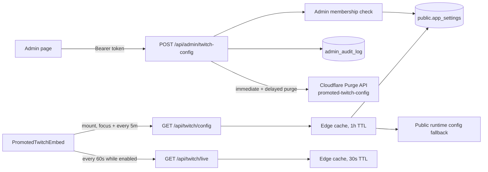

# Frontend runtime

Part of the [systems spec](./README.md): summary, flow, files, and invariants per system.

## Language selection

The app bar uses a compact translation icon with native language names and a checked current
language; phones retain the language submenu in More. Settings > Preferences > Appearance provides
the same language menu. `useLocaleSwitch` shares pending, cooldown, and error feedback across
these controls. One shared cache watcher and countdown timer remain active until the last selector
unmounts. All menu entries are disabled during a switch.

A locale switch passes an `AbortSignal` through metadata loading to the Tarkov proxy requests.
A superseding programmatic selection aborts the prior load, and only the current selection may
commit success or restore the previous locale and reload its metadata after failure. Aborted responses cannot update
metadata or its cache.

An uncached language starts a ten-second cooldown. Other uncached languages stay disabled until it
expires; languages with a complete, fresh IndexedDB switch cache for the current game mode remain available.
The cooldown does not apply server-side or prevent direct calls to the public proxy.

## Promoted Twitch configuration

**Summary.** The promoted Twitch embed uses build-time public runtime config as a safe fallback, but
an administrator can change the active channel, display name, and enabled state without a frontend
redeploy. The override is stored in a service-role-only settings table. The public config route is
cached at the edge with a bounded TTL and explicitly invalidated after an admin update; live status is
also edge-cached per TTL, so mounted clients do not invoke the Pages Function for every poll.

### Diagram



### Flow

1. `AdminTwitchConfigCard` loads the effective public configuration with browser caching disabled,
   so a previously cached response cannot make a later save revert newer settings. It obtains the
   current Supabase access token before saving. After a successful save it also publishes the saved
   config to the shared `usePromotedTwitch` client state, so the embed in the same tab adopts the
   change immediately without waiting for a poll.
2. `POST /api/admin/twitch-config` requires authenticated admin membership and validates the Twitch
   channel, display name, and enabled flag. Validation and operational failures include a stable
   `data.code` for clients; the English `statusMessage` remains a non-localized fallback. It calls
   `update_promoted_twitch_config`, which updates the `promoted_twitch` JSON value, advances its
   shared version, and writes the admin audit row in one database transaction. A failure rolls back
   both writes.
3. Only after the transaction commits does the route invoke the `admin-cache-purge` edge function
   with `purgeType: 'twitch-config'`, which calls the Cloudflare Purge API with the
   `promoted-twitch-config` cache tag. If the tag purge fails, the edge function falls back
   to purging the `/api/twitch/config` URL (apex and `www` variants). After a successful immediate
   purge, `EdgeRuntime.waitUntil()` schedules the same purge six seconds later. That delay exceeds
   the config route's five-second Supabase timeout, so a request that read the previous version before
   the commit cannot refill the cache after both purges. If the immediate tag and URL purges both
   fail, the route returns the committed config with `cacheInvalidated: false`; the admin UI applies
   the saved value locally and shows an explicit warning instead of encouraging a duplicate database
   write. The edge function records Twitch-only invalidations as `twitch_config_cache_purge`, not the
   `cache_purge` action consumed by Tarkov game-data cache metadata. A delayed purge failure is logged
   without changing the already returned save result.
4. `GET /api/twitch/config` combines the build-time fallback with a validated database override. A
   missing table, missing row, malformed override, or unavailable database falls back safely instead
   of breaking the embed. The route reads the database only when the Pages Function executes — i.e.
   on cache fills. Its response carries `Cache-Tag: promoted-twitch-config` with a browser TTL of
   five minutes (`max-age=300`) and a bounded Cloudflare edge TTL of one hour
   (`s-maxage=3600` / `cloudflare-cdn-cache-control: public, max-age=3600`), so Cloudflare serves
   cache hits without invoking the Function. The bounded TTL remains the final recovery path
   if invalidation fails, while the delayed second purge prevents a successful invalidation from
   being undone by an in-flight stale fill. When the database read fails, the fallback response is
   sent with `no-store` so a transient outage never pins the env-default fallback at the edge.
   Missing or invalid Supabase credentials are treated as the same uncacheable failure. Successful
   responses include the settings version.
5. `PromotedTwitchEmbed` fetches config on mount, every five minutes while visible, and again on tab
   focus. Browser and edge caching absorb those refreshes between fills. It watches the shared client
   state for immediate propagation of admin saves in the same tab and polls `/api/twitch/live` every
   60 seconds while `enabled === true`, pausing both timers while the tab is hidden. It ignores
   fetched configs older than the latest shared version, so a browser cache hit or overlapping focus
   request cannot revert an admin save. Live responses are edge-cached for 30 seconds, so the CDN
   absorbs the polling traffic instead of the Function.
   Channel changes advance a request generation so stale live results cannot apply after a channel
   cycles back. Channel changes replace the player URL and clear a stored dismissal, disabling hides
   an active player, and an unavailable config endpoint keeps the build-time fallback working.

### Files

- `app/features/admin/AdminTwitchConfigCard.vue` — admin form, authenticated save flow, and shared
  state publish.
- `app/server/api/admin/twitch-config.post.ts` — validation, admin authorization, upsert, audit, and
  post-commit cache purge.
- `app/server/api/twitch/config.get.ts` — public fallback/override resolution and edge-cache
  headers.
- `app/server/api/twitch/live.get.ts` — live-status check with short edge caching.
- `app/components/PromotedTwitchEmbed.vue` — bounded config refresh, live polling, and player state
  updates.
- `app/composables/usePromotedTwitch.ts` — shared client config state for cross-component
  propagation.
- `supabase/functions/admin-cache-purge/index.ts` — Cloudflare Purge API calls, including the
  immediate and delayed `twitch-config` tag purges with purge-by-URL fallbacks.
- `supabase/migrations/20260814120000_add_app_settings.sql` — service-role-only settings table and
  transactional update/audit RPC.

### Invariants

- `public.app_settings` grants no table access to `PUBLIC`, `anon`, or `authenticated`; all reads and
  writes go through server routes using the service role.
- The admin write route must authenticate the user and verify `user_system.is_admin` before reading
  the request body or changing settings.
- Twitch channels are normalized to lowercase and limited to Twitch-compatible letters, digits, and
  underscores with a maximum length of 25 characters. Display names are limited to 50 characters.
- The settings update, version increment, and audit insert are one database transaction; none may
  commit independently.
- Invalid or unavailable database overrides never make the public route fail; build-time runtime
  config remains the fallback.
- The build-time fallback is opt-in: `NUXT_PUBLIC_PROMOTED_TWITCH_ENABLED` must be exactly `true` to
  promote a stream without a database override or admin write. The admin-managed override can change
  the effective channel, display name, and enabled state. A missing or malformed build-time flag
  resolves to disabled.
- The config response must carry the `promoted-twitch-config` cache tag and a bounded edge TTL so
  Cloudflare serves cache hits without executing the Pages Function; the route and its database read
  run only on cache fills. A failed database read must not be cached (`no-store`), so a transient
  outage cannot pin the env-default fallback at the edge.
- The admin route must purge the `promoted-twitch-config` tag only after the database transaction
  commits, then schedule a second purge after a delay longer than the config read timeout so an
  in-flight stale fill cannot survive successful invalidation. If immediate invalidation fails, it
  must return the committed config with an explicit warning flag; the client must apply that config
  and visibly warn the admin without retrying the database write. The bounded TTL remains the final
  recovery path when invalidation fails.
- Mounted clients must refresh config every five minutes while visible and on mount/focus so remote
  enable, disable, and channel changes reach continuously open tabs. Config refreshes and live-status
  checks stop while the tab is hidden, and pending lifecycle work must not start timers after unmount.
  Older config versions and stale live-request generations must never overwrite the latest shared
  configuration or player state.
- Twitch-only invalidations must use the `twitch_config_cache_purge` audit action. The `cache_purge`
  action is reserved for `all` and `tarkov-data` purges because `/api/tarkov/cache-meta` treats its
  latest successful row as a signal to clear browser game-data caches.

The `admin-cache-purge` Edge Function returns `{ error: code, code }` for failures while retaining
HTTP status and CORS headers. Authentication, authorization, method, purge-type, configuration, and
upstream failures have stable codes. `useEdgeFunctions` preserves the response envelope in error
`data`; `AdminCacheCard` maps recognized codes through `admin.error.*` and uses a generic localized
fallback for older or unknown errors. Upstream purge details remain in server logs.

## Boot-time asset-failure recovery

**Summary**: When a hashed chunk or the entry module fails to load — for example, a stale
`/_nuxt/*` URL returning HTTP 404 during a rolling deploy — the app recovers automatically.
Missing assets return a real 404 under the
[public document routing model](../architecture.md#public-rendering-and-discovery).
Recovery runs in two layers that
share one retry budget: a pre-boot inline script for entry-module failures (the bundle never
boots, so in-bundle code cannot run) and the in-app ChunkRecovery for lazy-chunk failures after
boot.

### Flow

```text
Page load
  → inline recovery script registers in <head> (before the entry module)
  → entry module fails? (error event on same-origin <script type="module">)
      → cooldown budget available? → record attempt → reload once with ?_tt_retry=<ts>
      → budget exhausted or storage write fails → stay on the broken page (manual refresh needed)
  → app boots → lazy chunk fails? (ChunkLoadError / blocked network request)
      → NuxtErrorBoundary / error handlers in app.vue → same budget check → hard reload once
      → still failing → friendly localized error page (errors.chunk_load_blocked /
        errors.network_access_denied)
```

### Step-by-step

1. `nuxt.config.ts` emits the inline recovery script from `app/utils/entryRecoveryScript.ts` via
   `app.head.script`, so it lands in `<head>` before the entry module script in the built
   `index.html`.
2. The script registers a capture-phase `error` listener. It ignores classic scripts and
   cross-origin scripts; for same-origin `type="module"` failures it checks the shared cooldown,
   writes the attempt timestamp to sessionStorage, and reloads with a `_tt_retry` cache-buster so
   the HTML request revalidates (`max-age=0, must-revalidate`) against the fresh deployment and
   boots with the new chunk names.
3. Once the app boots, `app/app.vue`'s ChunkRecovery handles lazy-chunk and network failures with
   the same budget key, then surfaces localized error messages when recovery cannot succeed.

### Files

- `app/utils/entryRecoveryScript.ts` — the pre-boot inline script string.
- `nuxt.config.ts` — `app.head.script` placement, before the entry module in `<head>`.
- `app/app.vue` — ChunkRecovery: error patterns, cooldown check, hard reload, error page copy.
- `app/locales/en.json` — `errors.chunk_load_blocked` / `errors.network_access_denied` keys.

### Invariants

- The inline script must not depend on the bundle and must execute before the entry module.
- Recovery only triggers for `type="module"` script elements whose `src` parses (via the URL
  constructor against the page) to exactly `window.location.origin`. No string-prefix checks —
  they admit deceptive hosts such as `https://app.test.evil.example.com` and cross-host
  protocol-relative URLs.
- Both layers share the `tt:auto-reload-on-asset-error` sessionStorage key and the 120000 ms
  cooldown: at most one recovery reload per 2 minutes per tab session, so a prolonged outage
  cannot produce a reload loop.
- A throwing sessionStorage write must abort the reload (return before `location.replace`),
  otherwise storage breakage produces an unbounded reload loop.
- The retry URL always carries `_tt_retry=<timestamp>` so the reload bypasses the browser's cached
  HTML and revalidates against the current deployment.

## Light/dark theme system

**Summary**: Dark is the default and only mandatory theme; light mode is an opt-in user
preference (issue #102). The light theme never edits component markup globally: it flips the
neutral `surface` ladder plus companion text/state/border tokens under `[data-theme='light']` on
`<html>`, so every `surface-*` utility, Nuxt UI `neutral` alias, and the semantic
`--color-bg/-text/-link` tokens re-render on a warm paper scale. Gameplay accent palettes keep
their identity: accent _backgrounds_, rings, borders and gradient stops (steps 500-950) and the
pale tint steps (50-100) are byte-identical in both themes. Only the accent _foreground_ range
(steps 200-400, plus the bare Nuxt UI accent aliases) is re-pointed at the deep end of the same
hue under light, because those steps are authored as foregrounds for dark surfaces and would
otherwise land at 1.0-3.6:1 on paper. The preference
is device-local: a dedicated `tt_theme` localStorage key (not the user-scoped preferences store)
so the pre-paint boot script and the in-app `useTheme` composable read the same source.

### Flow

```text
First paint
  → THEME_BOOT_SCRIPT (inline <head> script in nuxt.config)
      reads tt_theme → validates value (mirrors normalizeThemeMode) → sets <html data-theme> + colorScheme
      → pre-hydration skeleton style block matches the light canvas (no dark flash)
App boot
  → useTheme() restores the client-persisted mode and re-applies it idempotently
  → toggle (AppBar sun/moon button or Settings > Appearance card)
      → setThemeMode persists tt_theme + sets data-theme + colorScheme atomically
```

### Step-by-step

1. `app/assets/css/tailwind.css` ends with `:root[data-theme='light'] { ... }`, which overrides
   only the neutral tokens (surface ladder role-mapped to parchment canvas → snow cards → dark
   ink; `--color-text*`, `--state-*`, `--border-*`, `--color-link`, `--color-failed`,
   `--color-checker-*`, three hardcoded Nuxt UI `--ui-*` aliases, and light-tinted `.vue-flow`
   `--vf-*` text vars) plus the accent foreground range described above: for every accent family
   `200 → 950`, `300 → 900`, `400 → 800` (pvp/pve take one extra step because their ladders sit
   near the neutral end, and `accent` follows primary's steps), and the bare `--ui-<accent>`
   aliases resolve to step 800/900 so
   `text-primary`, `bg-primary/10` and `ring-primary/25` stay legible together.
   `@custom-variant light` enables per-spot `light:` utilities where a specific component needs a
   different accent treatment (tone gradients, badges, brand buttons).
   Two consequences follow from the split and are load-bearing:
   - `text-<accent>-500` cannot be remapped at the token level (step 500 is the primary accent
     _background_), so those foregrounds carry explicit `light:text-<accent>-800/900` companions.
   - A dark accent plate paired with a light accent label (`bg-success-900` + `text-success-300`)
     would collapse to one colour once the label deepens, so those surfaces carry
     `light:bg-<accent>-100` companions that turn the plate pale instead.
2. `app/utils/theme.ts` owns `ThemeMode`, `normalizeThemeMode` (invalid/missing → dark), storage
   helpers, `applyThemeMode`, and `THEME_BOOT_SCRIPT`. Keeping the boot script next to the
   normalization it mirrors is deliberate; nuxt.config imports the same constant.
3. `nuxt.config.ts` inlines the boot script as the first `app.head.script` and extends the
   pre-hydration skeleton `<style>` with light surface fallbacks scoped to `[data-theme='light']`.
   It also pins `colorMode.preference/fallback` to `dark` so Nuxt UI's `.dark` alias block stays
   deterministic; those aliases resolve through the flipped `surface` palette.
4. `app/composables/useTheme.ts` exposes the singleton `themeMode` state and
   `setThemeMode`/`toggleThemeMode` used by the AppBar toggle and the Settings AppearanceCard.

### Invariants

- Dark is the default and is pixel-identical to before: the `:root[data-theme='light']` overrides
  are inert in dark mode and every component `light:` utility requires `data-theme='light'`.
- Theme state lives in `tt_theme` only; keep it out of the user-scoped preferences store so the
  boot script never depends on auth state. Account-level sync is a separate follow-up.
- `normalizeThemeMode` is the runtime validator (unknown values become dark). The synchronous
  inline `THEME_BOOT_SCRIPT` mirrors this accepted-value validation check identically before runtime
  modules load.
- Light-mode dimmed `surface-500` copy remains readable on shell chrome. Pale accent steps
  50–100 and translucent accent labels require explicit opaque light-mode ink companions when
  placed on paper surfaces; remapping the opaque accent ladder alone does not fix alpha contrast.
- Inline `hsl()` colors bypass the token ladder entirely, so any element that computes a color
  inline (the trader progress-percentage text and the progress-bar gradient fill are the
  examples; both resolve through `traderPercentageStyle.ts`) must read `useTheme`'s
  `isLightTheme` and pick a light-safe lightness itself — for the 0–120° hue ramp, 22% lightness
  clears AA for text (worst case 5.06:1 on the surface-900 card) and 26% keeps the progress-bar
  fill above the 3:1 non-text threshold against its track, while dark keeps the authored 55%/45%.
  Hue gradients encode information; keep the hue, change only the lightness.
- New components should prefer `surface-*`/semantic tokens over hardcoded `white`/`black` so both
  themes work without `light:` overrides; reserve `light:` for accent-on-accent cases.
- Light mode must not be measurably worse than dark for text contrast. Both themes are audited
  per route by resolving computed colours (including `oklch()` and composited alpha) against the
  effective background and checking WCAG AA: 4.5:1 for body text, 3:1 for large text and non-text
  indicators such as the checkbox tick and focus ring. A change that leaves any route with more
  failures in light than in dark is a regression, even when the failing element is theme-agnostic.
- Fixed-dark item action overlays and map tiles retain light foregrounds in light mode instead
  of inheriting inverted neutral ink. Floating map toolbars use theme-aware surfaces, not the tile
  palette: enabled visibility toggles and open popover buttons share `MAP_BUTTON_ACTIVE_CLASS`
  with a dark light-mode foreground. The selected Appearance option has a contrasting inset ring;
  keyboard focus uses a separate offset outline so focusing never replaces the selection boundary.
- Interactive card content uses native controls: trader navigation lives on the named header
  button and skill editing on its labelled input, not redundant clickable containers. Objective
  rows ignore events from their nested controls, and their Space handler checks `.self` before
  preventing default so nested buttons retain keyboard activation.
- Checkbox light-mode plate and tick overrides stay paired by color: success uses a pale
  `success-100` plate with a dark `surface-50` tick; other colors retain their own plates and
  inherit Nuxt UI's inverted foreground. Never apply the dark tick globally to dark accent plates.
- Accent steps 500-950 and 50-100 are the stable contract. Deepening a light foreground by editing
  those steps would move accent backgrounds and pale tints (`light:hover:bg-pvp-100/70` and the
  `bg-<accent>-100` chip plates depend on 100 staying pale), so foreground fixes belong in the
  200-400 remap or in an explicit `light:text-*` companion.

### Files

- `app/assets/css/tailwind.css` — `@custom-variant light` and the `[data-theme='light']` token block
- `app/utils/theme.ts` — ThemeMode, normalization, storage, apply, `THEME_BOOT_SCRIPT`
- `app/composables/useTheme.ts` — singleton state + set/toggle
- `app/features/settings/AppearanceCard.vue` — Settings > Preferences theme selector
- `app/shell/AppBar.vue` — sun/moon toggle in the utilities group (collapses into More menu on mobile)
- `nuxt.config.ts` — boot script, light skeleton fallbacks, pinned `colorMode`
