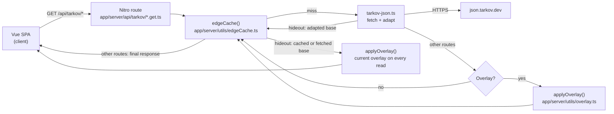
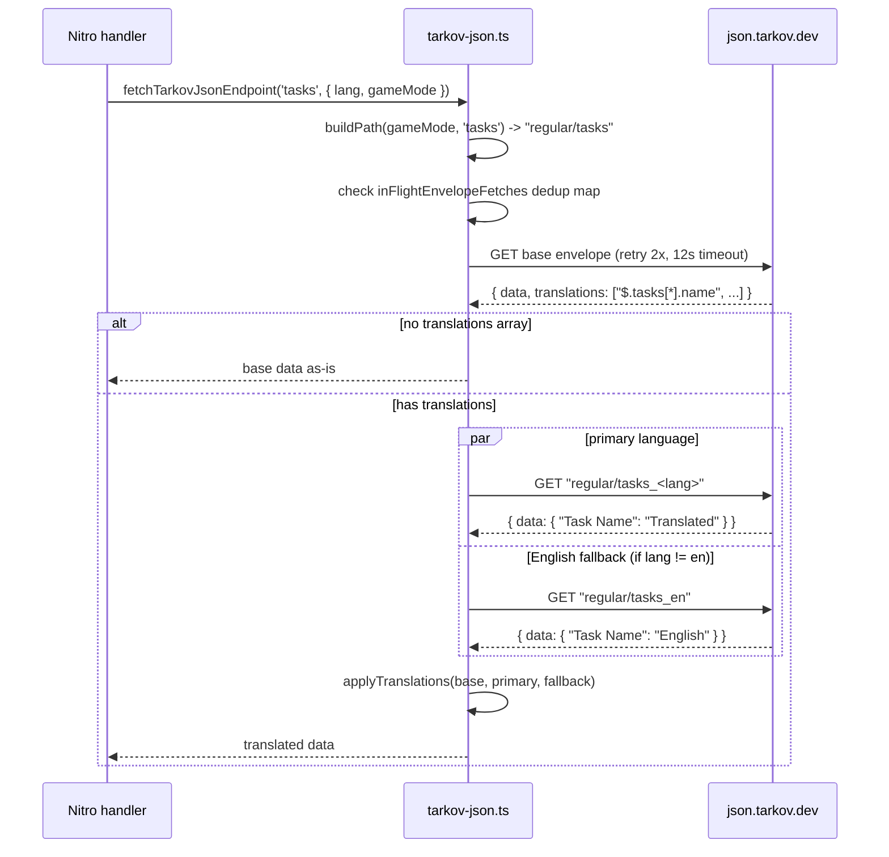
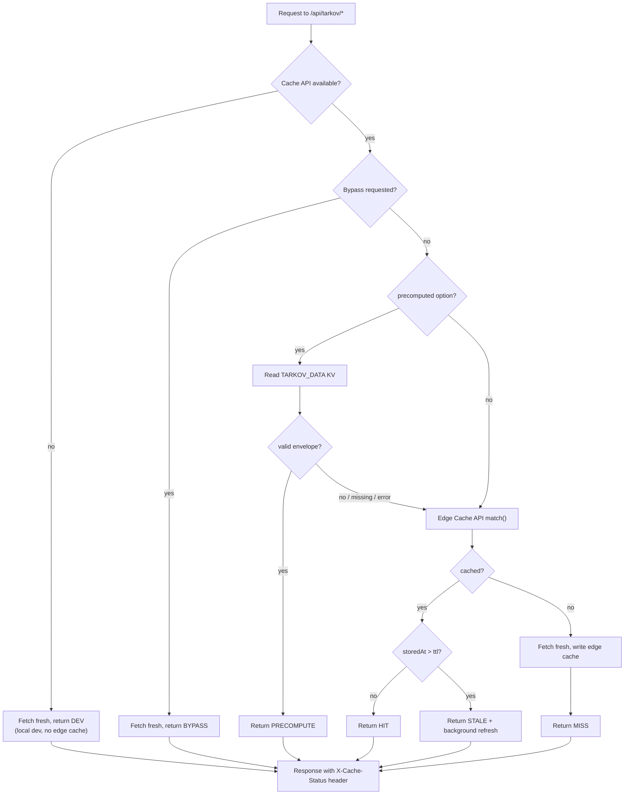

# Game data

Part of the [systems spec](./README.md): summary, flow, files, and invariants per system.

## Tarkov.dev data integration

**Summary.** TarkovTracker does not ship its own copy of the game database. Static game data
(tasks, hideout stations, items, maps, traders, prestige levels, player levels, map spawns) comes
from the community-maintained `json.tarkov.dev` static JSON API. The browser never calls
`json.tarkov.dev` directly — every request goes through our own Nitro server routes under
`/api/tarkov/*`. The server route fetches from upstream, adapts the raw JSON into the shape our
client expects, and (for most endpoints) applies corrections (see [Overlay](./overlay-and-precompute.md#overlay-corrections))
before returning it.

> **Note on upstream endpoints.** `json.tarkov.dev` is the static JSON API TarkovTracker uses for
> all Tarkov.dev game data. TarkovTracker no longer uses the older `api.tarkov.dev` GraphQL API;
> do not use it for new TarkovTracker functionality. The current static endpoint list is available
> at `https://json.tarkov.dev/endpoints`.

**Why a proxy instead of calling upstream from the browser?**

- We control caching headers and can serve stale-while-revalidate from the Cloudflare edge.
- We can apply the overlay and adapt the payload once on the server instead of in every client.
- We can keep the upstream retry/timeout budget server-side (see [Data fetching](#data-fetching-pipeline)).
- We avoid leaking the user's IP to a third party and avoid CORS quirks.

### Endpoints

| Endpoint                       | Purpose                      | Cache TTL  | Precomputed? | Overlay? |
| ------------------------------ | ---------------------------- | ---------- | ------------ | -------- |
| `/api/tarkov/bootstrap`        | Player levels                | 12h        | no           | no       |
| `/api/tarkov/tasks-core`       | Tasks, maps, traders         | 12h        | **yes**      | yes      |
| `/api/tarkov/tasks-objectives` | Task objectives              | 12h        | no           | yes      |
| `/api/tarkov/tasks-rewards`    | Task rewards                 | 12h        | no           | yes      |
| `/api/tarkov/hideout`          | Hideout stations             | 12h        | no           | yes      |
| `/api/tarkov/items-lite`       | Items (minimal)              | 24h        | no           | yes      |
| `/api/tarkov/items`            | Items (full)                 | 24h        | no           | yes      |
| `/api/tarkov/prestige`         | Prestige levels              | 24h        | no           | yes      |
| `/api/tarkov/editions`         | Editions, chapters, perks    | 1h overlay | no           | yes      |
| `/api/tarkov/overlay-status`   | Last complete fleet manifest | no-store   | no           | metadata |
| `/api/tarkov/map-spawns`       | Map spawn points             | 12h        | no           | no       |
| `/api/tarkov/cache-meta`       | Cache purge status           | 5m edge    | no           | no       |

Task, hideout, item and prestige endpoints consume overlays. The editions endpoint projects
editions, story chapters and Seasonal perks from the same validated loader. Bootstrap and
map-spawns remain upstream-only; cache-meta and overlay-status expose operational metadata.

Only `tasks-core` is precomputed today (it is the largest, hottest, and most expensive payload).
See [Precompute](./overlay-and-precompute.md#precompute-workflow).

The hideout route is the cache-order exception: its `json-v5` edge entry stores the adapted base
payload, then the handler applies the current module-cached overlay after every edge-cache read. Its
browser IndexedDB entry also uses `json-v5`, with a one-hour TTL matching overlay freshness. This
keeps the 12-hour edge cache and the browser cache from pinning an old overlay correction. The other
overlay-enabled routes cache their final overlay-applied payload.

### Diagram

### Files

- `app/server/api/tarkov/*.get.ts` — one handler per endpoint. Most are thin wrappers around
  `edgeCache`; `editions.get.ts` projects the overlay directly and `overlay-status.get.ts` reads the
  precompute manifest, so neither goes through the cache layers.
- `app/server/utils/tarkov-json.ts` — upstream fetch + adapt into client types.
- `app/server/utils/tarkov-cache-config.ts` — TTL constants and game-mode validation.
- `app/types/tarkov.ts` — the adapted shapes the client stores.

### Invariants

- The browser must never call `json.tarkov.dev` directly. All static game data flows through
  `/api/tarkov/*`.
- Every handler that fetches upstream game data returns its payload through `edgeCache()`; no
  handler fetches upstream outside the cache wrapper. The operational routes (`access-check`,
  `cache-meta`, `overlay-status`) fetch nothing upstream and do not use it.
- Only `json.tarkov.dev` static endpoints are used for upstream game data. The `api.tarkov.dev`
  GraphQL playground is deprecated and must not be called by TarkovTracker code.
- Overlay is applied only by endpoints that call `applyOverlay()` in their handler. Adding a new
  endpoint does not imply adding overlay — only add it when the upstream data needs corrections.
- Game mode is validated with `validateGameMode()` and defaults to `regular` on any invalid input.
- Internal `pvp`, `pve`, and `seasonal` modes map to upstream `regular`, `pve`, and `pvp-season`
  respectively. The upstream endpoint catalog is the authority for supported slugs.
- Language is validated with `getValidatedLanguage()` and defaults to `en`.

### Prestige, editions, fleet verification, and cache bundle scope

Prestige and progression-catalog responses await overlay refresh before creating downstream cache entries. Story chapters normalize missing/nonfinite order to zero, and prestige rows fall back to chapter names/IDs when requirement labels are absent.

Overlay fleet verification requires `X-Cache-Status: PRECOMPUTE` and matching nonempty version/SHA identities in the published overlay, full-fleet manifest, and served response. Invalid timestamps or malformed provenance remain unverified. Filtered busts do not certify a complete release: rerun the unfiltered precompute before promotion. The production verifier uses the configured HTTPS `OVERLAY_URL` (defaulting to the published main overlay).

Critical cache bundles carry mode/language scope and replace every matching collection, including empty arrays. Cached hydration owns the request tokens and clears stale errors/loading; superseded initializers and background callbacks cannot overwrite the new scope.

## Data fetching pipeline

**Summary.** `tarkov-json.ts` is the only module that talks to `json.tarkov.dev`. It fetches the
base (English) envelope, fetches the requested language envelope (and an English fallback if the
requested language is not English), then applies translations onto the base data. It has bounded
retries, a hard timeout, and deduplication of in-flight requests so a burst of cache misses for the
same payload only hits upstream once.

### Flow

### Retry, timeout, and dedup budget

- `DEFAULT_TIMEOUT_MS = 12000` per attempt, `DEFAULT_MAX_RETRIES = 2` attempts per envelope.
- Exponential backoff between attempts: 1s, then 2s, capped at 5s.
- The total upstream budget is bounded under Cloudflare's 100s origin limit. Worst case per route
  is roughly 2 legs (base + lang/en) × (2 retries × 12s + backoff) + overlay ≈ 55s, which fails
  fast (502) instead of triggering a 524.
- `inFlightEnvelopeFetches` is a module-level `Map<key, Promise>`. A concurrent cache miss for the
  same URL shares one upstream request. The key is `${url}|${timeoutMs}|${maxRetries}`.

### Translation application

`json.tarkov.dev` returns a `translations` array of JSONPath strings (e.g. `$.tasks[*].name`) that
point at string keys to look up in the language envelope. `applyTranslations` walks those paths and
replaces the key with the translated string.

- A fast path (`immutableUpdate`) handles the common JSONPath shapes (`*`, `prop[*]`, `prop`)
  without a dependency.
- If a path shape is not handled by the fast path, it falls back to `jsonpath-plus` for correctness.
- Primary language wins; English is the fallback when a key is missing in the primary language.

### Files

- `app/server/utils/tarkov-json.ts` — fetch, retry, dedup, adapt, translate.
- `app/server/utils/language-helpers.ts` — `getValidatedLanguage()`.

### Invariants

- Only `tarkov-json.ts` imports a fetcher for `json.tarkov.dev`. No other module hits upstream.
- Every upstream call uses `fetchEnvelope` (which enforces timeout + retry + dedup). No raw `$fetch`
  to upstream anywhere else.
- A missing translation falls back to English when available; otherwise, the original
  translation key is preserved.
- The upstream budget must stay under Cloudflare's 100s origin limit. If you add a new leg, budget
  it here.
- Upstream `link`/`wikiLink` values are untrusted. The adapters keep them only when they pass
  `toTrustedGameLinkUrl` (`app/utils/externalUrl.ts`: HTTPS, no credentials, allowlisted host).
  Client link helpers (`tarkovKeyHelpers`, `useWikiLink`, `GameItem`) re-check the same way, because
  overlays and older cached payloads bypass the adapters, and fall back to ID-derived tarkov.dev URLs.
  Link UI renders from the sanitized URL, so a rejected wiki link hides its action instead of leaving a
  dead anchor.

## Multi-layer caching

**Summary.** Game data is served from a four-layer cache that falls through on miss. The goal is:
**a warm colo never blocks on upstream, and a slow or failing upstream never blocks the user.**

### The four layers (in order)

1. **Precomputed KV** (globally replicated) — only when `edgeCache({ precomputed: true })`. Reads
   the `TARKOV_DATA` KV binding populated by the scheduled precompute workflow. See
   [Precompute](./overlay-and-precompute.md#precompute-workflow).
2. **Edge Cache API** (per-colo, Cloudflare `caches.default`) — the standard layer. Stores the
   adapted + overlay-applied payload with `s-maxage = ttl + staleTtl`. The hideout route instead
   stores its adapted base payload and applies the current overlay after the cache read.
3. **Upstream fetch** — on a cold miss, run the full pipeline (fetch → adapt → overlay) and write
   the result back into the edge cache.
4. **Dev fallback** — when running locally with no Cache API (`globalThis.caches` undefined), skip
   caching entirely and always fetch. Sets `X-Cache-Status: DEV`.

On top of these, the **client** has its own IndexedDB cache in `useMetadataStore` so the browser
does not re-fetch on every navigation. That layer is documented in `architecture.md`. Anything passed
to `setCachedData` must be structured-cloneable, so store-held catalogs stay `markRaw` on every
assignment including empty fallbacks: a plain array assigned to store state becomes a reactive proxy,
and IndexedDB rejects a proxy with `DataCloneError`, disabling that cache entry for every visit.

### Stale-while-revalidate

The full-items route opts into `edgeCache({ response: true })`: final cached JSON is streamed on
hits rather than parsed and serialized again. New entries store sanitized overlay headers and an
internal response-format marker alongside their body. Older or unknown markers fall back to JSON
parsing, so no purge or coordinated rollout is required. Only public cache/overlay headers are
returned; internal retention and storage metadata remain private to the Cache API. The default
object-returning path, hideout's post-cache overlay, and precomputed KV validation are unchanged.

When an edge cache entry exists but is older than `ttl`, the handler:

1. Returns the stale payload immediately with `X-Cache-Status: STALE`.
2. Kicks off a background refresh via `reviveCacheEntry()`, guarded by an `inFlightRevalidations`
   set so only one refresh per key runs at a time.
3. Uses `ctx.waitUntil()` on Cloudflare so the response is not cut off when the request returns.

This is why a slow upstream never blocks a warm colo: the user gets stale data in milliseconds and
the refresh happens after the response is sent.

### Bypass

`shouldBypassCache(event)` returns true when `NUXT_CACHE_BYPASS_ENABLED` is on AND the request sends
`x-bypass-cache` / `x-cache-bypass` header, or `?nocache` / `?cacheBust` query. Bypass skips both KV
and edge cache, fetches fresh, and sets `X-Cache-Status: BYPASS`. Used for forcing a refresh after a
data correction.

### Diagram

### Response headers

| Header                | Meaning                                                             |
| --------------------- | ------------------------------------------------------------------- |
| `X-Cache-Status`      | One of `PRECOMPUTE`, `HIT`, `STALE`, `MISS`, `BYPASS`, `DEV`        |
| `X-Cache-Key`         | Full cache key (`prefix-key`)                                       |
| `Cache-Control`       | `public, max-age=ttl, s-maxage=ttl` for fresh; `no-cache` otherwise |
| `X-Overlay-Status`    | Overlay result (`fresh` / `cached` / `stale` / `missing`)           |
| `X-Overlay-Version`   | Overlay `$meta.version`                                             |
| `X-Overlay-Generated` | Overlay `$meta.generated` timestamp                                 |
| `X-Overlay-Sha256`    | Overlay `$meta.sha256`                                              |

### Files

- `app/server/utils/edgeCache.ts` — the `edgeCache()` function and `reviveCacheEntry()`.
- `app/server/utils/edgeCacheKey.ts` — builds the synthetic `Request` used as the Cache API key.
- `app/server/utils/edgeCacheSanitizers.ts` — sanitizes error messages before they reach the client.
- `app/server/utils/precomputedTarkov.ts` — KV binding contract shared with `scripts/precompute`.
- `app/server/utils/tarkov-cache-config.ts` — `CACHE_TTL_DEFAULT` (12h), `CACHE_TTL_EXTENDED` (24h).

### Invariants

- Cache layers must be checked in order: precomputed KV → edge Cache API → upstream. Never skip a
  layer or reorder them.
- A `STALE` response must always trigger exactly one background refresh (guarded by
  `inFlightRevalidations`).
- `X-Cache-Status` must be set on every successful response served through `edgeCache`. Responses
  from its catch block do not set it (`503` when the failure already carried `503`, otherwise `502`),
  and the routes that deliberately bypass the cache layers (`editions`, `overlay-status`) do not set
  it either — the invariant covers the `edgeCache` success paths only.
- The cache key must include language and game mode so two locales or modes never share an entry.
- Hideout edge-cache entries must contain the adapted base payload, not the overlay-applied response;
  `hideout.get.ts` applies the overlay after `edgeCache()` and restores the overlay metadata headers.
- Only final-payload routes may request response mode. Fresh and stale hits must retain the same
  outward cache and overlay headers as the object path; a stale stream still schedules revalidation.
- The browser hideout cache version must match the server route version and its TTL must not exceed
  the one-hour overlay TTL.
- The precomputed envelope is only trusted if `isPrecomputedEnvelope()` returns true; a corrupt
  write falls through to the edge cache instead of serving `null`.
