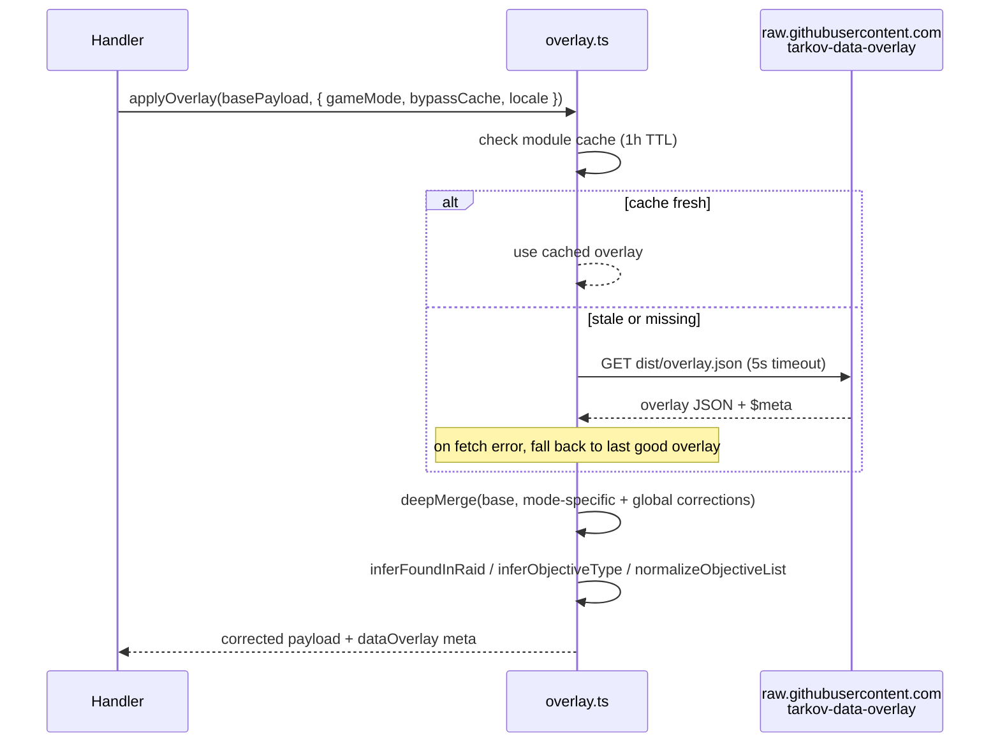
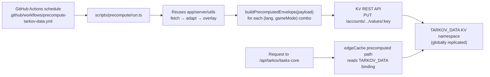

# Overlay and precompute

Part of the [systems spec](./README.md): summary, flow, files, and invariants per system.

## Overlay corrections

**Summary.** `json.tarkov.dev` is community-maintained and sometimes wrong (e.g. a task's
`minPlayerLevel` is off). The `tarkov-data-overlay` repo publishes a small JSON of corrections.
TarkovTracker fetches that overlay on the server, deep-merges it onto the upstream data, and
attaches overlay metadata to the response headers so we can tell which version was applied.

### Flow

### Behavior details

- Module-level cache (`cachedOverlay`, `cacheTimestamp`) with a 1-hour TTL
  (`OVERLAY_CACHE_TTL = 3600000`).
- The configured overlay URL must use HTTPS. Invalid URLs and non-HTTPS schemes fall back to the
  trusted `raw.githubusercontent.com` source so corrections cannot be modified in transit.
- Redirects are followed manually (`redirect: 'manual'`) for at most `MAX_OVERLAY_REDIRECTS = 3`
  hops, and every hop must also be HTTPS. A redirect to a non-HTTPS target, a redirect without a
  `location` header, or exceeding the hop limit aborts the fetch and leaves the previous overlay in
  place.
- Overlay task patches carry trader requirements in the raw upstream shape: one
  `traderRequirements` list discriminated by `requirementType` (`level` gates
  trader loyalty level, `reputation` gates standing). `applyOverlay` re-splits
  a patched task's merged list into `traderLevelRequirements` and
  `traderRequirements` (reputation-only) for compatibility, and regenerates the canonical
  `normalizedTraderRequirements` consumed by availability, badges and progress implications
  ([canonical task progression](./tasks.md#canonical-task-progression)). A patch's `traderRequirements` replaces the whole requirement set.
- Overlay corrections and `tasksAdd` entries merge into already-adapted tasks, so `applyOverlay`
  re-normalizes the declared prerequisite and prestige gates it can reach. A corrected task is
  re-normalized only when the patch touches `taskRequirements` or `requiredPrestige`, and a
  recomputation clears only the diagnostic for the field that patch rewrote: the adapter already
  dropped the other malformed value, so its diagnostic is retained rather than recomputed away. Every
  injected task is re-normalized because additions never pass through the adapter. `taskRequirements`
  stays a list and a resolvable `requiredPrestige` becomes a normalized `{ id }` reference. The
  overlay keeps an id-less `{ name, prestigeLevel }` reference verbatim, so it is not a loss and gets
  no diagnostic; only a declared gate the normalization had to drop becomes a
  `requirementDiagnostics` entry ([canonical task progression](./tasks.md#canonical-task-progression)).
- On fetch failure, serves the last good overlay (stale) rather than failing the request.
- Overlay supports mode-specific corrections under `modes[gameMode]` plus global corrections.
- Per-locale corrections under `locales[locale]` patch `tasks`, `items`, `traders` and `maps`
  (locale-sensitive fields such as name, wikiLink, and objective descriptions) and are applied last
  so they take precedence over global and mode-specific corrections. The locale defaults to `en`
  when a handler does not pass one.
- `tasksAdd` lets the overlay inject entirely new tasks not present upstream.
- Objective post-processing (`objectiveTypeInferrer.ts`) normalizes objective lists and infers
  `foundInRaid` flags so the client does not have to guess.
- `bypassCache: true` (from `shouldBypassCache`) forces an awaited overlay refresh — used after
  publishing a correction.
- A hideout request with an expired module-cached overlay serves the stale correction immediately
  and registers one coalesced refresh with the Cloudflare execution context. Background task
  rejections are logged and contained. A failed deferred refresh backs off for one minute before
  another hideout request may retry it. Cold requests still await the initial overlay fetch, whose
  five-second timeout covers both response headers and body parsing.
- Hideout applies the overlay after reading its versioned base-data edge entry, so its correction
  freshness is bounded by the overlay module's one-hour cache and browser cache TTL rather than the
  hideout edge TTL. Other
  overlay-enabled routes cache their final corrected payload; publishing new overlay data requires
  a Tarkov data cache purge so those entries and the browser cache-purge marker are invalidated.

### Endpoint ownership and precedence

Every collection merges shared records by ID, then the matching upstream mode (`regular`, `pve`,
`pvp-season`), then supported locale patches. `overlayValidation.ts` validates known collection
shapes, perk filters, craft additions and prestige chapter/objective references before replacing
the last-good overlay. Unsupported story statuses/types fail validation. Unknown root, mode or
locale sections are logged and retained in `dataOverlay.unconsumedSections`, including cache hits;
precompute refuses to publish payloads with unconsumed sections.

| Sections                               | Consumer and identity rules                                                                                                                                                                                                                                                                                                                                                                                                                                                                                                                                  |
| -------------------------------------- | ------------------------------------------------------------------------------------------------------------------------------------------------------------------------------------------------------------------------------------------------------------------------------------------------------------------------------------------------------------------------------------------------------------------------------------------------------------------------------------------------------------------------------------------------------------ |
| `tasks`, `tasksAdd`, `traders`, `maps` | Task routes; existing task IDs win over synthetic additions; maps support locale patches. A map's `extractsAdd` appends well-formed extracts (non-empty `id`/`name`, known or null faction, finite position) whose ID or name is not already present, then is removed from the response; the client applies the same rule to `app/data/maps.json` `extractsAdd`, whose `nameKey` resolves the label through i18n and is copied onto a matching upstream extract that lacks one.                                                                              |
| `items`, `itemsAdd`                    | Both item routes; adapt additions only when an ID is absent upstream, then apply explicit patches and locales.                                                                                                                                                                                                                                                                                                                                                                                                                                               |
| `hideout`, `craftsAdd`                 | Hideout; attach adapted crafts to station ID/level and deduplicate craft IDs globally. Null/absent task unlocks stay `unlockState: unknown`.                                                                                                                                                                                                                                                                                                                                                                                                                 |
| `prestige`                             | Prestige route; patch/append raw conditions by ID before adaptation resolves tasks from upstream plus missing, enabled `tasksAdd` IDs. Array condition patches replace arrays. Locale task/prestige corrections apply before resolution.                                                                                                                                                                                                                                                                                                                     |
| `storyChapters`                        | Editions route and task story unlock projection share chapter identities. Chapter/objective locales supply prestige story requirement names. Stored story progress is evaluated from explicit requirements, never chapter order or hardcoded chapter-name lists. Chapter `endings`, `mutuallyExclusiveQuestPairs`, `referenceCoverage`, and objective `sourceQuestId`/`endingId` survive projection and normalization; the storyline view reads them when a chapter carries them and falls back to objective-level exclusivity and objective text otherwise. |
| `editions`                             | Editions route and metadata store own the mode-scoped edition catalog.                                                                                                                                                                                                                                                                                                                                                                                                                                                                                       |
| `seasonalPerks`                        | Editions route exposes metadata only for `pvp-season`; the store's `resolvedSeasonalPerks` hydrates item/category references as items load, retaining missing IDs with null values. No perk selection/progress persistence is introduced.                                                                                                                                                                                                                                                                                                                    |

Prestige fetches the requested upstream mode; regular corrections cannot leak into PvE or Seasonal.
An empty upstream prestige collection stays empty. Client prestige and edition catalogs are keyed
by mode and language (`json-v3` and `overlay-v2`), and stale responses cannot replace another scope.
The item contract advances to `json-v2`, hideout to `json-v5`, tasks-core to `json-v3`, and IndexedDB
schema 8 clears incompatible browser payloads. The combined progression/overlay release skips the
standalone progression deployment: v3 always uses envelope format 2 with overlay provenance.
The superseded progression-only writer must never publish to these keys; rollback uses v2.
Story references must name own chapter entries, never inherited object properties. Seasonal perk
exclusion lists may be omitted; when present, every entry must be a string.

Story chapter branches follow the overlay's own evidence. Objective-level `mutuallyExclusiveWith`
blocks the opposing objective; chapter-level `mutuallyExclusiveQuestPairs` constrains only whole
sub-quests, so each declared pair becomes one chapter-level route choice and gates chapter bulk
completion, while individual objective toggles stay enabled. Pairs are never merged: two pairs
sharing a quest do not make their other members exclusive, and a route the player has not finished
is never rendered as blocked, because the objective list can be a projection of the overlay capture.
Both sides of a declared pair always render, a side with no captured objectives reporting pending
evidence rather than disappearing. A route is called chosen only when chapter coverage is complete and
exactly one side's steps are all done; under partial coverage a finished side reports known-step
progress instead, and a conflict between two finished sides is reported only when coverage is complete,
because unknown steps can otherwise remain on both.
Declared `endings` replace the text-derived ending labels when a chapter carries them — chapters
without them keep the text path — an ending with no attributed objectives reports pending evidence
rather than being hidden, and exclusivity between endings is not inferred. `referenceCoverage.partial`
surfaces as a chapter badge because a missing objective is not evidence that none exists. Objective
IDs are upstream-owned: completed marks the reconciliation pass below leaves unresolved are reported
for re-checking on the viewer's own progress only, never remapped on a guess.

Saved story objective marks are reconciled against the published catalog by
`app/utils/storyProgressMigration.ts`, on every chapter-catalog load and after a realtime merge,
which unions both sides' objective IDs and can reintroduce a retired one. Only the mode the loaded
catalog belongs to is reconciled: chapters are fetched per mode and language and the overlay may scope
a chapter to one mode, so a catalog is evidence about its own mode only. A merge naming another mode is
deferred to that mode's own catalog load, which a mode switch or the next start performs. The pass is idempotent and acts
only on proof: a mark moves when `STORY_OBJECTIVE_ID_ALIASES` records a re-key the published data
proves (identical unique objective text, or the overlay re-anchoring its own prestige requirement),
the catalog publishes that successor, and the successor carries no mark of its own; a mark whose
successor a partial chapter omits is kept until the successor appears, because that objective list is a
projection, while a complete chapter that omits it settles the question and the mark is dropped; a mark
is also dropped when no alias names it and its ID cannot satisfy the story schema's client-ID shape, so
it can never resolve again and would otherwise be re-synced forever, and when the successor already
carries the player's own mark; an unrecognized client ID is kept for the projection reason. Lookups use own properties, so an
inherited key such as `constructor` is treated as saved data rather than as a published objective. Nothing is dropped unless the loaded chapter itself proves the client-ID contract, so a
stale, curated, or failed catalog load cannot delete progress. Ambiguous re-keys are left unmapped
rather than guessed. Task and hideout IDs have no equivalent pass: the overlay still publishes
synthetic task IDs (`new_beginning_prestige_5`) as live data, so absence there is not proof of
retirement, and a future retirement needs the overlay to declare the replacement first.

### Files

- `app/server/utils/overlay.ts` — fetch, cache, merge, and deferred refresh coordination.
- `app/server/utils/backgroundTask.ts` — keeps deferred refreshes alive through the Cloudflare
  execution context.
- `app/server/utils/overlayResponseHeaders.ts` — restores overlay metadata headers when corrections
  are applied after an edge-cache read.
- `app/server/utils/deepMerge.ts` — `deepMerge` + `isPlainObject`.
- `app/server/utils/objectiveTypeInferrer.ts` — objective normalization.

### Invariants

- The overlay must never block the request path on a fresh fetch for more than
  `FETCH_TIMEOUT_MS = 5000`. On timeout, fall back to the cached overlay.
- Generic task/item/hideout consumers return the base payload with `X-Overlay-Status: missing`
  when no valid overlay is available. Prestige and edition/story/perk catalogs require an overlay
  and fail when no last-good overlay exists, preserving client caches rather than publishing
  incomplete authoritative eligibility data.
- The overlay repository is private. Set `OVERLAY_TOKEN` (a fine-grained, read-only Contents token
  scoped to `tarkov-data-overlay`) in every runtime that fetches it: production, previews, the
  precompute workflow, and local/operator runs such as `pnpm run verify:overlay`. Supply the token
  through the process environment or a secret store. `overlayAuthHeaders` attaches it only to
  `raw.githubusercontent.com` and
  `api.github.com` over HTTPS, never to redirect targets elsewhere, and it must never be logged.
- Overlay data must only be fetched over HTTPS on every server path. A non-HTTPS `OVERLAY_URL` must
  resolve to the trusted default, and no redirect hop may downgrade the transport — the fetch must
  fail rather than read a payload served over plaintext. `applyOverlay` follows HTTPS redirects
  manually; the streamer Kappa editions fetch in
  `app/server/api/streamer/[userId]/[mode]/kappa.get.ts` uses `redirect: 'error'` because its URL is
  a hardcoded constant that never redirects. Any new server-side overlay consumer must do one or the
  other.
- Overlay metadata (`status`, `version`, `generated`, `sha256`) must be propagated to response
  headers so we can debug which correction was applied. Routes that apply an overlay after
  `edgeCache()` must call `setOverlayResponseHeaders()` before returning.

## Precompute workflow

**Summary.** `tasks-core` is the single largest, hottest, and most expensive payload — adapting it
inside a request on a cold, low-traffic Cloudflare colo used to exceed the Workers Free tier CPU
limit and trigger Error 1102. The fix: compute the final payload **off the request path** in a
scheduled GitHub Actions workflow, write it to the `TARKOV_DATA` KV namespace, and have the request
handler read it back through `edgeCache({ precomputed: true })`.

### Why GitHub Actions and not a scheduled Worker?

The account is on the Workers Free tier, whose CPU limit rules out a scheduled Worker doing the full
adapt pipeline. A scheduled GitHub Actions workflow on `pnpm` has no such limit and can reuse the
exact same `app/server/utils` pipeline via `tsx` with the repo's tsconfig paths, so the precompute
output is byte-identical to what the request handler would have produced.

### Flow

### Key contract

- The KV binding name is `TARKOV_DATA` (`PRECOMPUTED_KV_BINDING`).
- The envelope shape is `{ payload, overlay: { version, sha256 }, storedAt, version }` with
  `PRECOMPUTED_ENVELOPE_VERSION = 2`.
- The cache key for `tasks-core` is built by `buildTasksCorePrecomputedKey(lang, gameMode)` and is
  `tasks-core-json-v3-<lang>-<gameMode>`. Both the precompute script and the request handler import
  this function from `precomputedTarkov.ts`, so the keys can never drift.
- Writes go through the Cloudflare REST API (one PUT per key) because the bulk endpoint's request
  size ceiling cannot hold all ~4.2MB envelopes in one call, and per-key writes isolate failures per
  `(lang, gameMode)` combo. Each write retries transport failures, HTTP 429/5xx, and Cloudflare
  error 7009 up to three total attempts, waiting one then two seconds with a fresh 30-second
  request timeout per attempt. Retries reuse the same key, payload and TTL; permanent API errors
  fail immediately, and exhausted retries retain the existing per-combination failure handling.

### Release verification

A run pins the first validated overlay SHA, or `EXPECTED_OVERLAY_SHA` supplied by a manual dispatch.
Missing provenance, a different SHA, invalid task payloads or unconsumed sections fail that
combination before its KV write. Previous entries survive failed combinations. Each successful
entry records language, mode, storage time and overlay identity; envelope validation requires its
identity to agree with `payload.dataOverlay`. Writes remain per-key, not atomic across the fleet. A verifier exit code of zero can include `propagating` rows within the 14-hour window; post-deployment confirmation requires all 48 rows to be `current`, while pre-deployment approval requires the complete matching precompute manifest.
A root `progressionCounters` registry that passes `validProgressionCounters` is consumed (see
[canonical task progression](./tasks.md#canonical-task-progression)). A malformed or mode-nested registry
remains unconsumed and blocks precompute; it is applied nowhere.
Only a complete, unfiltered, failure-free run updates `overlay-precompute-manifest-json-v3`.
The workflow uploads `precompute-manifest.json` even for partial failures, so operators can see
which entries changed. `/api/tarkov/overlay-status` returns the last complete manifest without caching.

Release order: publish the overlay, dispatch precompute with its expected SHA for all 48 supported
language/mode combinations, check the manifest, then advance the existing browser cache-purge marker
and purge corrected edge entries through the established operator workflow. When changing the
consumer contract, precompute the new versioned keys from the reviewed consumer revision before
promoting that app revision; old app revisions keep reading their old keys. Missing new keys still
have the existing live fallback, but that is not proof of production readiness for cold colos.

Run `pnpm run verify:overlay` after promotion. It targets the fixed production origin and prints the path to a report in a
new private temporary directory. The command writes
an artifact comparing the published SHA, last complete precompute and served tasks-core for all
48 language/mode combinations. Missing evidence is `unverified`; a mismatch is `propagating` for
at most 14 hours from the producer generation timestamp (12-hour schedule plus a 2-hour operational
target), then `drift`. Drift/unverified exits nonzero. This is a detection target, not a guarantee
that caches expire within 14 hours. Browser IndexedDB has a separate maximum 24-hour TTL and must
be invalidated through the purge marker for prompt client convergence. Retained seven-day KV
fallbacks are intentionally reported as drift after a failed release, never as a current fleet.

### Files

- `scripts/precompute/precompute.ts` — pipeline orchestration and `KvWriter` interface.
- `scripts/precompute/run.ts` — entry point invoked by the workflow.
- `scripts/precompute/kv.ts` — Cloudflare KV REST writer.
- `scripts/precompute/nuxt-imports.ts` — bridges Nuxt auto-imports for `tsx`.
- `.github/workflows/precompute-tarkov-data.yml` — schedule and secrets.
- `app/server/utils/precomputedTarkov.ts` — shared contract (binding name, envelope, key builder).

### Invariants

- The precompute script and the request handler must build the cache key with the same function
  (`buildTasksCorePrecomputedKey`). Never hard-code the key on either side.
- The envelope version must be bumped any time the envelope shape changes; old envelopes must be
  rejected by `isPrecomputedEnvelope()` and fall through to the edge cache.
- A missing or corrupt KV entry must fall through to the edge cache path, never 5xx.
- The precompute pipeline must reuse `app/server/utils` — it must not re-implement the adapt/overlay
  logic or the outputs will diverge from what the request handler would produce.

If the complete-fleet manifest write fails after payload writes succeed, precompute returns those 48 identities alongside the manifest failure. The CLI writes the diagnostic artifact and exits unsuccessfully so the release remains blocked without losing the record of changed entries.
