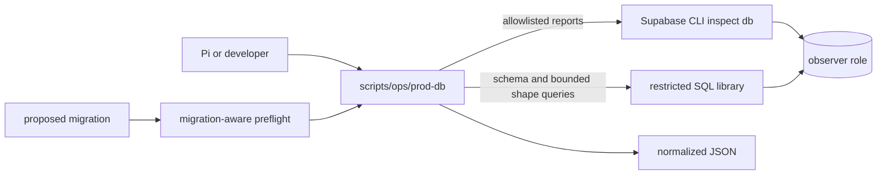

# Production database observer

Part of the [systems spec](./README.md): summary, flow, files, and invariants per system. Operational usage and role provisioning live in the [runbook](../runbook.md#production-database-observer).

## Production database observer

**Summary.** `scripts/ops/prod-db` is the canonical production inspection interface for agents and
humans. It uses Supabase CLI inspection commands for database telemetry and a restricted SQL
library for schema and bounded data-shape reports. The wrapper normalizes every result to JSON so
callers do not depend on Supabase CLI presentation formatting. It never applies migrations or
accepts arbitrary SQL.

### Diagram

### Flow

1. The caller selects an allowlisted operation such as `table-stats`, `outliers`, `locks`, or
   `vacuum`.
2. `scripts/ops/prod-db.mjs` selects the primary direct database target or local target and invokes
   the Supabase CLI with JSON output, then strips CLI connection noise and normalizes the result.
3. Every report captures observation metadata, including `captured_at`, observer application name,
   database statistics reset time, statement statistics reset time, and I/O statistics reset time.
   These timestamps establish the window for cumulative counters.
4. Schema, count, sample, and distribution operations use validated identifiers and bounded SQL.
   The schema report includes relation ACL entries, effective PUBLIC grants, privileges for the
   observer and existing `anon`, `authenticated`, and `service_role` roles (including inherited role
   membership), per-role schema `USAGE`, relation owners, and row-level-security flags. Effective
   privileges are listed only when the role also has `USAGE` on the relation's schema. Column-level
   ACL entries and the effective per-column privileges they grant are reported separately. Health
   reports whether the role can use the migration-history schema and read the `version` or
   `statements` column. Samples select
   allowlisted low-risk columns and are capped at 20 rows; distributions are capped at 50 groups.
5. The observer rejects writes, DDL, transaction-control statements, `EXPLAIN ANALYZE`, arbitrary
   SQL, unbounded samples, and non-allowlisted distributions.
6. `canary` runs only health and telemetry reports and is the first production validation path.
   It rejects privileged/write-capable roles, read access to stored migration statements, and
   unbounded transaction or lock timeouts before it
   runs the telemetry reports. It never reads application rows or runs migration preflight.
7. `preflight --migration <path>` parses the migration to identify referenced relations and
   operation classes, then collects table/index, traffic, vacuum, outliers, lock, and blocking reports
   sequentially to avoid a burst of production inspection queries. It returns an evidence-only JSON
   report. Unsupported or ambiguous syntax fails closed with `assessment: incomplete`,
   `risk: unknown`, and `requires_manual_review: true`. Multiple statements are classified only
   when every statement is a supported table-level `GRANT`/`REVOKE`, optionally wrapped in one
   `BEGIN`/`COMMIT` pair; ACL relations come from the `ON` clause, reserved keywords are rejected as
   unquoted relation or role names, unquoted relation names fold to lowercase, and privilege names
   are not data changes. It does not execute
   the migration.
8. `migration-history` reads applied version identifiers from
   `supabase_migrations.schema_migrations` and compares them against `supabase/migrations` in the
   current checkout, reporting `missing_locally` (applied remotely, absent from the checkout) and
   `pending_remotely` (in the checkout, not applied). It makes remote/local migration divergence
   observable without migration or Management API credentials.
9. Production credentials are supplied only through `PROD_DB_URL`, which must identify a dedicated
   observer role. The wrapper reads only `PROD_DB_*` keys from the repository-root `.env` when they
   are not already exported; explicit environment variables take precedence and other keys in that
   file are ignored. Values remain literal, including passwords; certificate paths must be absolute.
   `PROD_DB_ENV_FILE`, exported by the invoking shell, overrides the file path; setting it inside
   `.env` is unsupported. An explicitly selected file must be readable; an absent
   default `.env` is allowed. Other exported variables remain inherited, so callers must keep
   privileged credentials out of the invoking environment. The wrapper removes its password before
   invoking the Supabase CLI and supplies
   the password through a mode-`0600` temporary `PGPASSFILE`, keeping it out of child-process
   arguments and command errors. The credential file is removed after each CLI invocation.
   The role's actual database privileges are the hard safety boundary; connection defaults such as
   `statement_timeout`, `lock_timeout`, and `default_transaction_read_only` are additional defenses.

### Files

- `scripts/ops/prod-db` — stable executable entrypoint.
- `scripts/ops/prod-db.mjs` — allowlist, SQL validation, Supabase CLI adapter, redaction, and preflight.
- `scripts/ops/prod-db.test.mjs` — local integration tests for the observer contract.
- `.env.example` — observer environment variable documentation.
- `docs/runbook.md` — role provisioning and operational usage.

### Invariants

- Production inspection must use a dedicated database observer identity with no write or DDL
  privileges. Service-role, postgres-admin, migration, and Management API credentials are never
  accepted as observer credentials.
- `PROD_DB_URL` uses a TLS-protected direct connection or session-mode pooler with
  `sslmode=verify-full`; the transaction pooler is
  unsupported because session-level settings are not safe as a security boundary there. The
  wrapper rejects the documented default transaction-pooler port `6543`.
- Observer passwords must not appear in child-process arguments, inherited `PROD_DB_URL` values,
  normalized output, or command errors.
- Every successful operation returns JSON with `ok`, `operation`, `target`, `generated_at`, an
  `observation` object, and `data` or report fields.
- Built-in telemetry is allowlisted and does not depend on Supabase CLI text formatting.
- The schema report exposes catalog ACLs, PUBLIC grants, effective privileges for the observer and
  existing `anon`, `authenticated`, and `service_role` roles, relation owners, and RLS flags without
  reading application rows. Effective privileges account for inherited roles, require schema
  `USAGE` on the relation's schema (reported separately as `schema_usage`), and cover the server's
  supported table privileges. Column-only grants appear in `column_grants` and
  `effective_column_privileges`.
- SQL identifiers are validated before interpolation, row and group limits are enforced, sensitive
  sample columns are excluded, and sensitive distributions are rejected.
- The observer never executes migrations, arbitrary SQL, writes, DDL, `EXPLAIN ANALYZE`, or
  transaction-control statements.
- `canary` is telemetry-only and excludes samples, distributions, and preflight.
- `canary` must fail before telemetry collection when the observer is privileged, can write
  application tables or create persistent objects, can read stored migration `statements`, lacks
  default read-only transactions, or has unbounded statement or lock timeouts.
- Migration preflight is evidence-only and fails closed on unsupported or ambiguous syntax;
  production reports run sequentially, and migration execution remains in the reviewed merge and
  Supabase deployment workflow. The only classified multi-statement form is table-level ACL
  statements, optionally inside one `BEGIN`/`COMMIT` pair, and that transaction remains flagged as
  transaction control.
- Preflight masks string literals the way PostgreSQL lexes them with `standard_conforming_strings`
  on: standard strings end at an undoubled `'`, while `E'...'` escape strings (an `E` not preceded
  by an identifier character) also skip the character after each backslash, including in
  newline-separated continuation segments. Unterminated literals fail closed. A migration that
  changes `standard_conforming_strings` must contain further statements to matter, which already
  keeps it `incomplete`.
- Dollar-quoted values (`$tag$ ... $tag$`) are not masked: their bodies can be executable (`DO`,
  function bodies), so the text stays visible to classification and the observer's unsafe-SQL
  check, and quotes inside never start a literal. Any dollar quote is an unsupported construct,
  which keeps the migration `incomplete`.
- `migration-history` reads only the `version` column of `supabase_migrations.schema_migrations`.
  The stored `statements` column is never selected, and the observer's ledger grant is column-level
  for the same reason, so migration SQL and any literal inside it stay out of both the report and
  the role's reach.
- Version identifiers establish _which_ migrations are recorded, never that their SQL matches.
  Divergence found by `migration-history` is followed by comparing file contents against the
  deployed Git revision, as `docs/runbook.md` requires.
- The comparison must be complete or fail. When the ledger read reaches its row limit the command
  errors instead of reporting `in_sync` or a partial difference.
- The report names the project it observed (`project_ref`, `null` for a local target), so a
  comparison run against the wrong project is detectable. A primary target whose host and observer
  username identify no project fails instead of reporting a nameless comparison. The observer does
  not infer the expected project from application configuration; confirming the identity is the
  operator's step.
