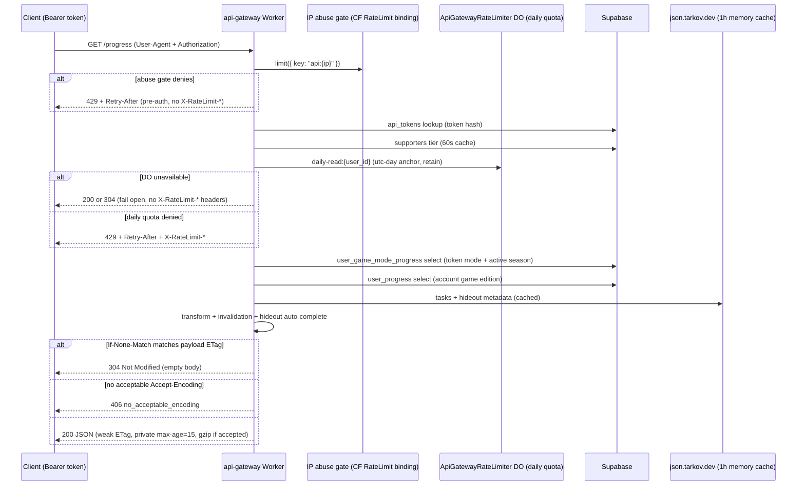

# Progress API

Part of the [systems spec](./README.md): summary, flow, files, and invariants per system.

## Progress API data flow

**Summary.** External clients (TarkovMonitor, RatScanner, tarkov.dev) read and write user progress
through the `api-gateway` Worker on `api.tarkovtracker.org`. A progress read touches several
layers; this section is the canonical map of those layers so a failure can be located quickly
instead of guessed at. Rate-limit ownership details live in
[`rate-limiting.md`](../rate-limiting.md); client-facing quota docs live in
[`api.md`](../api.md#rate-limits-api-gateway).

### Diagram

### Flow

1. **Routing + User-Agent gate.** `workers/api-gateway/src/router.ts` normalizes the path,
   enforces the api host boundary (non-api host requests outside `/health` return 404, while
   loopback hosts such as `localhost` and `127.0.0.1` are admitted for local development), and
   rejects protected endpoint requests without a 5–200 character `User-Agent`; infrastructure routes
   are exempt. Retired apex routes are retained as tombstone bindings in `wrangler.toml` so legacy
   traffic is terminated with 404 at the edge instead of falling through to Pages.
2. **Pre-auth abuse gate.** A Cloudflare Workers Rate Limiting binding (`API_ABUSE_LIMITER`) keys
   on `CF-Connecting-IP` and shields the `api_tokens` lookup from token-rotation floods. It is
   infrastructure protection, not a customer quota, and fails open on binding errors.
3. **Token auth.** `workers/api-gateway/src/auth.ts` validates the bearer token against
   `api_tokens` by hash and checks the permission (`GP`/`TP`/`WP`).
4. **Tier + daily quota.** `resolveTier` reads `public.supporters` (cached 60s), then a single
   `ApiGatewayRateLimiter` Durable Object call (`daily-{kind}:{user_id}`, UTC-day anchor, retained)
   admits or denies the request. The quota counts admitted requests — downstream Supabase failures
   do not trigger refunds. The daily quota fails open on DO unavailability.
5. **Data fetch.** `workers/api-gateway/src/handlers/progress.ts` selects the token mode's
   `progress_data` from `user_game_mode_progress` using the mode's season number, selects only
   account-wide `game_edition` from `user_progress`, resolves a display-name fallback from Supabase
   Auth (24h cache), and loads matching tasks/hideout metadata from `json.tarkov.dev` via
   `workers/api-gateway/src/services/tarkov.ts` (1h memory cache).
   Concurrent misses share one fetch/normalization per resource and upstream mode within an isolate.
   The originating request retains that operation with `waitUntil`; streams are consumed there and
   only parsed public catalog data is shared. Every settled operation leaves the in-flight map;
   failures remain uncached and retryable, with the existing 30-second fetch timeout.
6. **Transform.** `workers/api-gateway/src/utils/transform.ts` converts the JSONB objects into the
   public array format, applies invalidation (`shared/utils/progressInvalidation.ts`, the same
   algorithm the app uses) and game-edition hideout auto-completes.
   Gateway task catalogs are frozen and registered with a prepared dependency graph once per catalog
   snapshot. Expiry replaces the catalog and graph together. Each player still gets fresh invalidation
   state. The app's mutable entry point rebuilds its graph so in-place metadata edits remain visible.
7. **Conditional response.** `conditionalReadResponse` in `workers/api-gateway/src/responses.ts`
   serializes once, derives a weak `ETag` from the payload, answers `304` on a matching
   `If-None-Match`, and sets `Cache-Control: private, max-age=15` plus
   `Vary: Accept-Encoding, Authorization, Origin`. Bodies ≥1 KiB are gzipped when the client
   accepts gzip; an explicit `gzip;q=0` is honored as a rejection, `identity;q=0` bypasses the
   size threshold, and a client that refuses every available coding gets `406`.
8. **Usage accounting.** `workers/api-gateway/src/services/usage.ts` records the read/write (and
   throttle flag) in `public.api_usage_daily` via `record_api_usage`, off the response path.

### Files

- `workers/api-gateway/src/index.ts` — Worker entrypoint; delegates to the modules below
- `workers/api-gateway/src/router.ts` — path normalization, User-Agent gate, API host boundary enforcement, route dispatch
- `workers/api-gateway/src/authentication.ts` — abuse gate, token auth, daily-quota enforcement
- `workers/api-gateway/src/rateLimiter.ts` — `ApiGatewayRateLimiter` Durable Object + quota client
- `workers/api-gateway/src/responses.ts` — CORS, envelopes, conditional response, ETag/compression
- `workers/api-gateway/src/auth.ts` — token validation
- `workers/api-gateway/src/handlers/progress.ts`, `workers/api-gateway/src/handlers/team.ts` —
  progress reads/writes
- `workers/api-gateway/src/services/supporter.ts`, `workers/api-gateway/src/services/usage.ts`,
  `workers/api-gateway/src/services/tarkov.ts`
- `workers/api-gateway/src/utils/transform.ts`
- `shared/utils/progressInvalidation.ts` — runtime-independent task/objective invalidation
  (faction, failed-only and failed prerequisites, `failed`-tolerant requirements), shared by the
  app progress store, public profile/streamer views, and the Worker transform
- `shared/utils/requirementStatus.ts` — runtime-independent task-requirement status predicates,
  shared by invalidation, app task actions, failed-state repair, and the Worker
- `shared/utils/taskTransitions.ts` — runtime-independent explicit task-state transitions (dependent
  lock/unlock) used by Worker task writes
- `shared/utils/userMetadata.ts` — runtime-independent provider metadata parsing, shared with app
  user hydration through the `@shared` alias in Nuxt and the Worker build/test configuration
- `docs/rate-limiting.md`, `docs/api.md` — ownership map and client-facing docs

### Invariants

- App user hydration and API progress responses share provider metadata fallback ordering, and the
  app and API share one invalidation algorithm: a requirement whose `status` includes `failed`
  never invalidates its task when the prerequisite is failed. Shared utilities must not import
  Nuxt or Worker runtime modules; invalidation logic must not be re-implemented per runtime.
- Gateway task catalogs are frozen with one prepared dependency graph per snapshot. Catalog expiry
  replaces the catalog and graph together.
- Each player receives fresh invalidation state; mutable player state is never shared between
  requests through the catalog or prepared graph.
- Completed and failed tasks (including legacy records with both flags set) and their objectives
  are never marked invalid. This terminal-state guard applies to faction, prerequisite, and legacy
  alternative entry points. Completed tasks stop propagation; failed tasks still invalidate strict
  dependents, but not dependents whose requirements accept failure. Faction mismatch alone does
  not cascade.
- A request makes at most one Durable Object call (the daily quota). There is no burst bucket, no
  IP backstop bucket, and no refund reconciliation; reintroducing any of those is a regression.
- The daily quota fails open on DO unavailability (logs `daily_quota_unavailable`); the pre-auth
  abuse gate fails open on binding errors (logs `abuse_gate_unavailable`). Neither is recorded as a
  throttle in `api_usage_daily`.
- The daily quota counts admitted requests, not successful responses. A Supabase 500 after
  admission consumes one slot — no refund system exists or is needed.
- Invalid task/objective states return 400 with rate-limit headers after authentication and quota
  checks. Error messages preserve scalar values but label arrays and objects without invoking
  client-controlled string coercion, which could otherwise turn malformed input into a 500.
- Progress reads select one exact `(user_id, game_mode, season_number)` row and account metadata;
  they never read another mode's progress or use `select=*`.
- Read responses derive the `ETag` from the serialized payload (not `updated_at`), so a `304` can
  never hide a change that came from task metadata or invalidation rather than the user's row.
- Read responses are `private` (token-scoped) — no shared/edge caching of authenticated progress.
- The ETag digest and the gzip decision both derive from the same serialized UTF-8 payload bytes,
  so the validator and the payload can never disagree. The wire body is those bytes uncompressed,
  or a `CompressionStream('gzip')` over them when gzip is negotiated — the ETag always represents
  the uncompressed entity, keyed by `Vary: Accept-Encoding`.
- gzip is applied when the client accepts it and the payload clears the 1 KiB size threshold, or
  when the client accepts gzip but explicitly refused identity (`identity;q=0`), in which case
  uncompressed is not an acceptable response and the threshold is bypassed. If no acceptable
  encoding exists the gateway returns `406 no_acceptable_encoding`.
