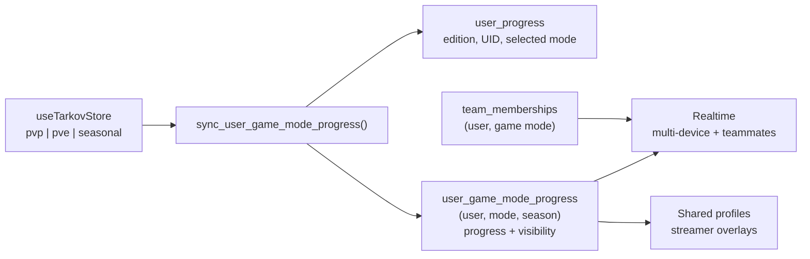

# Progress storage

Part of the [systems spec](./README.md): summary, flow, files, and invariants per system.

## Game-mode and Seasonal progress storage

**Summary.** Persistent PvP, PvE, and numbered Seasonal PvP progress share one normalized table.
`user_game_mode_progress` has primary key `(user_id, game_mode, season_number)`; PvP and PvE use
season `0`, while Seasonal uses the active positive season number. Season 1 is active. The
`user_progress` row holds account-wide metadata only. Its legacy `pvp_data` / `pve_data` columns are
no longer written (#1028 Phase 3) and remain, frozen, until they are dropped; Seasonal progress was
never stored there.

### Diagram

### Flow

1. Startup reads account metadata from `user_progress` and progress only from normalized rows.
   Missing or unmaterialized rows do not cause legacy JSON reads. Owned local recovery copies still
   reconcile with cloud state under the existing ownership, reset-epoch, and per-mode clock rules.
2. Debounced writes call `sync_user_game_mode_progress`, which validates the caller, serializes
   concurrent account-row updates, updates account metadata only when it changed, and upserts each
   normalized row. A mode-only sync therefore leaves the account row, its `updated_at` and its
   Realtime stream untouched. The caller passes the season number its bundle was
   built for; the function writes the Seasonal row only when that number equals the database's
   active season, so a cached client from a previous season cannot upload stale Seasonal state. The
   Tarkov UID link is applied last in its own savepoint: a UID another account owns keeps the stored
   link, still commits the progress, and is returned as `tarkov_uid_conflict`; the client then drops
   the UID locally and tells the user. Conflict outcomes also correct startup's merged snapshot
   before it is assigned or persisted. Session reset removes the conflict listener; request ownership
   and live identity fence delayed replies, including a later session for the same account.
   Split saves recognize the known stored-UID metadata echo until the link settles, then use the
   stored link for any remaining batches. Imports wait for persistence with controls disabled and
   ignore completions from an abandoned preview or session (migration
   `20261001200000_decouple_tarkov_uid_link_from_progress_sync.sql`). A
   client sync carries only the modes that differ from the copy the server last loaded,
   acknowledged, or delivered through Realtime for this session
   (`app/stores/tarkov/acknowledgedModes.ts`); an omitted mode is kept as stored. Background and
   direct saves share an account queue in `app/stores/tarkov/progressPersistence.ts`, and compare
   their captured snapshot with the baseline only after preceding writes settle. Dispatched modes
   remain unacknowledged until a current request succeeds, so a revert cannot match an obsolete
   baseline while an older write is still pending, including across a same-account session reset.
   A multi-mode sync over half the payload cap is sent as one request per mode, and each mode is
   acknowledged only after its request succeeds; a newer sync, a session reset, or Realtime applying
   newer progress or account metadata stops the remaining requests so they never replay a stale snapshot; the
   interrupted sync reports a failure, so the controller reconciles and resends from the merged
   state. Each queued or dispatched save keeps its own captured values until it settles. An accepted
   Realtime scope that matches both one pending save's captured values and the values applied
   locally is that save's echo and interrupts no pending save. Once a sync has
   selected its modes, Realtime changes to modes it omits no longer interrupt it. Remote observations
   also invalidate the controller's last-upload hash, so reverting to an earlier upload still
   reaches the sender's current baseline comparison. One request can still carry several modes, so a stale Seasonal entry is skipped rather
   than raising: persistent PvP and PvE from the same request still commit. The RPC rejects payloads
   larger than 512 KiB and allows at most 60 direct client syncs per user per minute. API gateway
   reads resolve the active Seasonal number through the database before selecting a row. Persisted
   `lastApiUpdate` and `apiUpdateHistory` retain task states `active`, `completed`, `failed`, and
   `uncompleted`; malformed entries and unknown states are stripped by the database sanitizer.
   Each entry keeps at most the first 20 valid task updates in input order (the gateway lists the
   requested tasks before cascaded dependents) and records the pre-truncation total as `taskCount`
   only when updates were dropped. The gateway, client, and database apply the same rules
   (`shared/utils/apiTaskUpdates.ts`), so a client sync cannot flip a stored entry. When a sync
   resends an entry with the same id and timestamp but a smaller or missing `taskCount` (for example
   from a client built before the cap), the database keeps the larger stored count.
3. Realtime listens to both the account row, for metadata, and normalized rows. Recognized account metadata
   echoes advance the listener's timestamp watermark before being discarded, so older metadata
   cannot overwrite acknowledged values. Echoes do not reconcile, persist freshness, or patch state.
   A sync that leaves metadata unchanged writes no account row and returns the stored
   `metadata_write_id`; an echo matches only that marker together with the same values, so a
   foreign metadata change is never mistaken for one.
   A normalized event is applied only
   when its mode is supported and its season equals the active season. The long-lived system and team
   listeners run in detached scopes so route unmounts cannot orphan their channels. The team store
   uses one private `team:<id>` channel for membership changes and multiplexed normalized progress
   events; teammate stores consume those events locally instead of opening one channel per teammate
   or trusting client-supplied broadcast state. Signing out removes all remaining Realtime channels.
4. Profile sharing is stored per normalized row in `profile_public`. Public profile and streamer
   routes select the exact mode and season; teammates receive same-mode progress through RLS. The
   sharing RPC also mirrors persistent PvP/PvE visibility back to the legacy
   `user_preferences.profile_share_*` columns, and a trigger mirrors legacy writes forward into
   `profile_public`, so a cached older client can still turn sharing off during a rolling deploy.
   A missing normalized row is treated as private rather than missing.
   Shared-profile REST reads use `fetchWithTimeout` with an eight-second deadline covering headers
   and the complete response body. A failed read cancels the sibling reads; timeouts return 504.
   The configured Supabase URL is normalized before auth and REST paths are appended, removing
   query strings, fragments, and the trailing slash; invalid or non-HTTPS URLs fail closed.
5. The active season definition carries its number, start date, and exact end timestamp. The UI
   counts down to that end timestamp. Advancing the number starts each account on a fresh empty row;
   historical rows remain retained and cannot be merged into the new season. Locally persisted
   progress carries the season it belongs to, and Seasonal progress stamped with a different season
   is discarded on load so stale browser state cannot be uploaded into the new season. Rollover
   deploys the database flip first during the between-season no-write gap, verifies it, and then
   deploys the matching application constants before the new season opens.
6. Native backup v2 includes `seasonNumber` and Seasonal progress. A backup from another season
   may restore persistent modes but cannot write its Seasonal payload into the active season.
7. Prestige is a PvP-only concept and Seasonal PvP does not support it, so the archive RPC accepts
   only `pvp` (and `pve`, which the UI still gates off) and never writes the Seasonal row. The store
   rejects a Seasonal prestige before any request, and the settings card reports prestige as
   unavailable in Seasonal PvP. Prestige archives use the same account write queue as background
   syncs, supersede older splits, and acknowledge only the persistent modes the transaction writes.
   A committed archive is applied even if a newer local sync started while it was in flight; that
   sync captured pre-archive state, so it is superseded before dispatch and resent from merged state.
   Remote changes outside the transaction's write scope, such as Seasonal progress, do not interrupt it.
   A cancelled session cannot dispatch a queued archive or apply its result to another account.

Teams, save status and recovery, and progress imports build on this storage; see
[teams](./teams.md), [progress sync and recovery](./progress-sync.md), and
[imports](./imports.md).

### Files

- `supabase/migrations/20260804043342_normalize_game_mode_progress_and_add_seasonal.sql` — schema,
  RLS, compatibility triggers, `team_member_mode_summary`, sync/sharing/prestige RPCs
- `supabase/migrations/20260830130000_harden_client_progress_access.sql` — authenticated progress
  sync limits, client mutation revocation, and mode-scoped legacy teammate progress RPC
- `supabase/migrations/20260806120000_add_game_mode_progress_backfill_helper.sql` — original
  backfill helper, superseded by `20261002090000`
- `supabase/migrations/20261002090000_side_effect_free_mode_progress_backfill.sql` — current
  revoked one-range backfill helper and its completion gate `private.unmaterialized_mode_progress`.
  While its transaction-local `tarkovtracker.mode_progress_backfill` flag is set, the prepare trigger
  keeps source timestamps and records unknown freshness, and `track_account_mutation` records no
  activity. Correctness does not depend on running it until the legacy fallbacks are removed (#1028);
  see _Normalized PvP/PvE progress backfill_ in `docs/runbook.md`
- `supabase/migrations/20260806160000_seed_unmaterialized_mode_progress_on_merge.sql` — former
  legacy seed of an unmaterialized persistent row inside `merge_progress_data`'s row lock
- `supabase/migrations/20261005090000_retire_legacy_mode_progress_dual_writes.sql` — stops every
  legacy PvP/PvE write and legacy merge seed, and drops the legacy-to-normalized trigger and the
  legacy-only `update_task_completion`
- `supabase/migrations/20260910050000_add_manual_activity_history_to_progress.sql` — adds
  `manualActivityHistory` to the persisted progress allowlist and its entry/history sanitizers
- `app/composables/useDataBackup.ts` — season-aware native backups
- `app/server/api/profile/[userId]/[mode].get.ts`,
  `app/server/api/streamer/[userId]/[mode]/kappa.get.ts`, `app/server/api/team/members.ts` —
  mode-aware sharing and team routes
- `app/utils/constants.ts`, `workers/api-gateway/src/utils/gameMode.ts` — runtime active-season
  constants and upstream mode mapping

### Invariants

- `pvp` and `pve` always use season `0`; `seasonal` always uses a positive season.
- Persisted API task-update metadata accepts only `active`, `completed`, `failed`, and
  `uncompleted`. Its sanitizer strips malformed entries and unknown states; enabling a new producer
  requires aligned application/gateway consumers and a verified database rollout first. The
  per-entry task cap and `taskCount` rules must stay identical across those three layers.
- Browser roles never need table maintenance privileges (`TRUNCATE`, `REFERENCES`, `TRIGGER`,
  `MAINTAIN`) on account, progress, team, billing, or audit tables. Explicit forward revokes preserve
  existing row and column access, including token-note updates. Billing events remain server-only;
  supporters and admin audit logs expose only their RLS-filtered authenticated reads. New-table
  default privileges require a separate creating-role audit; these revokes do not change defaults.
- Nitro shared-profile and team-member reads resolve Seasonal through the service-role-only
  `get_active_season_number` RPC on each request before cache lookup. Cache keys include the resolved
  season; missing credentials, failed lookups and invalid responses return 503 rather than falling
  back to the bundled season. Persistent modes use season 0 without an RPC. The resolver is
  `app/server/utils/gameModeSeason.ts`. A request uses one resolved season for its reads; a rollover
  during that request is observed by the next request.
- App `ACTIVE_SEASON` metadata must match the database's `private.active_season_*()` functions;
  the Worker resolves the active Seasonal number through the database instead of carrying a
  second runtime constant.
- Both season resolvers (Nitro and the Worker's `workers/api-gateway/src/utils/gameMode.ts`) accept
  the RPC's `SMALLINT` only as a JSON number that is a positive integer
  (`shared/utils/seasonNumber.ts`); strings, booleans, arrays, objects, null, zero, negatives and
  fractions are rejected without coercion and fail closed.
- Own and teammate hydration, shared profiles and overlays, team summaries, and public progress/team
  API reads use normalized rows only. A materialized row carries a finite numeric `level`; missing
  and placeholder rows provide no remote progress. A missing normalized profile row remains private,
  regardless of legacy sharing preferences. Visibility on an existing normalized row remains authoritative.
  The production completion gate was verified zero across all 16 UUID ranges for PvP and PvE on
  2026-10-04 before removing database reader fallbacks (#1028).
- The operational backfill only fills rows whose normalized progress has no numeric `level`; it
  cannot overwrite an already materialized row or change its visibility. Missing rows use
  `ON CONFLICT DO NOTHING`; placeholder repairs lock and recheck after concurrent writes. It preserves
  source timestamps and records no account activity. Schema rollout and data completion are separate
  checks; see the runbook for bounded verification.
- No runtime path writes `user_progress.pvp_data` / `pve_data` or merges from them (#1028 Phase 3).
  `merge_progress_data` creates a missing normalized row empty under the account row lock and
  merges into the normalized row only; as before, a Seasonal write also advances
  `user_progress.updated_at` (never a legacy column). Its `p_field` values keep the legacy names
  only to select a mode. The sync RPC's merge base is the stored normalized row.
  Removing both former legacy seeds is safe only because the completion gate was zero: no account
  has legacy progress with a numeric `level` whose normalized row lacks one, so a frozen legacy
  column can never resurrect progress. Signup no longer creates placeholder normalized rows;
  readers already treat missing and placeholder rows alike.
  `supabase/tests/database/legacy_mode_progress_writes.test.sql` fails if a legacy writer, the
  legacy-to-normalized trigger, or a legacy merge seed returns.
- Historical Seasonal rows are retained but never merged into the active season. Locally persisted
  Seasonal progress is stamped with its season number and reset to defaults when that stamp does not
  match the active season; absent stamps are treated as the active season. `sync_user_game_mode_progress`
  independently skips Seasonal writes whose caller-supplied season number is absent or does not
  match `private.active_season_number()`, so the fresh-season guarantee does not depend on client
  code alone. It skips rather than raises so a client whose bundled season number lags the database
  cannot take persistent-mode cloud sync offline.
- Authenticated users can write only their own progress through the bounded sync RPC; direct client
  mutations of team, membership, legacy progress, and normalized progress tables are revoked.
  Teammate reads require a shared team in the same game mode; cross-mode teammates and outsiders
  cannot read a row.
- Startup fetches account metadata and normalized modes without selecting legacy mode columns.
  Shared-profile, gateway, and teammate reads never request legacy progress. Public visibility and
  team authorization still precede normalized reads. Clients since #641 apply `user_progress`
  Realtime events as account metadata only, so frozen legacy columns in those payloads are ignored.
  Because PvP/PvE writes no longer advance the account row's `updated_at`, startup treats a mode
  as independently advanced only when it is newer than both the account clock and the persistent
  PvP/PvE clocks (#1087, which must deploy first), so startup mode-merge decisions stay as they
  were, while the account-metadata choice now follows actual metadata freshness.
  That decision covers every mode at once: a Seasonal client sync newer than PvP/PvE still selects
  the value-maximizing snapshot merge for all modes, a pre-existing gap tracked separately. The read-only
  `get_teammate_legacy_progress` RPC, the unused `team_member_summary` view and the backfill gate
  still read the frozen columns until they are dropped (#1028 Phase 4).
- The public API, profile sharing, teams, backups, and streamer tools use the exact mode and active
  season. No Seasonal operation may silently fall back to persistent PvP.
- Seasonal PvP has no prestige. `archive_prestige_run_and_reset_progress` rejects any mode outside
  `pvp`/`pve`, `user_prestige_runs` keeps its `mode IN ('pvp','pve')` constraint, and no Seasonal
  progress is written through a prestige.
- Tarkov.dev profile imports can target Seasonal through the verified `pvp-season` source. EFT-log
  imports can target Seasonal using the verified notification formats and active-season guards
  specified in [EFT log import](./imports.md#eft-log-import); unresolved-mode events require an explicit destination choice.
- Manual activity-log entries live in the selected mode's progress blob as `manualActivityHistory`,
  next to `apiUpdateHistory`, and never in a standalone browser store. They share the progress
  lifecycle: the client and persisted sanitizers accept them, `mergeProgressData` unions them by
  stable id in the equal-epoch branch, a reset/prestige epoch win discards the losing side's feed
  with the rest of that side's data, and a session transition clears them through the progress store
  rather than through a second storage adapter. Both sanitizers require a non-empty id and title, a
  numeric millisecond `timestamp`, and a known `type`/`action`; ids, titles, and details are clamped
  and each mode keeps at most 50 entries so three full feeds stay far below the sync RPC's 512 KiB
  ceiling. Adding a progress field requires a forward migration recreating
  `sanitize_user_progress_mode_data`, because that allowlist is the single gate on every write and
  silently drops keys it does not name. Read state (`lastReadByMode`) stays device-local and is
  isolated by mode. Backups strip the feed and its clear generation alongside `apiUpdateHistory`,
  and teammate/public API projections never include them.
- Manual histories merge during preferred-snapshot startup as well as realtime reconciliation.
  History-only state starts sync and passes the empty-state guard. Deferred startup explicitly
  persists the mutation that created the subscription, including post-load local recovery adoption. Initial
  saves retry once after a failure, retain pending state, and stop retrying after a session change.
  A failed authenticated initial sync retries within the same session on a bounded 30-second cycle
  (five attempts, first failure and exhaustion toast, intermediate failures log a warning) so the
  local recovery adoption is not stranded until the next login. Each failed attempt first tears
  down the partially initialized sync controller and realtime listener (`resetTarkovSync`) so the
  retry rebuilds from a clean slate instead of skipping listener setup; stale-session failures
  skip both teardown and retry. Identity changes cancel the pending retry and reset the attempt
  budget, and success cancels the cycle.
  Clearing advances
  `manualActivityEpoch` without changing gameplay or `progressEpoch`; only histories from the
  highest history generation participate in the union. Full progress reset epochs take precedence.
  The sync RPC merges histories under its existing account lock before unchanged-write comparisons,
  and row triggers preserve that contract for API writers. Omitted fields from older clients
  preserve existing server history; a higher full reset epoch intentionally discards it.
- Equal-timestamp manual entries sort by ID; conflicting same-ID entries use type, action, title,
  then details as ascending Unicode code-point tie-breakers. Client and database use the same order
  before the 50-entry cap, so device argument order cannot change the retained feed. The cap applies
  to the merged feed, not per device: when two devices at the same history generation together hold
  more than 50 entries, the union keeps the 50 newest and drops the rest by design. Ids, titles, and
  details clamp by Unicode code point on both sides, matching SQL `left()`, so neither side can
  produce a different id for the same entry. The client additionally strips lone surrogates before
  clamping: `jsonb` rejects the whole `p_modes` document at parameter binding, before the SQL
  sanitizer can run, so no client-sanitized string can carry one.
- The sync RPC merges each mode against the persisted normalized payload for that mode, under the
  account row lock, before its unchanged-write comparison. The account row is compared and written
  for metadata only, so a placeholder normalized row cannot cause account-row rewrites.
- Legacy activity envelopes with no owner are adoptable guest data. Authenticated startup waits
  until progress sync restores the selected mode before adoption. Another account's envelope is
  retained for its owner. The legacy key is removed only after entries have been added to progress.
