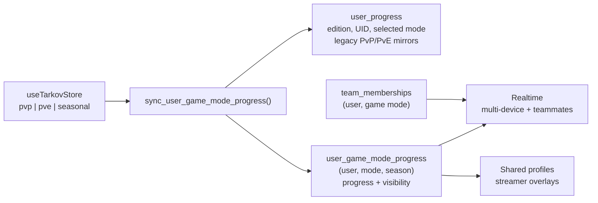

# Progress storage

Part of the [systems spec](./README.md): summary, flow, files, and invariants per system.

## Game-mode and Seasonal progress storage

**Summary.** Persistent PvP, PvE, and numbered Seasonal PvP progress share one normalized table.
`user_game_mode_progress` has primary key `(user_id, game_mode, season_number)`; PvP and PvE use
season `0`, while Seasonal uses the active positive season number. Season 1 is active. The legacy
`user_progress` row retains account-wide metadata and mirrored PvP/PvE JSON during the rolling
deployment window, but Seasonal progress is never stored in that combined row.

### Diagram

### Flow

1. Startup reads account metadata and legacy PvP/PvE from `user_progress`, then reads normalized
   rows and prefers the normalized active row for each mode. An account with no normalized row falls
   back to the legacy PvP/PvE JSON, so the normalized table can be populated lazily or backfilled
   after the schema ships.
2. Debounced writes call `sync_user_game_mode_progress`, which validates the caller, serializes
   concurrent account-row updates, updates account metadata, mirrors persistent PvP/PvE for older
   clients, and upserts each normalized row. The caller passes the season number its bundle was
   built for; the function writes the Seasonal row only when that number equals the database's
   active season, so a cached client from a previous season cannot upload stale Seasonal state. A
   client sync always carries every mode in one payload, so a stale Seasonal entry is skipped rather
   than raising: persistent PvP and PvE from the same request still commit. The RPC rejects payloads
   larger than 512 KiB and allows at most 60 direct client syncs per user per minute. API gateway
   reads resolve the active Seasonal number through the database before selecting a row. Persisted
   `lastApiUpdate` and `apiUpdateHistory` retain task states `active`, `completed`, `failed`, and
   `uncompleted`; malformed entries and unknown states are stripped by the database sanitizer.
3. Realtime listens to both the account row and normalized rows. A normalized event is applied only
   when its mode is supported and its season equals the active season. The long-lived system and team
   listeners run in detached scopes so route unmounts cannot orphan their channels. The team store
   uses one private `team:<id>` channel for membership changes and multiplexed normalized progress
   events; teammate stores consume those events locally instead of opening one channel per teammate
   or trusting client-supplied broadcast state. Signing out removes all remaining Realtime channels.
4. Profile sharing is stored per normalized row in `profile_public`. Public profile and streamer
   routes select the exact mode and season; teammates receive same-mode progress through RLS. The
   sharing RPC also mirrors persistent PvP/PvE visibility back to the legacy
   `user_preferences.profile_share_*` columns, and a trigger mirrors legacy writes forward into
   `profile_public`, so a cached older client can still turn sharing off during a rolling deploy.
   A missing normalized row is treated as private rather than missing.
   Shared-profile REST reads use `fetchWithTimeout` with an eight-second deadline covering headers
   and the complete response body. A failed read cancels the sibling reads; timeouts return 504.
   The configured Supabase URL is normalized before auth and REST paths are appended, removing
   query strings, fragments, and the trailing slash; invalid or non-HTTPS URLs fail closed.
5. The active season definition carries its number, start date, and exact end timestamp. The UI
   counts down to that end timestamp. Advancing the number starts each account on a fresh empty row;
   historical rows remain retained and cannot be merged into the new season. Locally persisted
   progress carries the season it belongs to, and Seasonal progress stamped with a different season
   is discarded on load so stale browser state cannot be uploaded into the new season. Rollover
   deploys the database flip first during the between-season no-write gap, verifies it, and then
   deploys the matching application constants before the new season opens.
6. Native backup v2 includes `seasonNumber` and Seasonal progress. A backup from another season
   may restore persistent modes but cannot write its Seasonal payload into the active season.
7. Prestige is a PvP-only concept and Seasonal PvP does not support it, so the archive RPC accepts
   only `pvp` (and `pve`, which the UI still gates off) and never writes the Seasonal row. The store
   rejects a Seasonal prestige before any request, and the settings card reports prestige as
   unavailable in Seasonal PvP.

Teams, save status and recovery, and progress imports build on this storage; see
[teams](./teams.md), [progress sync and recovery](./progress-sync.md), and
[imports](./imports.md).

### Files

- `supabase/migrations/20260804043342_normalize_game_mode_progress_and_add_seasonal.sql` — schema,
  RLS, compatibility triggers, `team_member_mode_summary`, sync/sharing/prestige RPCs
- `supabase/migrations/20260830130000_harden_client_progress_access.sql` — authenticated progress
  sync limits, client mutation revocation, and mode-scoped legacy teammate progress RPC
- `supabase/migrations/20260806120000_add_game_mode_progress_backfill_helper.sql` — retained,
  revoked helper for optional one-range-at-a-time operational maintenance. Correctness does not
  depend on running it; see the Database Migrations section of `docs/runbook.md`
- `supabase/migrations/20260806160000_seed_unmaterialized_mode_progress_on_merge.sql` — seeds an
  unmaterialized persistent row from its legacy column inside `merge_progress_data`'s row lock
- `supabase/migrations/20260910050000_add_manual_activity_history_to_progress.sql` — adds
  `manualActivityHistory` to the persisted progress allowlist and its entry/history sanitizers
- `app/composables/useDataBackup.ts` — season-aware native backups
- `app/server/api/profile/[userId]/[mode].get.ts`,
  `app/server/api/streamer/[userId]/[mode]/kappa.get.ts`, `app/server/api/team/members.ts` —
  mode-aware sharing and team routes
- `app/utils/constants.ts`, `workers/api-gateway/src/utils/gameMode.ts` — runtime active-season
  constants and upstream mode mapping

### Invariants

- `pvp` and `pve` always use season `0`; `seasonal` always uses a positive season.
- Persisted API task-update metadata accepts only `active`, `completed`, `failed`, and
  `uncompleted`. Its sanitizer strips malformed entries and unknown states; enabling a new producer
  requires aligned application/gateway consumers and a verified database rollout first.
- Browser roles never need table maintenance privileges (`TRUNCATE`, `REFERENCES`, `TRIGGER`,
  `MAINTAIN`) on account, progress, team, billing, or audit tables. Explicit forward revokes preserve
  existing row and column access, including token-note updates. Billing events remain server-only;
  supporters and admin audit logs expose only their RLS-filtered authenticated reads. New-table
  default privileges require a separate creating-role audit; these revokes do not change defaults.
- Nitro shared-profile and team-member reads resolve Seasonal through the service-role-only
  `get_active_season_number` RPC on each request before cache lookup. Cache keys include the resolved
  season; missing credentials, failed lookups and invalid responses return 503 rather than falling
  back to the bundled season. Persistent modes use season 0 without an RPC. The resolver is
  `app/server/utils/gameModeSeason.ts`. A request uses one resolved season for its reads; a rollover
  during that request is observed by the next request.
- App `ACTIVE_SEASON` metadata must match the database's `private.active_season_*()` functions;
  the Worker resolves the active Seasonal number through the database instead of carrying a
  second runtime constant.
- A missing or unmaterialized normalized persistent-mode row is never treated as absent progress: own
  and teammate hydration, shared profiles and overlays, team summaries, and public progress/team API
  reads fall back to `user_progress`; sharing falls back to the legacy preference. A row counts as
  unmaterialized when its `progress_data` carries no numeric `level`, which is the same test the
  optional operational backfill uses. Seasonal never falls back to persistent PvP. A materialized
  normalized row always wins, and writes populate it lazily. A failure reading the legacy sharing
  preference is logged and treated as "not shared"; it never discards normalized visibility that
  loaded successfully. Optional operational backfill only fills rows whose `progress_data` carries no
  `level`, so it cannot overwrite a write that landed first and never changes `profile_public` on an
  existing row.
- `merge_progress_data` seeds an unmaterialized persistent row from its legacy column inside the same
  `FOR UPDATE` lock before merging. Its original seed is an `INSERT ... ON CONFLICT DO NOTHING`, which
  only fires when no row exists, so a placeholder row created by the visibility RPC or the legacy
  sharing trigger used to become the merge base — and because the RPC mirrors the result back into
  `user_progress.pvp_data` / `pve_data`, a single public-API write erased the account's level, display
  name, and every task completion. The seed is a write-time repair, not a backfill: it touches only
  the row the write already locks. Reader-side fallback alone cannot close this hole, because the
  merge base comes from the row rather than from anything the caller sends.
- Historical Seasonal rows are retained but never merged into the active season. Locally persisted
  Seasonal progress is stamped with its season number and reset to defaults when that stamp does not
  match the active season; absent stamps are treated as the active season. `sync_user_game_mode_progress`
  independently skips Seasonal writes whose caller-supplied season number is absent or does not
  match `private.active_season_number()`, so the fresh-season guarantee does not depend on client
  code alone. It skips rather than raises so a client whose bundled season number lags the database
  cannot take persistent-mode cloud sync offline.
- Authenticated users can write only their own progress through the bounded sync RPC; direct client
  mutations of team, membership, legacy progress, and normalized progress tables are revoked.
  Teammate reads require a shared team in the same game mode; cross-mode teammates and outsiders
  cannot read a row.
- Startup fetches metadata and normalized modes before requesting missing persistent legacy columns.
  Shared-profile, gateway, and teammate reads request legacy progress only when their existing
  fallback rules require it. Public visibility and team authorization still precede fallback use.
  This reduces Supabase transfer; gateway response ETags alone do not avoid upstream reads.
- The public API, profile sharing, teams, backups, and streamer tools use the exact mode and active
  season. No Seasonal operation may silently fall back to persistent PvP.
- Seasonal PvP has no prestige. `archive_prestige_run_and_reset_progress` rejects any mode outside
  `pvp`/`pve`, `user_prestige_runs` keeps its `mode IN ('pvp','pve')` constraint, and no Seasonal
  progress is written through a prestige.
- Tarkov.dev profile imports can target Seasonal through the verified `pvp-season` source. EFT-log
  imports can target Seasonal using the verified notification formats and active-season guards
  specified in [EFT log import](./imports.md#eft-log-import); unresolved-mode events require an explicit destination choice.
- Manual activity-log entries live in the selected mode's progress blob as `manualActivityHistory`,
  next to `apiUpdateHistory`, and never in a standalone browser store. They share the progress
  lifecycle: the client and persisted sanitizers accept them, `mergeProgressData` unions them by
  stable id in the equal-epoch branch, a reset/prestige epoch win discards the losing side's feed
  with the rest of that side's data, and a session transition clears them through the progress store
  rather than through a second storage adapter. Both sanitizers require a non-empty id and title, a
  numeric millisecond `timestamp`, and a known `type`/`action`; ids, titles, and details are clamped
  and each mode keeps at most 50 entries so three full feeds stay far below the sync RPC's 512 KiB
  ceiling. Adding a progress field requires a forward migration recreating
  `sanitize_user_progress_mode_data`, because that allowlist is the single gate on every write and
  silently drops keys it does not name. Read state (`lastReadByMode`) stays device-local and is
  isolated by mode. Backups strip the feed and its clear generation alongside `apiUpdateHistory`,
  and teammate/public API projections never include them.
- Manual histories merge during preferred-snapshot startup as well as realtime reconciliation.
  History-only state starts sync and passes the empty-state guard. Deferred startup explicitly
  persists the mutation that created the subscription, including post-load legacy adoption. Initial
  saves retry once after a failure, retain pending state, and stop retrying after a session change.
  A failed authenticated initial sync retries within the same session on a bounded 30-second cycle
  (five attempts, first failure and exhaustion toast, intermediate failures log a warning) so the
  deferred legacy adoption is not stranded until the next login. Each failed attempt first tears
  down the partially initialized sync controller and realtime listener (`resetTarkovSync`) so the
  retry rebuilds from a clean slate instead of skipping listener setup; stale-session failures
  skip both teardown and retry. Identity changes cancel the pending retry and reset the attempt
  budget, and success cancels the cycle.
  Clearing advances
  `manualActivityEpoch` without changing gameplay or `progressEpoch`; only histories from the
  highest history generation participate in the union. Full progress reset epochs take precedence.
  The sync RPC merges histories under its existing account lock before unchanged-write comparisons,
  and row triggers preserve that contract for legacy/API writers. Omitted fields from older clients
  preserve existing server history; a higher full reset epoch intentionally discards it.
- Equal-timestamp manual entries sort by ID; conflicting same-ID entries use type, action, title,
  then details as ascending Unicode code-point tie-breakers. Client and database use the same order
  before the 50-entry cap, so device argument order cannot change the retained feed. The cap applies
  to the merged feed, not per device: when two devices at the same history generation together hold
  more than 50 entries, the union keeps the 50 newest and drops the rest by design. Ids, titles, and
  details clamp by Unicode code point on both sides, matching SQL `left()`, so neither side can
  produce a different id for the same entry. The client additionally strips lone surrogates before
  clamping: `jsonb` rejects the whole `p_modes` document at parameter binding, before the SQL
  sanitizer can run, so no client-sanitized string can carry one.
- The sync RPC merges each mode against the persisted payload for that mode, and seeds from the
  account row's locked legacy column when the normalized row is an unmaterialized placeholder. Row
  triggers re-merge against each table's own stored row, so the seeding is what keeps the RPC's
  unchanged-write comparison accurate: without it a placeholder makes every sync rewrite an
  otherwise unchanged account row.
- Legacy activity envelopes with no owner are adoptable guest data. Authenticated startup waits
  until progress sync restores the selected mode before adoption. Another account's envelope is
  retained for its owner. The legacy key is removed only after entries have been added to progress.
