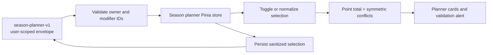

# Season planner

**Summary.** The Season Planner lets a user choose Kord Breach personal modifiers while enforcing
the season's point budget and incompatibility rules. The plan is local-only and persisted in a
user-scoped envelope so one signed-in user cannot inherit another user's selections in the same
browser.

### Flow

### Behavior details

- Selecting a positive modifier subtracts points from the budget (a negative point value), while a
  negative modifier adds points (a positive point value). A plan is valid when its total is at least
  zero and no incompatible pair is selected.
- Incompatibility is checked in both directions because older or edited data may list only one side
  of a pair.
- Rehydration accepts only a matching user-scoped envelope and a string array of known personal
  modifier IDs. Duplicate and stale IDs are removed before they reach the UI; `normalizeSelection`
  also removes incompatible persisted entries after mount.
- Persistence uses separate owner slots, including an anonymous slot. Legacy envelopes are read
  only by their matching owner. Delayed authentication restores that owner's plan without
  overwriting it during anonymous startup; identity changes reload the matching slot.
- A malformed persisted value falls back to an empty plan.

### Files

- `app/pages/season-planner.vue` — planner layout, point summary, and validation messages.
- `app/features/season-planner/ModifierCard.vue` — accessible modifier selection card.
- `app/data/seasonal-modifiers.ts` — Kord Breach modifier definitions and rules.
- `app/stores/useSeasonPlanner.ts` — selection state, persistence sanitization, and rule evaluation.
- `app/types/season.ts` — modifier and store state types.

### Invariants

- Hardcore modifiers are display-only and never contribute to the personal point total.
- An unknown, non-string, duplicate, or cross-user persisted ID must never be selected or counted.
- A modifier cannot be added when either side of its incompatibility relationship is selected.
- A user switch or malformed storage value must produce an empty, safe selection rather than expose
  another user's plan or throw during initial render.
